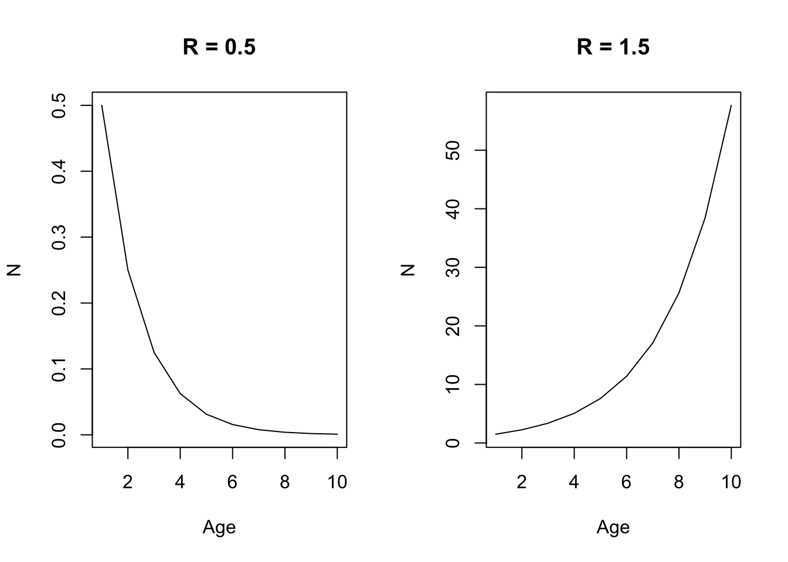
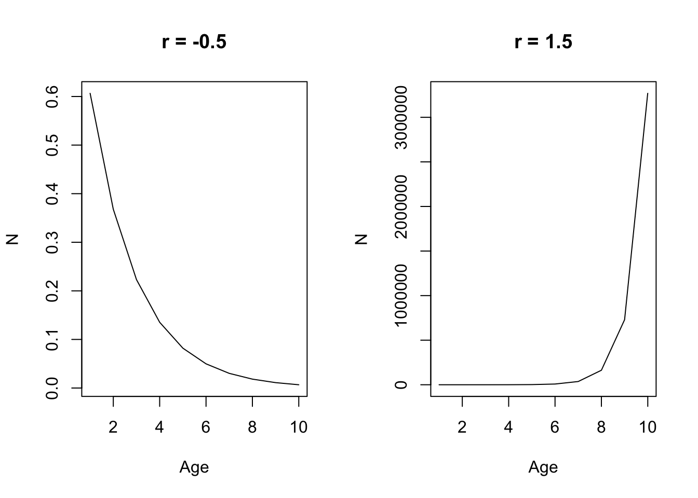
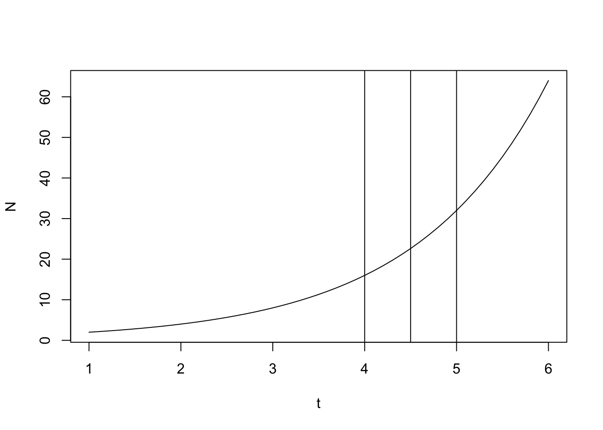
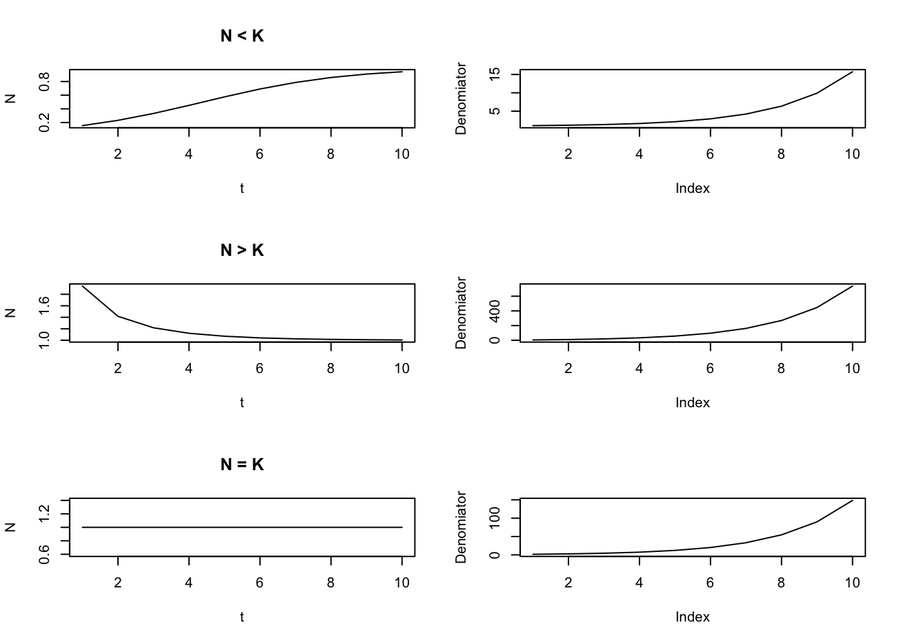
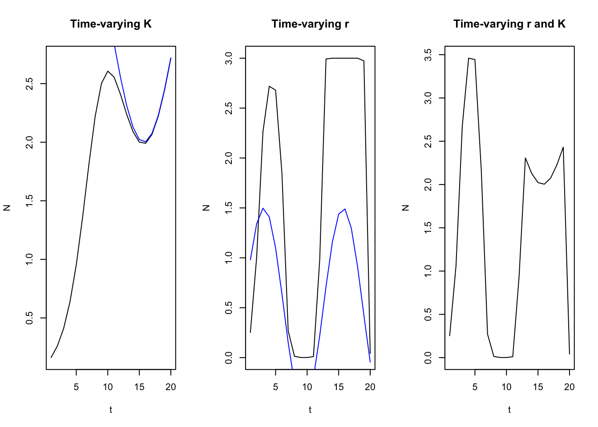

# Quinn and Deriso (1999)

## Chapter 1 (Population Growth, Mortality, and the Fishing Process)

### Geometric and Exponential Growth
- Representing changes in populations can be done in two ways: 1) time-discrete functions (difference equations), and 2) continuous functions (differential equations). Additionally, changes in population growth here are represented as either geometric or exponential. These population models presented below refer to the geometric and exponential laws of growth. 

- A common assumption in the difference equation setting is that population growth or decline changes as a constant ratio from one point to the next:

\begin{equation}
N_{t+1} = N_tR \\
N_{t+1}/N_t = R \\
N_{t} = N_0R^t
\end{equation}

where R represents a common multiple or ratio of change, and is also commonly reffered to as the Malthusian parameter. When R < 0, the population declines geometrically to 0, and when R > 1, the population increases geometrically without bound. The difference between geometric and exponential (differential) changes lies in the fact that geometric changes are discrete (multiplied by a constant factor), whereas exponential changes are continuous and instantaneous (multiplied by a constant percentage). 


```r
R_0.5 <- 0.5 # Constant ratio of growth
R_1.5 <- 1.5 # Constant ratio of growth
t <- seq(1,10,1) # time index
N <- 1 # Numbers in time 1

par(mfrow = c(1,2))
plot(N*R_0.5^t, xlab = "Age", ylab = "N", main = "R = 0.5", type = "l")
plot(N*R_1.5^t, xlab = "Age", ylab = "N", main = "R = 1.5", type = "l")
```



For a geometric population growth model, the change in the population is given by:

\begin{equation}
\Delta N_t = N_{t+1} - N_{t}\\
\Delta N_t = N_{t}R - N_{t} = (R-1)N_{t}
\end{equation}

and so the per-capita rate of change is:

\begin{equation}
\Delta N_t / N_{t} = R-1
\end{equation}

In the differential equation setting, where changes are instantaneous instead of discrete, we can rewrite the equations above as:

\begin{equation}
\Delta N_{t+h} = N_0R^{t+h} = N_tR^h \\
\frac{\Delta N_t}{\Delta t} = \frac{ N_{t+h} - N_{t}}{(t+h) - t} = N_t\frac{R^h-1}{h}
\end{equation}

which yields the following after using lHoptial's Rule:

\begin{equation}
\frac{dN(t)}{dt} = rN(t) \\ 
\int_{N_0}^{N} \frac{1}{N(t)} dN(t) = \int rdt \\
logN - logN_0 = rt = logN = logN_0 + rt\\
N_t = N_0e^{rt}
\end{equation}


```r
R_0.5 <- -0.5 # instantaneous rate of growth 
R_1.5 <- 1.5 # instantaneous rate of growth 
t <- seq(1,10,1) # time index
N <- 1 # Numbers in time 1

par(mfrow = c(1,2))
plot(N*exp(R_0.5*t), xlab = "Age", ylab = "N", main = "r = -0.5", type = "l")
plot(N*exp(R_1.5*t), xlab = "Age", ylab = "N", main = "r = 1.5", type = "l")
```



for both the difference and differential equation representation, the change in abundance is directly proportional to its previous abundance. Similarly, r the parameter that describes instantaneous growth demonstrates a population that declines exponentially if r < 0, and increases exponentially when r > 0.

#### Cell Division Example 1.4

```r
N0 <- 1 # start numbers
R <- log(2) # change in growth
t <- seq(1,6, 0.1) # time sequence
par(mfrow = c(1,1))
plot(t, N0 * exp(R * t), type = "l", xlab = "t", ylab = "N")
abline(v = 4)
abline(v = 4.5)
abline(v = 5)
```



The example above showcases the danger of using a continuous model to calculate changes in populations when the model is actually a discrete time index. i.e., the abundance is different for time 4.5, compared to time 4 or time 5. An additional deficiency to some of these models is that it assumes growth in the population occurs without any bound (i.e., no carrying capacity).

### Logistic Model
- Population growth cannot increase without bounds, because it is mediated by density dependent factors (e.g., food diseases, space limitations, and competition) can lead to changes in K (carrying capacity). As the population approaches K, your change in growth should begin to slow down. 

The logistic model is given below by including a linear modifying factor (1 - N/K) to reduce growth rates as N approaches K:

\begin{equation}
\frac{dN}{dt} = rN(1-\frac{N}{k}) \\ 
N_t = \frac{N_0e^{rt}}{1 - \frac{N_0}{K} + \frac{N_0}{K}e^{rt}}
\end{equation}

where the deominator of the second equation is a dampening factor to make sure the numerator doesn't increase without bound. As you can see in the plot below, as N0 approaches K, the denomiator gets larger, which reduces the change in the numerator such that is dampens it and is unable to increase without bound. When N > K, it decreases exponentially, and when N = K, growth is constant. When N < K, it increases sigmoidally. 


```r
N01 <- 0.1 # start N
N02 <- 5 # start N
N03 <- 1 # start N
r <- 0.5 # rate of growth
K <- 1 # carrying capacity
t <- seq(1, 10, 1) # time index
par(mfrow = c(3,2))
plot(t, N01 * exp(r * t) / (1 - (N01/K) + (N01/K * exp(r*t))), type = "l", ylab = "N", main = "N < K")
plot((1 - N01/K + N01/K * exp(r*t)), type = "l", ylab = "Denomiator")
plot(t, N02 * exp(r * t) / (1 - (N02/K) + (N02/K * exp(r*t))), type = "l", ylab = "N", main = "N > K")
plot((1 - N02/K + N02/K * exp(r*t)), type = "l", ylab = "Denomiator")
plot(t, N03 * exp(r * t) / (1 - (N03/K) + (N03/K * exp(r*t))), type = "l", ylab = "N", main = "N = K")
plot((1 - N03/K + N03/K * exp(r*t)), type = "l", ylab = "Denomiator")
```



### Time-varying parameters
- Logistic growth model and the r and K parameters do not necessarily have to be constant, but instead can vary as a function of time. This can happen if let's say productivity of the population changes via a regime shift, or if there is a competitor has been removed from the population so as to free up resources available to the species of interest. (Reference page 7 for derivation).
- In general, the effect of r is greatest when populations are small, and the effect of K is greatest when the population is big. Furthermore, the change in population tends to be weighted more heavily towards the most recent K - given that the integral of Eq. 1.15 is the weighted harmonic mean of previous carrying capacities (I don't really get that part...)


```r
N01 <- 0.1
t <- seq(1, 20, 1) # time index
r_constant <- 0.5 # constant rate of growth
r <- sin(0.5 * t) + 0.5 # rate of growth
K <- sin(0.3*t) + 3 # carrying capacity
K_constant <- 3 # constant K

par(mfrow = c(1,3))
plot(t, N01 * exp(r_constant * t) / (1 - (N01/K) + (N01/K * exp(r_constant*t))), type = "l", ylab = "N", main = "Time-varying K")
lines(t, K, col = "blue")
plot(t, N01 * exp(r * t) / (1 - (N01/K_constant) + (N01/K_constant * exp(r*t))), type = "l", ylab = "N", main = "Time-varying r")
lines(t, r, type = "l", col = "blue")
plot(t, N01 * exp(r * t) / (1 - (N01/K) + (N01/K * exp(r*t))), type = "l", ylab = "N", main = "Time-varying r and K")
```



### Multi-species extensions (Page 9)
- Multi-species extensions of the logistic growth model is needed because species can compete for the same resources, which can lead to decreasing population growth with increasing population sizes when multiple species interact - as is the case for many populations. However, this can also include both positive and negative relationships (parasite-host, mutualism, protocooperation, etc). In the extensions of multi-species models for logistic growth, the impact of competition is primarily to lower the equilibrium abundance of carrying capacity of the other species (makes sense because there are less resources for them in equilibrium). 

- In general, these models are seldom used for management, but are generally used for exploring hypotheses about species interactions, ecosystem information about bioenergetics and food habits, etc. They're hard to parameterize because species interactions are highly variable, different response functions among species, and probably confounding with other variables. All of this leads to poor prediction. 

### Theory of Mortality
- Key principle: The abundance of an age-class decreases as it ages because of mortality.
The following equation is commonly used in modern day stock assessments: 

\begin{equation}
\frac{dN}{dt} = -ZN \\
\int_{N_0}^{N_t} \frac{1}{N} dN = \int -Zdt \\
logN_t - logN_0 = -Zt \\
N_t = N_0e^{-Zt}
\end{equation}

where abundance decreases exponentially as a function of time, which is modified by -Z (our natural + fishing mortality term). Hence, $e^{-Z}$ denotes our survival fraction of the population (e.g., fraction of $N_0$ that survives). Since this is a fraction (i.e., maxes out at 1), then the number of individuals that die are $1 - e^{-Z}$, which represents our annual death fraction. To observe the entire cohort:

\begin{equation}
N_t = N_{t-1}S{t-1} = N_0\prod_{x = 0}^{t - 1}S_t = N_0e^{-\sum_{x = 0}^{t - 1}Z}
\end{equation}

where to get instantaneous survival up to certain point, its multiplicative, while to get instantaneous mortality, its additive. Additionally, these equations can be applied to find abundance during fractions of years, which can be useful for pulse fisheries (e.g., salmon fisheries), surveys, or tagging experiments: 

\begin{equation}
N_{t+\tau} = N_te^{-Z_t\tau}
\end{equation}

where $\tau$ represents the fraction of the year and partitions out Z to be a fraction.

### Theory of Fishing
- Total mortality is decomposed into natural mortality and fishing mortality, both of which are commonly represented as instantaneous rates. Thus Z = F+M and the resultant population dynamics would look like:

\begin{equation}
\frac{dN}{dt} = -FN - MN = -(F + M)N \\
N_t = N_0e^{-Z_t} = N_0e^{-(F+M)t} 
\end{equation}

Thus, catch (C) is then composed of:

\begin{equation}
\frac{dC}{dt} = -FN  \\
\end{equation}

and natural deaths are composed of:

\begin{equation}
\frac{dD}{dt} = -MN  \\
\end{equation}

To derive Baranov's catch equation, we can integrate the catch equation in differential form:

\begin{equation}
dC = -FNdt \\
\int_0^C dc = \int_0^\tau -FNdt \\
C = \int_0^\tau -FNdt \\
\end{equation}

Solving for $\int_0^\tau -FNdt$ we get:

\begin{equation}
\int_0^\tau FNdt = \int_0^\tau -FN_0e^{-Zt}dt \\ 
= -FN_0 \int_0^\tau e^{-Zt}dt \\ 
= -FN_0 \int_0^\tau e^{-Zt}dt \\ 
= -FN_0 [-\frac{1}{Z} (e^{-Zt}-e^0)] \\
= FN_0 [\frac{1}{Z} - \frac{1}{Z}(e^{-Zt})] \\
= \frac{F}{Z}N_0(1-e^{-Zt})
\end{equation}

where $\frac{F}{Z}$ represents the fraction of deaths due to fishing relative to the total mortality and $(1-e^{-Zt})$ denotes the annual death fraction. It is then easy to show that the fraction of deaths due to natural mortality is $\frac{M}{Z}$. In general, the assumption is that catch is proportional to the instantaneous fishing mortality and its average abundance ($N_0(1-e^{-Zt})/Zt$) across the interval of fishing $C = FN$. Differential formulation of these equations are inappropriate when we have pulse fishing or removals occuring over a short interval. In these circumstances, we need to rewrite catch or abudance as:

\begin{equation}
N_t = N_0e^{-Zt}
\end{equation}
where t is up to the middle of the year (e.g., 0.4999) or some other approximation, 
\begin{equation}
N_t = N_0e^{-Zt} - C\\
\end{equation}
where C is catch and t = 0.5, which denotes the middle of the year, and
\begin{equation}
N_t = [N_0e^{-\frac{1}{2}Zt} - C]e^{-M(t-\frac{1}{2})}\\
\end{equation}

where t is now equal to 1 and we are simply incorporating only natural mortality in the latter half of the year.

### Stochastic Theory of Fishing
- Rarely is it the case that we have deterministic fishing - i.e., F does not vary nor does M. We can use statistical methods to incorporate stochasticity into the fishing process, although there are some key assumptions: 1) no immigration, recruitment, or emigration from the population.

The probability of capturing an individual of a given age then follows a multinomial distribution where the probability of capturing an individual is:
\begin{equation}
p_j = \int_{t_j}^{t_j+1}F_tr_tdt \\
\end{equation}

where $p_j$ is the probability an individual is captured, $F_t$ is the fishing mortality at time t, and $r_t$ is the probability and individual survives, and is a function of fishing and natural mortality (integrate over an interval to get it). Given this, the probability of not capturing an individual is therefore $q = 1 - p_j$. So for a given cohort, the catch distribution can be assumed to follow a multinomial distribution, where the expectation and variances are simply derived from the binomial (multinomial individual components are binomially distributed) (e.g., $E(C_j) = N_0p_j, V(C_j) = N_0p_j(1-p_j)$). Following a similar fashion, the probability of selecting N individuals (the random variable) from a cohort then follows a binomial distribution with probability equal to $r_t$ (individuals survive) and the total number of samples taken equalling to $N_0$ (initial abundance). Thus, these equations allow for stochasticity in both catch and abundance and are random variables that are governed by some statistical distribution with a set sample space (e.g., binomial, multinomial). Allowing for stochastic theory here therefore allows us to figure out what the variances and uncertainty of our population estimates are. 

### CPUE and Fishing Process


## Chapter 2 (Stock Productivity and Surplus Production)

## Chapter 3 (Stock and Recruitment)

## Chapter 4 (Growth and Fecundity)

## Chapter 5 (Delay Difference Models)

## Chapter 6 (Per Recruit and Year Class Models)

## Chapter 7 (Renewal Theory)

## Chapter 8 (Catch age and Age structured Assessment Methods)

## Chapter 9 (Size structured Models and Assessment Methods)

## Chapter 10 (Migration Movement and Other Spatiotemporal Considerations)

## Chapter 11 (Optimal Harvesting)
