# Quantitative Fish Population Dynaamics Quinn and Deriso (1999)

## Chapter 1 (Population Growth, Mortality, and the Fishing Process)

### Geometric and Exponential Growth
- Representing changes in populations can be done in two ways: 1) time-discrete functions (difference equations), and 2) continuous functions (differential equations). Additionally, changes in population growth here are represented as either geometric or exponential. These population models presented below refer to the geometric and exponential laws of growth. 

- A common assumption in the difference equation setting is that population growth or decline changes as a constant ratio from one point to the next:

\begin{equation}
N_{t+1} = N_tR \\
N_{t+1}/N_t = R \\
N_{t} = N_0R^t
\end{equation}

where R represents a common multiple or ratio of change, and is also commonly reffered to as the Malthusian parameter. When R < 0, the population declines geometrically to 0, and when R > 1, the population increases geometrically without bound. The difference between geometric and exponential (differential) changes lies in the fact that geometric changes are discrete (multiplied by a constant factor), whereas exponential changes are continuous and instantaneous (multiplied by a constant percentage). 


```r
R_0.5 <- 0.5 # Constant ratio of growth
R_1.5 <- 1.5 # Constant ratio of growth
t <- seq(1,10,1) # time index
N <- 1 # Numbers in time 1

par(mfrow = c(1,2))
plot(N*R_0.5^t, xlab = "Age", ylab = "N", main = "R = 0.5", type = "l")
plot(N*R_1.5^t, xlab = "Age", ylab = "N", main = "R = 1.5", type = "l")
```


For a geometric population growth model, the change in the population is given by:

\begin{equation}
\Delta N_t = N_{t+1} - N_{t}\\
\Delta N_t = N_{t}R - N_{t} = (R-1)N_{t}
\end{equation}

and so the per-capita rate of change is:

\begin{equation}
\Delta N_t / N_{t} = R-1
\end{equation}

In the differential equation setting, where changes are instantaneous instead of discrete, we can rewrite the equations above as:

\begin{equation}
\Delta N_{t+h} = N_0R^{t+h} = N_tR^h \\
\frac{\Delta N_t}{\Delta t} = \frac{ N_{t+h} - N_{t}}{(t+h) - t} = N_t\frac{R^h-1}{h}
\end{equation}

which yields the following after using lHoptial's Rule:

\begin{equation}
\frac{dN(t)}{dt} = rN(t) \\ 
\int_{N_0}^{N} \frac{1}{N(t)} dN(t) = \int rdt \\
logN - logN_0 = rt \\ 
logN = logN_0 + rt\\
N_t = N_0e^{rt}
\end{equation}


```r
R_0.5 <- -0.5 # instantaneous rate of growth 
R_1.5 <- 1.5 # instantaneous rate of growth 
t <- seq(1,10,1) # time index
N <- 1 # Numbers in time 1

par(mfrow = c(1,2))
plot(N*exp(R_0.5*t), xlab = "Age", ylab = "N", main = "r = -0.5", type = "l")
plot(N*exp(R_1.5*t), xlab = "Age", ylab = "N", main = "r = 1.5", type = "l")
```


For both the difference and differential equation representation, the change in abundance is directly proportional to its previous abundance. Similarly, r the parameter that describes instantaneous growth demonstrates a population that declines exponentially if r < 0, and increases exponentially when r > 0.

#### Cell Division Example 1.4

```r
N0 <- 1 # start numbers
R <- log(2) # change in growth
t <- seq(1,6, 0.1) # time sequence
par(mfrow = c(1,1))
plot(t, N0 * exp(R * t), type = "l", xlab = "t", ylab = "N")
abline(v = 4)
abline(v = 4.5)
abline(v = 5)
```


The example above showcases the danger of using a continuous model to calculate changes in populations when the model is actually a discrete time index. i.e., the abundance is different for time 4.5, compared to time 4 or time 5. An additional deficiency to some of these models is that it assumes growth in the population occurs without any bound (i.e., no carrying capacity).

### Logistic Model
- Population growth cannot increase without bounds, because it is mediated by density dependent factors (e.g., food diseases, space limitations, and competition) can lead to changes in K (carrying capacity). As the population approaches K, your change in growth should begin to slow down. 

The logistic model is given below by including a linear modifying factor (1 - N/K) to reduce growth rates as N approaches K:

\begin{equation}
\frac{dN}{dt} = rN(1-\frac{N}{k}) \\ 
N_t = \frac{N_0e^{rt}}{1 - \frac{N_0}{K} + \frac{N_0}{K}e^{rt}}
\end{equation}

where the denominator of the second equation is a dampening factor to make sure the numerator doesn't increase without bound. As you can see in the plot below, as N0 approaches K, the denominator gets larger, which reduces the change in the numerator such that is dampens it and is unable to increase without bound. When N > K, it decreases exponentially, and when N = K, growth is constant. When N < K, it increases sigmoidally. The differential equation is pretty easy to solve, but involves some annoying algebra to rearrange and calculate partial fractions for the N and r terms. 


```r
N01 <- 0.1 # start N
N02 <- 5 # start N
N03 <- 1 # start N
r <- 0.5 # rate of growth
K <- 1 # carrying capacity
t <- seq(1, 10, 1) # time index
par(mfrow = c(3,2))
plot(t, N01 * exp(r * t) / (1 - (N01/K) + (N01/K * exp(r*t))), type = "l", ylab = "N", main = "N < K")
plot((1 - N01/K + N01/K * exp(r*t)), type = "l", ylab = "Denomiator")
plot(t, N02 * exp(r * t) / (1 - (N02/K) + (N02/K * exp(r*t))), type = "l", ylab = "N", main = "N > K")
plot((1 - N02/K + N02/K * exp(r*t)), type = "l", ylab = "Denomiator")
plot(t, N03 * exp(r * t) / (1 - (N03/K) + (N03/K * exp(r*t))), type = "l", ylab = "N", main = "N = K")
plot((1 - N03/K + N03/K * exp(r*t)), type = "l", ylab = "Denomiator")
```


### Time-varying parameters
- Logistic growth model and the r and K parameters do not necessarily have to be constant, but instead can vary as a function of time. This can happen if let's say productivity of the population changes via a regime shift, or if there is a competitor has been removed from the population so as to free up resources available to the species of interest. (Reference page 7 for derivation).
- In general, the effect of r is greatest when populations are small, and the effect of K is greatest when the population is big. Furthermore, the change in population tends to be weighted more heavily towards the most recent K - given that the integral of Eq. 1.15 is the weighted harmonic mean of previous carrying capacities (I don't really get that part...)


```r
N01 <- 0.1
t <- seq(1, 20, 1) # time index
r_constant <- 0.5 # constant rate of growth
r <- sin(0.5 * t) + 0.5 # rate of growth
K <- sin(0.3*t) + 3 # carrying capacity
K_constant <- 3 # constant K

par(mfrow = c(1,3))
plot(t, N01 * exp(r_constant * t) / (1 - (N01/K) + (N01/K * exp(r_constant*t))), type = "l", ylab = "N", main = "Time-varying K")
lines(t, K, col = "blue")
plot(t, N01 * exp(r * t) / (1 - (N01/K_constant) + (N01/K_constant * exp(r*t))), type = "l", ylab = "N", main = "Time-varying r")
lines(t, r, type = "l", col = "blue")
plot(t, N01 * exp(r * t) / (1 - (N01/K) + (N01/K * exp(r*t))), type = "l", ylab = "N", main = "Time-varying r and K")
```


### Multi-species extensions (Page 9)
- Multi-species extensions of the logistic growth model is needed because species can compete for the same resources, which can lead to decreasing population growth with increasing population sizes when multiple species interact - as is the case for many populations. However, this can also include both positive and negative relationships (parasite-host, mutualism, protocooperation, etc). In the extensions of multi-species models for logistic growth, the impact of competition is primarily to lower the equilibrium abundance of carrying capacity of the other species (makes sense because there are less resources for them in equilibrium). 

- In general, these models are seldom used for management, but are generally used for exploring hypotheses about species interactions, ecosystem information about bioenergetics and food habits, etc. They're hard to parameterize because species interactions are highly variable, different response functions among species, and probably confounding with other variables. All of this leads to poor prediction. 

### Theory of Mortality
- Key principle: The abundance of an age-class decreases as it ages because of mortality.
The following equation is commonly used in modern day stock assessments: 

\begin{equation}
\frac{dN}{dt} = -ZN \\
\int_{N_0}^{N_t} \frac{1}{N} dN = \int -Zdt \\
logN_t - logN_0 = -Zt \\
N_t = N_0e^{-Zt}
\end{equation}

where abundance decreases exponentially as a function of time, which is modified by -Z (our natural + fishing mortality term). Hence, $e^{-Z}$ denotes our survival fraction of the population (e.g., fraction of $N_0$ that survives). Since this is a fraction (i.e., maxes out at 1), then the number of individuals that die are $1 - e^{-Z}$, which represents our annual death fraction. To observe the entire cohort:

\begin{equation}
N_t = N_{t-1}S{t-1} = N_0\prod_{x = 0}^{t - 1}S_t = N_0e^{-\sum_{x = 0}^{t - 1}Z}
\end{equation}

where to get instantaneous survival up to certain point, its multiplicative, while to get instantaneous mortality, its additive. Additionally, these equations can be applied to find abundance during fractions of years, which can be useful for pulse fisheries (e.g., salmon fisheries), surveys, or tagging experiments: 

\begin{equation}
N_{t+\tau} = N_te^{-Z_t\tau}
\end{equation}

where $\tau$ represents the fraction of the year and partitions out Z to be a fraction.

### Theory of Fishing
- Total mortality is decomposed into natural mortality and fishing mortality, both of which are commonly represented as instantaneous rates. Thus Z = F+M and the resultant population dynamics would look like:

\begin{equation}
\frac{dN}{dt} = -FN - MN = -(F + M)N \\
N_t = N_0e^{-Z_t} = N_0e^{-(F+M)t} 
\end{equation}

Thus, catch (C) is then composed of:

\begin{equation}
\frac{dC}{dt} = -FN  \\
\end{equation}

and natural deaths are composed of:

\begin{equation}
\frac{dD}{dt} = -MN  \\
\end{equation}

To derive Baranov's catch equation, we can integrate the catch equation in differential form:

\begin{equation}
dC = -FNdt \\
\int_0^C dc = \int_0^\tau -FNdt \\
C = \int_0^\tau -FNdt \\
\end{equation}

Solving for $\int_0^\tau -FNdt$ we get:

\begin{equation}
\int_0^\tau FNdt = \int_0^\tau -FN_0e^{-Zt}dt \\ 
= -FN_0 \int_0^\tau e^{-Zt}dt \\ 
= -FN_0 \int_0^\tau e^{-Zt}dt \\ 
= -FN_0 [-\frac{1}{Z} (e^{-Zt}-e^0)] \\
= -FN_0 [-\frac{1}{Z}e^{-Zt}+\frac{1}{Z}e^0)] \\
= FN_0 [\frac{1}{Z} - \frac{1}{Z}e^{-Zt}] \\
= \frac{F}{Z}N_0(1-e^{-Zt})
\end{equation}

where $\frac{F}{Z}$ represents the fraction of deaths due to fishing relative to the total mortality and $(1-e^{-Zt})$ denotes the annual death fraction. It is then easy to show that the fraction of deaths due to natural mortality is $\frac{M}{Z}$. In general, the assumption is that catch is proportional to the instantaneous fishing mortality and its average abundance ($N_0(1-e^{-Zt})/Zt$) across the interval of fishing $C = FN$. Differential formulation of these equations are inappropriate when we have pulse fishing or removals occuring over a short interval. In these circumstances, we need to rewrite catch or abudance as:

\begin{equation}
N_t = N_0e^{-Zt}
\end{equation}
where t is up to the middle of the year (e.g., 0.4999) or some other approximation, 
\begin{equation}
N_t = N_0e^{-Zt} - C\\
\end{equation}
where C is catch and t = 0.5, which denotes the middle of the year, and
\begin{equation}
N_t = [N_0e^{-\frac{1}{2}Zt} - C]e^{-M(t-\frac{1}{2})}\\
\end{equation}

where t is now equal to 1 and we are simply incorporating only natural mortality in the latter half of the year.

### Stochastic Theory of Fishing
- Rarely is it the case that we have deterministic fishing - i.e., F does not vary nor does M. We can use statistical methods to incorporate stochasticity into the fishing process, although there are some key assumptions: 1) no immigration, recruitment, or emigration from the population.

The probability of capturing an individual of a given age then follows a multinomial distribution where the probability of capturing an individual is:
\begin{equation}
p_j = \int_{t_j}^{t_j+1}F_tr_tdt \\
\end{equation}

where $p_j$ is the probability an individual is captured, $F_t$ is the fishing mortality at time t, and $r_t$ is the probability and individual survives, and is a function of fishing and natural mortality (integrate over an interval to get it). Given this, the probability of not capturing an individual is therefore $q = 1 - p_j$. So for a given cohort, the catch distribution can be assumed to follow a multinomial distribution, where the expectation and variances are simply derived from the binomial (multinomial individual components are binomially distributed) (e.g., $E(C_j) = N_0p_j, V(C_j) = N_0p_j(1-p_j)$). Following a similar fashion, the probability of selecting N individuals (the random variable) from a cohort then follows a binomial distribution with probability equal to $r_t$ (individuals survive) and the total number of samples taken equalling to $N_0$ (initial abundance). Thus, these equations allow for stochasticity in both catch and abundance and are random variables that are governed by some statistical distribution with a set sample space (e.g., binomial, multinomial). Allowing for stochastic theory here therefore allows us to figure out what the variances and uncertainty of our population estimates are. 

### CPUE and Fishing Process
- Catch is the product of both fishing mortality and the abundance of the population $C = FN$, therefore, changes in catch equals changes in either fishing mortality or abundance and are confounded if you want to interpret changes in abundance. Effort data is needed to better parse out whether catch is changing (fluctuations in catch) due to F or N. 

To derive CPUE, fishing effort is assumed to be independent and additive. Then, the change in catch is proportion to fishing effort per unit time and abundance:

\begin{equation}
\frac{dC}{dt} = q\frac{dE}{dt}N \\
\frac{dC}{dt} = FN \\
FN = q\frac{dE}{dt}N \\
F = q\frac{dE}{dt}\\
Fdt = qdE \\
\int Fdt = q\int dE \\
Ft = qE
\end{equation}

where q is the catchability coefficient - denoting the fraction of N individuals captured per unit effort. If q remains constant, then a higher effort equates to a higher fishing mortality rate. If q changes (which can reflect improvements in fishing gear, targeting practices, expansion into other areas, etc.) the fishing mortality can also get modified. So if catch is proportional to FN, then rewriting $C = FN$ yields:

\begin{equation}
C = FN \\
C = qEN \\ 
\frac{C}{E} = qN
\end{equation}

where catch-per-unit effort can be assumed to be proportional to changes in abundance, if q is constant over time (rarely the case). Even if q is not known, you can still use CPUE to figure out relative changes in abundance. If q is known, you can simply divide CPUE by q to get N. If information about area swept or effective fishing area is known, you can extrapolate out to the total area sampled to get total abundance as well: 

\begin{equation}
N = \frac{A}{a}C
\end{equation}

where $A$ is the total area, and $a$ is the sample area (i.e., if your total area is the sampled area, then catch = abundance). In relation to CPUE data, if the density of fish is $D = N/A$ and assuming that area swept is proportional to fishing effort ($a = qE$), then $N = \frac{A}{a}C$ becomes the following after some rearranging:

\begin{equation}
N = \frac{A}{a}C \\
N = \frac{A}{qE}C \\
\frac{N}{qE} = AC\\
NqE = AC \\
\frac{N}{A}q = \frac{C}{E} \\
qD = \frac{C}{E} 
\end{equation}

and the changes in population density are therefore proportional to changes in CPUE, assuming that area swept is proportional to fishing effort (i.e., if area swept increases, then fishing effort increases as well). 

#### Regional considerations of CPUE data
- In some cases, we might want to compare CPUE data among regions. If certain areas fished (i.e., management areas) have different CPUEs, the interpreation of relative abundance can depend on the space of that area. For example, if you fish in a small area and you have the same CPUE as a large area, that implies that the small area has a larger density of fish than the large area.

Area-specific CPUE is a simple extension of previosu equations: 
\begin{equation}
\frac{C_r}{E_r} = q\frac{N_r}{A_r} = qD_r \\
\end{equation}

where the subscript $r$ denotes region. To get the total abundance $N$, its simply a sum of the densities extrapolated to the total area where one just has to cancel out the denominator of area in the density calculations:

\begin{equation}
N = \sum_rN_r = \sum_r A_rD_r \\
N = \sum_r A_r\frac{N_r}{A_r} \\ 
\end{equation}

These equations suggest that when using CPUE data to interpret overall population trends, we need to weight the CPUE data by the area. Taking a simple sum without weighting by area can lead to spurious conclusions about population trends (i.e., because the densities by area are different). 

- Generally speaking, CPUE data are usually higher densities than the entire population because harvesters typically fish in areas with high densities of fish. But if we are comparing apples to apples (e.g., same areas over time), then we can still track the change in abundance in these specific areas fairly accurately. But this techincally assumes that the population is immobile if we were to interpret changes in CPUE this way. For example, if the population contracts to the fishing grounds fished, a change in CPUE in that area does not necessarily reflect a change in the ovearll abundance. This is important for surveys and CPUE standardization because we need to be surveying both areas of high abundance and low abundance, to ensure that contraction or expansion of the population isn't a big issue. Increases in CPUE by expanding into other fishing grounds can also occur, and care is needed when interpreting naive CPUE metrics without standardization methods. 

- The naive use of CPUE data should be cautioned against e.g.,: $\frac{C}{E} = \frac{\sum_rC_r}{\sum_rE_r}$ because you are not weighting the effort appropriately. Essentially, what happens here is that CPUE is now weighted by effort - this is only valid when fishing is uniformly distributed in relation to fish habitat (i.e., random sampling). 


#### CPUE standardization and selectivity
- The use of CPUE is centered on the fact that q is constant across space and time, etc. However, q can change from vessel to vessel, areas, and time, because of differences in soak time, use of different gear, new advances, etc. Thus, to correctly interpret CPUE data, q needs to be corrected for such that it remains constant. For example, if q increases, while the abundance decreases, you CPUE can still be increasing - which leads to hyperstability. 

##### Standardization
- Two general approaches: 1) standardized by fishing power coefficients (less done now that we have computational tools, and also more expensive), and 2) using statistical models (e.g., GLM, GAMs, VAST). 

For the first approach, its bascially a gear calibration study where you compare gears side by side fishing at the same time, area, etc and you get the CPUE from each gear type. If you have gear $i$ and gear $j$, this would just be:

\begin{equation}
FishingPower_i = \frac{U_i}{U_j}
\end{equation}

where $U$ is CPUE and FishingPower reflects the ratio of CPUEs. If gear $i$ is better at catching fish per unit of effort, then $FishingPower_i > 1$, vice versa. Effective effort can then be calculated as $EffE_i = FishingPower_iE_i$, which is then used as to calculate CPUE $\frac{C_i}{EffE_i}$ to make them comparable among gears or areas, etc.

The second approach is to use some form of a linear model to estimate fishing power coefficients - which are the parameters of the model. Effective effort can then be estimated by multiplying the fishing power coefficients by the observed effort. The total effective effort would then be summed across the reference effort level and the effective effort and the standardized CPUE would be calculated by summing catch across the levels (without any modification) and dividing by the effective effort, giving us our CPUE trend. Note that model-based methods will change in terms of the CPUE trend obtained as you continue to add new data. 

##### Selectivity 
- Selectivity refers to catching fish of particular size or age ranges. Gear selectivity is a function of fishing mortality and catchability. Thus, changes in catchability is a special case of changes in selectivity (potentially confounded in assessment applications).  

The fishing mortality for a given category $x$ is then:

\begin{equation}
F_x = s_xF \\
F_x = s_xqE \\
q_x = s_xq
\end{equation}

where $s_x$ is the selectivity for a given category, and catchability can be calculated for a given category (e.g., proportion of the stock of category x caught with one unit of effort). Furthermore, CPUE is then not a reflection of the overall stock, but rather the component of the stock that is selected by the fishery (e.g., the exploitable population):

\begin{equation}
\frac{C_x}{E_x} = qs_xN_x 
\end{equation}

Using the same ideas as fishing power coefficients, if the average abundance doesn't change substantially (e.g., survey) such as to impact CPUE (because you can cancel out the N), then you can compare the CPUE specific to category x to understand the relative catchability between two different gears: 

\begin{equation}
\frac{U_{x1}}{U_{x2}} = \frac{q_1s_{x1}N_x}{q_2s_{x2}N_x} =  \frac{q_1s_{x1}}{q_2s_{x2}}\\
\end{equation}

where $1$ and $2$ refer to the different gears. As you can see above, selectivity and catchability are confounded and you can only compare the relative selectivities between the two different gear types (because q cannot easily be distinguished). In the context of an assessment, it really shows the importance of getting q correct/constant and standardizing the CPUE such that information from selectivity can be attributed to the selectivity process rather than the catchability process. In general, the comparison between gear selectivities are a special case of CPUE standardization - i.e., comparing the fishing power coefficients and making them relative to some reference gear. 

CPUE standardization and investigation of gear selectivities can be investigated jointly. One approach would be to construct age or length specific CPUE, the other approach would be to add in these bins as a factor in a linear model, and look at how CPUE changes as a function of bins.

##### Sampling CPUE data
Assuming that CPUE is collected with random sampling, the variance of catch sampled is proportional to fishing effort (i.e., more samples and more effort = lower variance; see Eq. 1.46 and 1.47). Subsequent calculations for the variance of effort and CPUE can be found in pages 26 - 27, and simply follows the linear properties of variances using their expected values. 

##### More Complex Models for CPUE 
As noted above, catchability might not be constant due to a variety of factors, and might not be linearly related to abundance. Several models can be constructed and one such model raises effort and abundance to estimated parameters to get non-linear relationships: 

\begin{equation}
C = qE^{\alpha + 1} N^{\beta + 1} \\
C = qE^\alpha E N^\beta N \\
\frac{C}{E} = (qE^\alpha N^\beta) N
\end{equation}

where $\alpha$ and $\beta$ are power functions such that $q$ is linearly related to power functions of effort and abundance. The following relationships can be derived by changing $\beta$ and is what we come to know as hyperstability and hyperdepletion. Holding $\alpha$ constant and varying $\beta$, we see that when $\beta = 0$, abundance is just raised to the power of 1 (i.e., proportional relationship between CPUE and N), when $\beta > 0$, then abundance is raised to the power of something greater than 1, resulting in an exponential relationship (hyperdepletion, where CPUE increases less quickly than abundance). Conversely, when $-1 < \beta < 0$ such that N is raised to the power of something less than 1, the relationship between CPUE resembles more of an asymptotic curve (hyperstability, where CPUE increases quicker than abundance). 

Under hyperstability, a population is fished down more rapidly than indicated by CPUE because you have the illusion of plenty - i.e., CPUE is increasing, but stock is actually smaller. Under hyperdepleted scenarios, a population is not declining as quickly as the trend suggests (i.e., illusion of little). Hyperstability can be caused by contraction of a stock (i.e., cod), increasing fishing power, targetting fish preferred habitats, subsetting data to only look at certain vessels, areas, etc. Hyperdepletion can be caused by depleting a stock in a localized area, but not expanding to other areas where abundance is high (e.g., only considering areas that were fished) (see Walters 2003 as well).


```r
q <- 1 # catchability
N <- seq(1, 10, 1) # abundance
E <- 3 # effort
alpha <- 0 # alpha for effort
beta_1 <- 0 # beta for abundance (proportional)
beta_2 <- 0.8 # beta for abundance (hyperdepletion)
beta_3 <- -0.3 # beta for abundance (hyperstable)

CPUE_prop <- (q * E^(alpha) * N^(beta_1)) * N
CPUE_prop <- CPUE_prop / mean(CPUE_prop)
CPUE_hd <- (q * E^(alpha) * N^(beta_2)) * N
CPUE_hd <- CPUE_hd / mean(CPUE_hd)
CPUE_hs <- (q * E^(alpha) * N^(beta_3)) * N
CPUE_hs <- CPUE_hs / mean(CPUE_hs)

plot(N, CPUE_prop, ylab = "CPUE", xlab = "N", type = "l", lwd = 5)
lines(N,CPUE_hd, ylab = "CPUE", xlab = "N", type = "l", col = "red", lwd = 5) 
lines(N, CPUE_hs, ylab = "CPUE", xlab = "N", type = "l", col = "blue", lwd = 5)
```


 
In the case where $\alpha$ changes, it changes the relationship between fishing mortality and effort. Recall that $F = qE$. Thus, F no longer changes linearly with effort. Similar to the relationship between hyperstability and hyperdepletion, when $\alpha = 0$, the relationship between F and effort is linear, when $-1 < \alpha < 0$ more effort leads to what we term as gear saturation (more effort = less incremental catch), and when $\alpha > 0$, it leads to what we term as gear synergy (more effort = more incremental catch). Other extensions of these models (accounting for non-linear relationships between F and effort and abundance and CPUE) are similar and more flexible options are available (see page 29). 

##### Statistical models for CPUE
To fit statistical models for CPUE (using the more "complex" models described above), one needs to figure out what distribution to use to adequately characterize the uncertainty in CPUE predictions. Back in the day, we would do a bunch of different transformations (e.g., log, Box-Cox) and use Poisson approximations to fit models to CPUE data, likely given computational demands. However, in the modern day, we are now able to use more complex statistical distributions (e.g., Tweedie, negative-binomial) to fit to CPUE data. The book gives a full detailed explanation taking you step-by-step how the MLE process is done, as well as getting the mean and variances using mgf and integration methods, and the delta method (pages 31 - 33).

There are couple ways to obtain confidence intervals for the median of CPUE, which include: 1) the delta method as mentioned above $\sqrt n (g(X_n) - g(\mu)) \xrightarrow{D} N(0,\sigma_\mu^2 g^`(\mu)^2)$, 2) likelihood profiles, 3) reparameterize the model so that you are estimating the median instead of the mean, 3) brute-force methods (e.g., bootstrapping, MCMC). 

#### Other considerations w/ CPUE data (Schooling, Searching)
There are several considerations that need to be accounted for when using CPUE data. Under a scenario where we are using passive fishing gear (e.g., hook and line w/ bait) where fish are attracted to bait, there is a potential for increased variance in your catch because of aggregations (i.e., sampling is not representative of the entire population or similar to clustering issues - need to account for covariances in variance calculations). No bias is expected to occur unless when there is severe competition for bait  (e.g., hook competition) or the fishery is in areas of high abundance.

In terms of active searching gear, there are some other implications that need to be considered, particularly when fishing for schooling species. The book gives an example where if a sampling process is random and a small fraction of the school is taken, the number of schools stays the same, but the population goes down. In this case, using encounter non-encounter data (i.e., binomial likelihood) would give us an index on the number of schools in the population, but not the overall population (i.e., more encounters = more schools). The other issue the book points out is that if catch per unit effort is used, and the catch of the school remains constant per unit effort, your average CPUE will remain the same, but abundance declines, which might not be reflected in your data (I don't really get this point...). Nonetheless, the general consensus is that using CPUE for schooling fish can be tricky. 

Some models have been developed to estimate the encounter rates as a function of predator search and handling time (Michaelis-Menten equation):

\begin{equation}
n = a\tau_sD = a(\tau_t - n\tau_h)D \\
n = \frac{a\tau_sD}{1 + a\tau_hD}
\end{equation}

where a is a search rate (area searched per unit time), $\tau_s$ is time spent searching by a predator, $\tau_t = \tau_s + n\tau_h$ is the total time available for searching $\tau_h$ is handling time, D is density and n = encounter rate. Encounter rates (n) increases with increased densities, but levels off (asymptotes) because of partitioning between search and handling time (i.e.., $\tau_t$ is partitioned between search ($\tau_s$) and total handling time ($n\tau_h$) when there are a lot of encounters). In a schooling species, we can use this equation and relate CPUE as density (encounter/search time). Generally, the relationship begins to asymptote because the amount of time

Given the equation above, reducing $\tau_s$ reduces the maximum number of schools encountered (because its in the numerator), changing $\tau_s$ therefore changes the scale of the relationship. 


```r
a = 0.3 # search rate
tau_s = seq(0.1, 1, 0.1) # search per unit time
tau_h = 1 # handling per unit time
D = seq(1, 1e3, 1) / 30 # density

col = viridis::viridis(n = length(tau_s))
for(i in 1:length(tau_s)) {
  if(i == 1) plot(D, (a * tau_s[i] * D) / (1 + (a * tau_h * D)), lwd = 5, col = col[i], ylim = c(0,1),
                  xlab = "Density", ylab = "Schools encountered", main = "Changing search time")
  else lines(D, (a * tau_s[i] * D) / (1 + (a * tau_h * D)), lwd = 5, col = col[i])
}
```

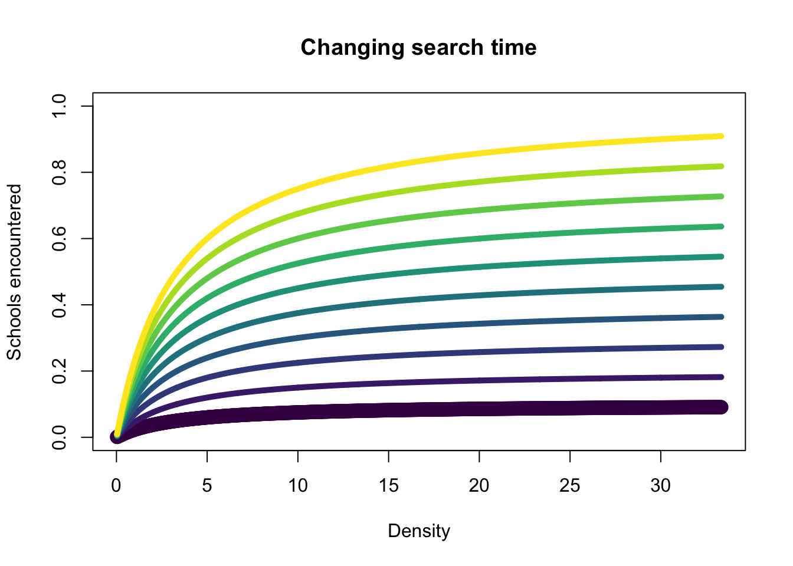

while changing $\tau_h$ similarly has an effect on the overall scale of the curve - where increasing $\tau_h$ reduces the number of schools encountered, because the predator partitions out time to handle prey. 


```r
a = 0.3 # search rate
tau_h = seq(0.1, 1, 0.1) # handling per unit time
tau_s = 1 # search per unit time
D = seq(1, 1e3, 1) / 30 # density
col = viridis::viridis(n = length(tau_h))
for(i in 1:length(tau_h)) {
  if(i == 1) plot(D, (a * tau_s * D) / (1 + (a * tau_h[i] * D)), lwd = 5, col = col[i], ylim = c(0,5),
                  xlab = "Density", ylab = "Schools encountered", main = "Changing handling time")
  else lines(D, (a * tau_s * D) / (1 + (a * tau_h[i] * D)), lwd = 5, col = col[i])
}
```

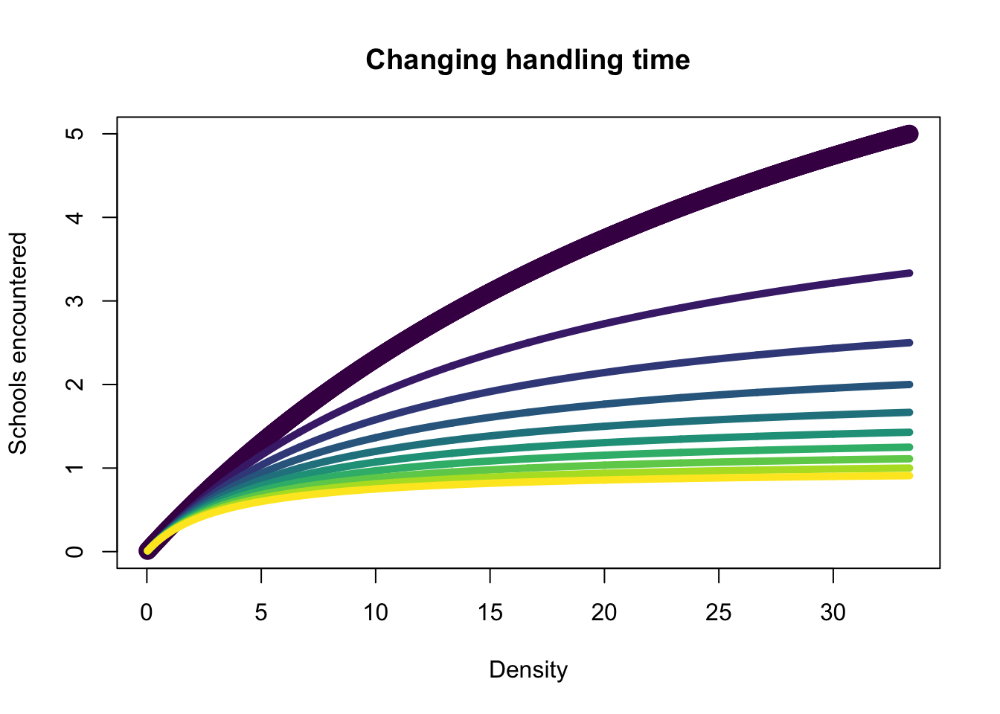


#### Line Transect Model (Schooling Populations)
Some other extensions of this model provided by the book uses line transect theory, where the total number of schools encountered is the ratio of effective area search and the total area occupied by the population, multiplied by the number of schools:

\begin{equation}
E(n_t) = \frac{2L_tc(S_t)}{A}N_t \\
c(S_t) = a + bln(S_t)
\end{equation}

where $n_t$ is the number of schools encountered, $L_t$ is the length of the search along a transect, $c(S_t)$ is the effective width of search along the transect, $S_t$ is the size of the school, and $N_t$ are the number of schools in the population. Presumably, the 2 refers to both sides of the transect? Regardless, this shows that the number of schools encountered is equal to the ratio of searched area and total area multiplied by the total schools. The effective width searched is then some function of the average size of the school. In this model, mortality is additionally included:

\begin{equation}
C_t = \overline{C}n_t
\end{equation}

where $\overline{C}$ can be assumed to be a fixed number of fish killed per school (i.e., for each school encountered, a fixed number is removed). Additionally, some other extensions could include a fixed proportion of the school:

\begin{equation}
C_t = p_cS_tn_t
\end{equation}

where $p_cS_t = \overline{C}$ and is a proportion of the average size of the school. Then, the number of individuals at each time is:

\begin{equation}
T{t+1} = T_t - C_t
\end{equation}

where $T$ is the total number of individuals. Fragmented schools can also be incorporated via $N_{t+1} = N_t + (x - 1)n_t$, where each school encountered breaks off into a constant number of schools. 

In an example where we have data for number of schools encountered, length of search, and catch from each encounter, then three CPUE measures can be used: 1) schools / length of search, 2) catch / length of search, and 3) catch / school encountered. The expected values of the CPUE measures can easily be derived using the aforementioned equations and rearrange them (see page 39). In general, these relationships (CPUE) show that CPUE is not directly proportional to the abundance of the schools or the average school size, and is often hard to interpret. In reality, you need information on encounter rates, fragmentation rates, school size, etc. to really understand what's going on with schooling population dynamics. Welp... we went through all these equations, just to find out that none of the CPUE measures above do a great job of describing the population... 

### Schooling Population Example (Vagaries of CPUE)

```r
N_1 = 100 # number of schools in pop
S_t = 10 # number of individuals per school
T_1 = N_1 * S_t # number of total individuals
A = 100 # total pop area
L_t = 10 # length searched
Cbar = 3 # number of individuals killed per school encountered
x = 2 # school fragment when encountered
a = b = 0.5 # c(St) relationship encounter parameters
cS_t = a + (b * log(S_t) )# effective area searched
t = seq(1, 5, 1) # time

# set up empty vectors
N_vec = vector() # total number of schools
T_vec = vector() # total individuals
n_vec = vector() # schools encountered
C_vec = vector() # catch 
nL = vector() # schools encountered / length searched
CL = vector() # catch / length searched
Cn = vector() # catch per number of schools encountered

for(i in 1:length(t)) {
  if(i == 1) {
    N_vec[i] = N_1 # total schools
    T_vec[i] = T_1 # total individuals
  } # time i = 1
  
  # population dynamics
  n_vec[i] = ((2 * L_t * cS_t) / A) * N_vec[i] # total number of schools encountered
  C_vec[i] = Cbar * n_vec[i] # total catch
  if(i < length(t))T_vec[i+1] = T_vec[i] - C_vec[i] # total abundance in the next year
  if(i < length(t))N_vec[i+1] = N_vec[i] + (x - 1) * n_vec[i] # update to the number of schools after fragmenting
  
  # cpue measures
  nL[i] = n_vec[i] / L_t
  CL[i] = C_vec[i] / L_t
  Cn[i] = C_vec[i] / n_vec[i]
}

# Relationships between Total Schools and Number of individuals
par(mfrow = c(1,1))
plot(N_vec, T_vec, type = "l", lwd = 5, xlab = "Total Schools", ylab = "Total Numbers" )
```


```r
# Relationships between CPUE and population vectors
par(mfrow = c(2,3))
plot(T_vec, nL, type = "l", lwd = 5, xlab = "Total Numbers", ylab = "Schools Encountered / Length searched" )
plot(T_vec, CL, type = "l", lwd = 5, xlab = "Total Numbers", ylab = "Catch / Length searched" )
plot(T_vec, Cn, type = "l", lwd = 5, xlab = "Total Numbers", ylab = "Catch / Schools Encountered" )
plot(N_vec, nL, type = "l", lwd = 5, xlab = "Total Schools", ylab = "Schools Encountered / Length searched" )
plot(N_vec, CL, type = "l", lwd = 5, xlab = "Total Schools", ylab = "Catch / Length searched" )
plot(N_vec, Cn, type = "l", lwd = 5, xlab = "Total Schools", ylab = "Catch / Schools Encountered" )
```


As you can see, an increase in the number of schools does not necessarily reflect an increase in the numbers (because of fragmentation). Catch / number of schools encountered, results in a constant CPUE, while an increase in encounters and catch / length searched reflects a lower population size, and an increase in the aforementioned CPUE measures leads to an increased number of schools detected (but the population size is reduced). So this is all to say its hard to figure out a good index for schooling populations, especially if fragmentation occurs. 


#### Effects of Catchability differing between individuals
Catchability can differ between individuals because of learned behaviors (avoidance), propensity to bite hooks, habitat preference of a cohort (e.g., the catchability of a large cohort might increase b/c they're everywhere, similar to AK sablefish). Nonetheless, during the initial period, the catchability of the cohort will be high, but after removing individuals with high catchability, the ones remaining in the population actually have low catchability. 

A possible model for describing the catchability processes above is described below and is conditional on catchability decreasing because of increased effort on the stock (i.e., quickly removing vulnerable individuals first). This can easily be implemented within an assessment model using penalized or state-space approaches: 

\begin{equation}
u(t,q) = 1 - exp(-qE_t) \\ 
\end{equation}

where $E_t$ is the effort expended and $u(t,q)$ is the probability of capture (basically the number of fish that died due to fishing because its just $qE_t = F$). Hence, the above equation is just our annual death fraction. Thus, the probability an individual survives is $P(survive|q) = exp(-qE_t)$, which is what we formerly termed as our annual survival fraction. 

To get the probability density of $q$ given that a fish survives, we need to multiply the probability that a fish survives $exp(-qE_t)$ by the density function of $q$ given that there is prior fishing, and integrate it to normalize:

\begin{equation}
f_t(q|fish survives) = \frac{e^{-qE_t}f_t(q|prior fishing)}{\int e^{-xE_t}f_t(x|prior fishing)dx}
\end{equation}

where the above is just Bayes theorem, and flipping the problem on its head, where we are now focusing on finding $f_t(q|fish survives)$. As an example, assume that $f_t(q|prior fishing) \sim N(Q_1, \sigma^2)$, which results in  $f_t(q|fish survives)$ also being normal because of the normal-normal conjugacy. However, using a normal will result in the cohort having a negative catchability. Nonetheless, changes in $Q_t$ are then modeled as:

\begin{equation}
Q_t = Q_1 - \sigma^2E_{t-1}^*
\end{equation}

where $E_{t-1}^*$ is cumulative effort. Given the above, the mean catchability will update and change and continually decrease at a rate proportional to the fishing effort is expended. 


```r
q_1 = 1 # catchability
E = seq(1, 7, 1) # effort expended
cumsum_E = cumsum(E) # cumulative sum of effort to update q
t = seq(1,length(E),1) # time index
sigma_2 = 0.05 # variance of normal
q_t = vector()

# Change in q over time for a cohort after increased expended total effort
par(mfrow = c(1,2))
for(i in t) q_t[i] = q_1 - sigma_2 * cumsum_E[i]
plot(t, q_t, xlab = "t", ylab = "q", main = "Change in q over time after expended effort", lwd = 5, type = "l")
  
# Change in the pdf of q after expended effort
col = viridis::viridis(n = length(q_t))
curve(dnorm(x, q_t[1], sigma_2), from=-1, to=1, col = col[i], lwd = 5, xlab = "q", ylab = "pdf", main = "Change in pdf of q")
for(i in 2:length(t)) curve(dnorm(x, q_t[i], sigma_2), from=-1, to=1, col = col[i], lwd = 5, xlab = "q", ylab = "pdf", add = TRUE)
```


An extension to this would be to use a gamma pdf instead, to ensure that catchability is always larger than 0, and is never negative:

\begin{equation}
Q_t = R/\lambda_t \\
V_t(q) = r/\lambda^2_t \\
\lambda_t = \lambda_{t-1} + E_{t-1}
\end{equation}

where q decreases as lambda increases (denominator gets bigger, but r remains constant). If we have asymptotic selectivity but q decreases over time by age, it can manifest in dome-shaped mortality patterns.

```r
lambda_1 = 1 # lambda to adjust q
q_1 = 1/lambda_1 # catchability
E = seq(1, 7, 1) # effort expended
t = seq(1,length(E),1) # time index
q_t = vector() # q vector
lambda_t = vector() # lambda vector

# initialize 
q_t[1] = q_1
lambda_t[1] = lambda_1
# loop through to calculate quantities
for(i in 2:length(t)) {
  lambda_t[i] = lambda_t[i - 1] + E[i-1]
  q_t[i] = 1/lambda_t[i] 
}

# gear selectivity
sel = 1 / (1 + exp(- 5 * (t - 1)))
par(mfrow = c(1,3))
plot(t, q_t, xlab = "t", ylab = "q", main = "Change in q over time after expended effort", lwd = 5, type = "l")
plot(t, sel, xlab = "t", ylab = "Selectivity", main = "Gear Selectivity", lwd = 5, type = "l")
plot(t, q_t * sel, xlab = "t", ylab = "q * Sel", main = "q * Gear Selectivity", lwd = 5, type = "l")
```

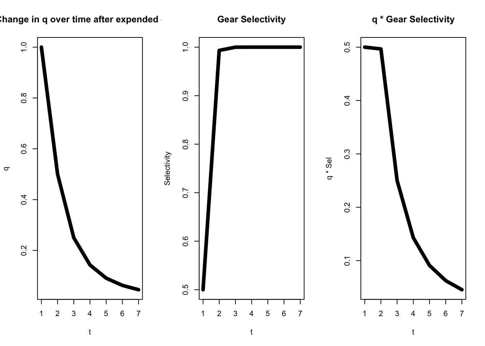

#### Stochastic Fishing Models
Catch rates for a given operation can be highly variable. In fisheries where a lot of vessels operate, the mean aggregate catch rate can be close to the true mean, by the central limit theorem. However, some exceptions exist, especially if vessels do not operate independently (sharing information, non-random sampling, preferential sampling, etc)

##### Purse-Seine Model
The purse seine model described in the book predicts catch by using a Markov process (transitions between searching and setting states), and time spent on as give state is a random variable where its distribution is conditional on the state. Setting on a school is governed by a binomial process and the waiting time in between setting is governed by a negative exponential (Laplace) (see page 43 for more details). Catch can then be predicted, conditional on search and set times.

#### Angling Gear Model
This is a similar extension to the purse-seine model but explicitly incorporates components about handling time, attack rates, and in the context of multi-species, incorporates competition/inhibition factors. These models can predict an index of abundance, although the interpretation can be difficult particularly in a multi-species context due to gear/hook competition. 

For example, the book gives an example where in a multi-species case (e.g., the AK longline survey), an increase in CPUE of one species over time might not be due to competition necessarily, but can be due to differences in handling time of the angler - i.e., more catch potentially if handling time is low (depth fished for a given species). Similarly, other species can impact the CPUE, where declines in CPUE of other species and increase the CPUE of a species. 

#### Longline Model
For a longline survey, the abundance can be nonlinearly related to CPUE, due to gear saturation and competition (inter and intra). Here, the model is similar to the angling gear model where multi-species generalizations can be incorporated. Additionally, components are incorporated to account for removed bait but non-captures. Three probabilities are incorporated: 1) probability a bait is taken, 2) probability species $i$ attacked a hook, and 3) probability that an attack leads to a fish getting hooked. This whole model is represented using multinomial probabilities of species-specific catch (pages 47 - 49). 

More generally, I think a lot of these factors can be incorporated without the use of such an invovled model. In particular, we can incorporated factors from other species in a linear model and standardize CPUE that way. 

## Chapter 2 (Stock Productivity and Surplus Production)
The main goal of determining stock productivity is to understand the surplus that can be harvested after accounting for recruitment, mortality, and growth. Here, the subsequent models described are simplistic and make a lot of assumptions - i.e., the stock is an aggregate of a population, and no direct accounting is made of growth, natural mortality, age, structure, recruitment, and species interactions (biomass dynamics models). The book establishes some notation below, which I'm not the biggest fan of, so I'll make my own simplifications:

\begin{equation}
B = NW \\
Y = CW 
\end{equation}

where $B$ is biomass, $N$ is numbers, $Y$ and $C$ are yield and catch, and $W$ is weight (average). The book defines latent productivity as the instantaneous biomass production when fishing is absent. Latent productivity is a function of biomass alone. Equations are provided below for latent productivity:

\begin{equation}
P^. = \frac{dP}{dt} = B^. = \frac{dB}{dt}
\end{equation}

where $P^.$ and $B^.$ are instantaneous rates of change for biomass and productivity. As described above, productvitiy is the same as changes in biomass production when fishing is absent. To further partition this out:

\begin{equation}
P^. = B^. = \frac{dB}{dt} = \frac{dP}{dt} = N\frac{dW}{dt} + \frac{dN}{dt}W
\end{equation}

where the change in biomass or latent productivity when no fishing is present is composed of $N\frac{dW}{dt}$ which represents the growth of the population, and $\frac{dN}{dt}W$ which represents the change in the population (i.e., due to recruitment or mortality). When fishing is present, the instataneous change in biomass is now called "net productivity" rather than latent productivity and is equal to the latent productivity subtracted by the yield:

\begin{equation}
\frac{dB}{dt} = \frac{dP}{dt} - \frac{dY}{dt}
\end{equation}

which shows that the change in biomass (net productivity in this case) increases when the latent productivity is larger than the yield. However, when yield is larger than the latent productivity, the net productivity of the population decreases. When biomass does not change, the population is in equilibrium (denoted with *). When a stock is in equilibrium a general relationship can be formulated by setting $\frac{dB}{dt} = B^. = 0$ (i.e., change in net productivity is at equilibrium), resulting in change in yield and latent productivity equalling each other, where: 

\begin{equation}
\int_0^{Y^*}dY  = \int_0^\tau P^.(B^*)dt \\
Y^* = P^.(B^*) \tau \\
\frac{Y^*}{\tau} =  P^.(B^*)
\end{equation}

where the last part of the equation tells us if our model is an annual time step, we can harvest the population at a rate of $\frac{Y^*}{\tau}$ to keep the population in equilibrium without driving the stock above or below its current level. Yield generally has the relationship of:

\begin{equation}
\frac{dY}{dt} = F_tB_t 
\end{equation}

where $F_t$ is the fishing mortality rate. The equilibrium yield can then be solved for by replacing $F_t$ with $F^*$ if biomass is at an equilibrium:

\begin{equation}
Y^*/\tau = F^*B^* \\
F^* = Y^*/\tau/B^* = P(B^*)/B^* \\
\end{equation}

if fishing mortality is $F = qE$, then we can also similarly solve for equilibrium effort. Thus, solving for these equilibrium quantities allows us to solve for effort or fishing mortality rates that would result in equilibrium yield - i.e., how much can we remove from the population without depleting it. These models also often have a carrying capacity parameter ($B_\infty$), where when no fishing occurs, it converges toward this value. 

### Graham-Schaefer Model
This model is our typical parabolic curve, where the midpoint is where our productivity is maximized. In general, we will use the Fletcher formulation of this:

\begin{equation}
P(B^.) = \frac{4m}{B_\infty} (1 -\frac{B}{B_\infty}) B 
\end{equation}

To solve for equilibrium conditions and solve for where maximum productivity occurs, we need to set this equation to 0:
\begin{equation}
P(B^.) = \frac{4m}{B_\infty} (1 -\frac{B}{B_\infty}) B = 0
\end{equation}

although the equation has two solutions, 1) when $B = 0$ and 2) when $B = B_\infty$ because of $(1 -\frac{B}{B_\infty})$. To understand the regions in which equilibrium occurs, i.e., where productivity does not change ($\frac{dP^.}{dB} = 0$). To understand where productivity is maximized, solve for:

\begin{equation}
\frac{dP^.}{dB} = \frac{4m}{B_\infty} - \frac{8mB}{B^2_\infty} = 0 \\
B_m = \frac{B_\infty}{2} 
\end{equation}

where $B_m$ is the biomass at which productivity is maximized and the population is at equilibrium. Maximum productivity of this stock can then be solved for by replacing $B_m$ into the Fletcher equation and yields $m$. 

When fishing occurs in the population, the change is biomass is then defined as:

\begin{equation}
\frac{dB}{dt} = \frac{4m}{B_\infty} (1 -\frac{B}{B_\infty}) B - F_tB
\end{equation}

and under equilibrium conditions, substituting $F^*$ into the above equation and setting the equation to 0, we find the relationship that equilibrium biomass is therefore $B^* = B_\infty - \frac{B^2_\infty }{4m}F^*$ where the equilibrium carrying capacity is simply adjusted by equilibrium fishing mortality (linear relationship) - i.e., it doesn't reach as large of a population size under conditions without fishing. 

The figure below shows the relationship between equilibrium F and biomass - i.e., adjusting the carrying capacity term down when fishing is present.


```r
m = 25 # maximum productivity
B_inf = 100 # K of biomass
eq_F = seq(0.01, 1, 0.1) # fishing mortality
B_star = B_inf - (B_inf^2/(4*m))*eq_F
plot(eq_F,B_star, xlab = "F", ylab = "B", lwd = 5, type = "l",
     main = "Relationship between equilibrium Biomass and F")
```

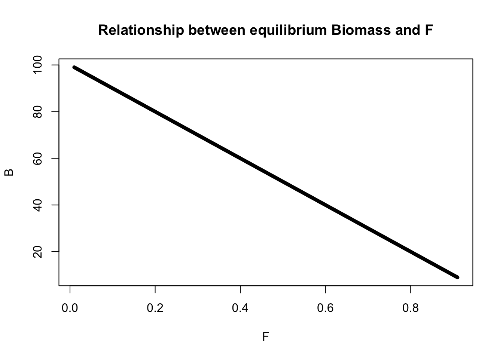

Equilibrium yield can simply be calculated by replacing $B$ with $B^*$:
\begin{equation}
Y^* = \frac{4m}{B_\infty} (1 -\frac{B^*}{B_\infty}) B^* \\
Y^* = F^*B^* = qE^*B^* \\
\end{equation}

To collate everything together, the points at which yield/productivity is maximized are:
\begin{equation}
B_m = B_\infty / 2 \\
F_m = 2m / B_\infty \\ 
E_m = 2m / qB_\infty 
\end{equation}

because of the relationship between yield and latent productivity $Y_m = P(B_m) = m$ and the relationship between yield, biomass, and fishing mortality where $Y = FB = qEB$

The figures below illustrates the behavior of equilibrium F, effort, yield, and biomass. All these relationships are parabolic and the maximum productivity occurs in the middle of the curve. Note that these are not rates of change.


```r
m = 25 # maximum productivity
B_inf = 100 # K of biomass
B = seq(0, 100) # sequence of B
q = 0.03 # catchability (for effort paramterization)
eq_F = seq(0.01, 4*m/B_inf, length.out = length(B)) # fishing mortality
eq_E = eq_F / q # equilibrium effort
Yield = (((4 * m )/ B_inf )* (1 - (B / B_inf)) * B) # yield 
Yield_wF = B_inf * eq_F - ((B_inf^2) / (4*m)) * eq_F^2 # yield with F
Yield_wE = B_inf * q*eq_E - ((B_inf^2) / (4*m)) * (q*eq_E)^2 # yield with effort

par(mfrow = c(1,3))
plot(B, Yield, type = "l", lwd = 5, xlab = "Biomass", main = "Equilibrium Biomass and Yield")
abline(v = B_inf/2, col = "blue", lwd = 5, lty = 2)

plot(eq_F, Yield_wF, xlab = "F", main = "Equilibrium F and Yield", type = "l", lwd = 5)
abline(v = 2*m/B_inf, col = "blue", lwd = 5, lty = 2)

plot(eq_E, Yield_wE, xlab = "Effort", main = "Equilibrium Effort and Yield", type = "l", lwd = 5)
abline(v = (2*m)/(q*B_inf), col = "blue", lwd = 5, lty = 2)
```


To get the time-dependent version of the biomass dynamics model, we would simply integrate over $\frac{4m}{B_\infty} (1 -\frac{B}{B_\infty}) B$ with a constant F (as in solutions to logistic law). This basically yields an equation for a sigmoidal curve:

\begin{equation}
B_t = \frac{B^*}{1 + \frac{B^*-B_0}{B_0}exp(-(4m/B_\infty-F^*)t)}
\end{equation}

and $B^*$ gets adjusted by equilibrium F, such that the maximum scale of the population changes. Additionally, when the biomass is below $B_\infty$, the population will increase rapidly, if B = $B_\infty$, the population is stable, and when $B > B_\infty$, the population decreases exponentially. Below is a figure showing the response of biomass when equilibrium F changes. 


```r
m = 25 # maximum productivity
B_inf = 100 # K of biomass
B0 = 30 # virgin biomass
eq_F = seq(0.01, 1.5, 0.1) # fishing mortality
B_star = B_inf - (B_inf^2/(4*m))*eq_F # change in biomass according to equilibrium F
t = seq(0, 30, 1) # time
col = viridis::viridis(n = length(eq_F))

for(i in 1:length(eq_F)) {
  if(i == 1) plot(t, B_star[i] / (1 + ((B_star[i] - B0) / B0) * exp(-(((4*m)/B_inf) - eq_F[i])*t)), 
                  type = "l", ylim = c(0, 100), xlab = "Time", ylab = "Biomass", col = col[i], lwd = 5)
  else lines(t, B_star[i] / (1 + ((B_star[i] - B0) / B0) * exp(-(((4*m)/B_inf) - eq_F[i])*t)), 
                  type = "l", ylim = c(0, 100), xlab = "Time", ylab = "Biomass", col = col[i], lwd = 5)
}
```

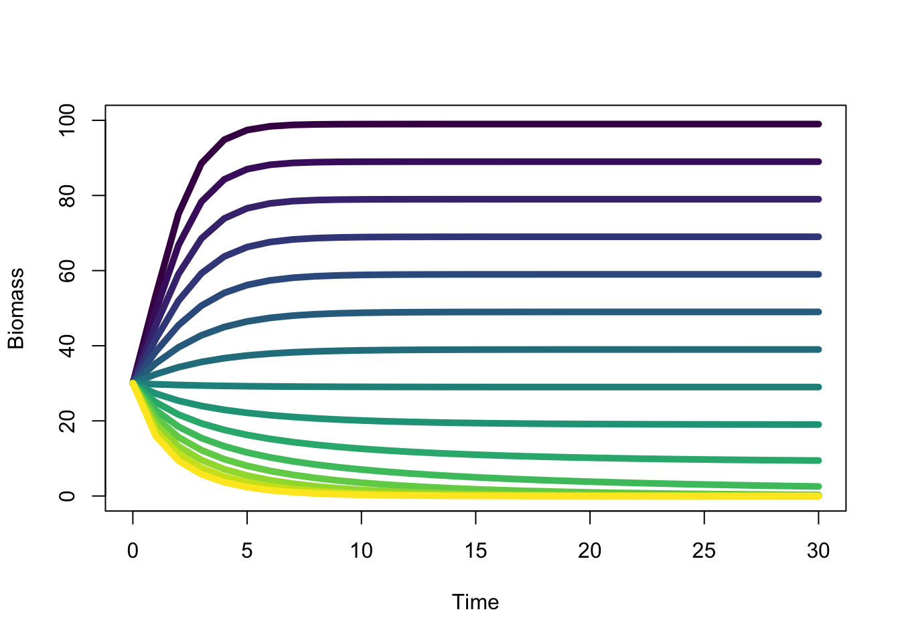

The biomass decreases exponentially when $B_0 > B^*$, increases sigmoidally when $B_0 < B^*$, and remains constant when both are equal. If F exceeds $4m/B_\infty$, then the stock is driven to extinction because the rate of decrease surpasses the rate of increase. 

Yield is calculated similarly by integrating over its relationship $dY/dt = FB$ (see equation 2.10 in book), where equilibrium yield increases with increased equilibrium F in a similar fashion (i.e., following logistic growth patterns). In general, all of these equilibrium calculations can lead to new equilibrium being defined, and your reference points can change - especially in the situation where you have time-varying productivity parameters.

### Pella-Tomlinson Model
The Graham-Schaefer model is not flexible and is critcized because maximum sustainable yiled always occurs at the middle of the parabolic curve, and is a symmetric relationship. However, these yield curves might not be symmetric and may shift left or right. The Pella-Tomlinson model introduces a new parameter $n$ that can shift this curve left or right. Fletcher reformulated this to make it more interpretable as:

\begin{equation}
\frac{dP}{dt} = \gamma m (\frac{B}{B_\infty}) - \gamma m (\frac{B}{B_\infty})^n \\
\gamma = \frac{n^{\frac{n}{n-1}}}{n-1}
\end{equation}

where $\gamma$ is positive when $n > 1$ and is negative when $0 < n < 1$. When $n < 1$, the curve is more right skewed, whereas when $n > 1$, the curve is more left skewed. 


```r
n = c(0.1, 0.2, 0.5, 0.9, 1.5 , 3, 4) # n parameter to shift curve
B_inf = 100 # b inf
m = 25 # max prod
gamma = (n^(n/(n-1))) / (n-1) # gamma parameter
B = seq(1, 100) # biomass
col = viridis::viridis(n = length(gamma))
for(i in 1:length(col)) {
  if(i == 1) plot(B , gamma[i] * m *(B/B_inf) - (gamma[i] * m *(B/B_inf)^n[i]), type = "l", col = col[i], lwd = 5,
                  ylab = "dP/dt", main = "Change in latent productivity")
  else lines(B , gamma[i] * m *(B/B_inf) - (gamma[i] * m *(B/B_inf)^n[i]), type = "l", col = col[i], lwd = 5,)
}
```


When fishing is present, it no longer is expressed as latent productivity, but is instead expressed as net productivity (i.e., $B = P(B) - Y$) where:

\begin{equation}
\frac{dB}{dt} = [\frac{\gamma m}{B_\infty} - F_t]B - (\frac{\gamma m }{B^n_\infty})B^n \\
\end{equation}

and equilibrium biomass is calculated as:

\begin{equation}
B^* = B_\infty (1 - \frac{B_\infty}{\gamma m}F^*)^{1/(n-1)}\\
\end{equation}

Given that $F^*$ is incorporated in something that is raised to the power, the relationship between equilibrium biomass and fishing mortality is no longer linear, unlike the Graham-Schaefer model.


```r
m = 25 # maximum productivity
B_inf = 100 # K of biomass
eq_F = seq(0.01, 0.75, 0.05) # fishing mortality
n = c(0.1, 0.2, 0.5, 0.9, 1.5 , 3, 4) # n parameter to shift curve
gamma = (n^(n/(n-1))) / (n-1) # gamma parameter

col = viridis::viridis(n = length(gamma))
for(i in 1:length(col)) {
  if(i == 1) plot(eq_F , B_inf * (1 - (B_inf/(gamma[i]*m))*eq_F)^(1/(n[i]-1)), type = "l", col = col[i], lwd = 5,
                  xlab = "F", ylab = "B", main = "Change in equilibrium biomass")
  else lines(eq_F , B_inf * (1 - (B_inf/(gamma[i]*m))*eq_F)^(1/(n[i]-1)), type = "l", col = col[i], lwd = 5,)
}
```


Equilibrium yield is obtained similarly, and is very analgous to calculations from the Graham Schaefer curves:
\begin{equation}
Y^* = F^*B_\infty (1 - \frac{B_\infty}{\gamma m}F^*)^{1/(n-1)}\\
\end{equation}


```r
m = 25 # maximum productivity
B_inf = 100 # K of biomass
eq_F = seq(0.01, 5, 0.05) # fishing mortality
n = c(0.1, 0.2, 0.5, 0.7 , 1.75) # n parameter to shift curve
gamma = (n^(n/(n-1))) / (n-1) # gamma parameter

col = viridis::viridis(n = length(gamma))
par(mfrow = c(1,2))
for(i in 1:length(col)) {
  if(i == 1) plot(eq_F , eq_F * B_inf * (1 - (B_inf/(gamma[i]*m))*eq_F)^(1/(n[i]-1)), type = "l", col = col[i], lwd = 5,
                  xlab = "F", ylab = "Yield", main = "Change in equilibrium yield")
  else lines(eq_F , eq_F * B_inf * (1 - (B_inf/(gamma[i]*m))*eq_F)^(1/(n[i]-1)), type = "l", col = col[i], lwd = 5,)
  abline(v = ((n[i]-1)/n[i] )* ((gamma[i] * m) / B_inf), col = col[i], lty = 2, lwd = 3) # fmsy
}

n = seq(0.1, 5, 0.2) # n parameter to shift curve
gamma = (n^(n/(n-1))) / (n-1) # gamma parameter
plot(n, ((n-1)/n )* ((gamma * m) / B_inf), type = "l", xlab = "n", ylab = "Fmsy",
     main = "Fmsy ~ n", lwd = 5)
```

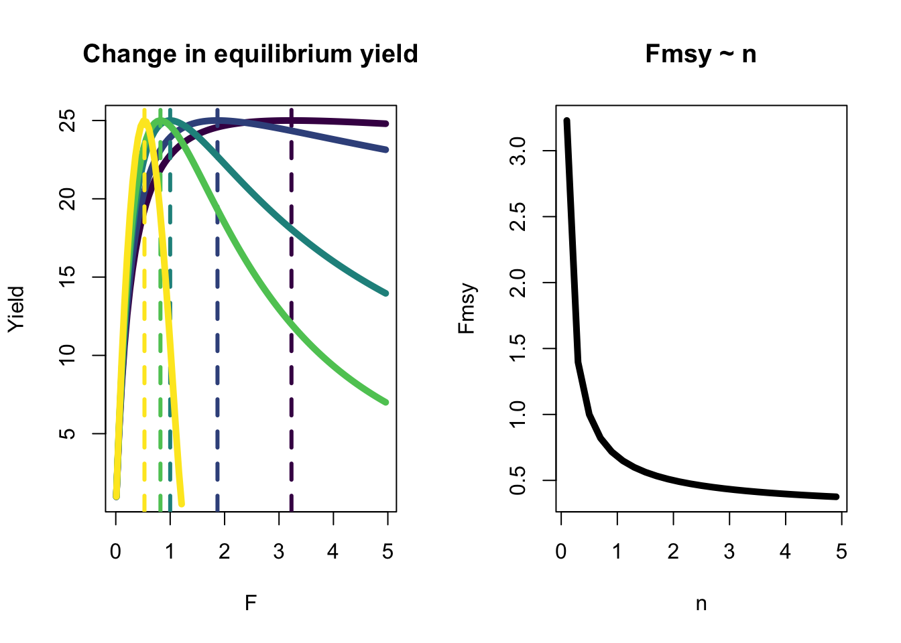

As you can see in the figure above, the stocks with low $n$ (purple lines) can sustain high F across a broad range, and are super productive over a broad range (i.e., high steepness) even when biomass is low, whereas the stocks with high $n$ (yellow lines) can only sustain a narrow range of exploitation, and generally are less resilient (lower steepness). MSY for F is higher for stocks with low $n$ and low for stocks with high $n$, which declines exponentially. Time-dependent formulations can be found by integrating equations for $B^. or \frac{dB}{dt}$ (also see equations 2.18 and 2.19).

To collate everything together, the points at which yield/productivity is maximized are:
\begin{equation}
B_m = n^{1/(1-n)}B_\infty \\
F_m = (n-1/n) (\gamma m / B_\infty )\\ 
E_m = (n-1/n) (\gamma m / qB_\infty) \\ 
\end{equation}

for $B_m$, that is found by setting the productivity equation for the Pella-Tomlinson to 0 and solving the derivative, and the subsequent equations for F and E are found by substituting $B_m$ into $F_m = m / B_m$ and $E_m = F_m /q$ using the general equations $dY/dt = F_tB_t$ and $F_t = qE_t$. 

Note that for all of the aforementioned equations, MSY in yield occurs at maximum productivity (under fishing conditions in this case):

\begin{equation}
Y_m = P(B_m) = m
\end{equation}

so that maximizing yield is equivalent to maximizing productivity (eq. 2.5, page 53).

### Gompertz-Fox Model
The Gompertz-Fox model is a special case of the Pella-Tomlinson in that it approximates the PT model when n converges to 1. The Gompertz model is also controlled by 2 parameters but with a different shape than the GS model:

\begin{equation}
\frac{dP}{dt} = -em \frac{B}{B_\infty} ln(\frac{B}{B_\infty})
\end{equation}

Similarly, maximum productivity occurs at $m$, which can be found by setting $\frac{dP}{dt}$ wrt $B$ to 0. Here, maximum productivity occurs at around $0.368B_\infty = B_\infty/e$. Unfortunately, given that its a fixed value and is unable to change (i.e., fixed proportion of carrying capacity), this model is just as inflexible as the GS model. Intuitively, the change in productivity when fishing is present is simply: 

\begin{equation}
\frac{dP}{dt} = -em \frac{B}{B_\infty} ln(\frac{B}{B_\infty}) - F_tB
\end{equation}

and equilibrium biomass under fishing occurs at:

\begin{equation}
B^* = B_\infty exp(\frac{-B_m}{m}F^*)
\end{equation}

where equilibrium biomass and equilibrium F is a decreasing exponential function (i.e., similar to the conditions in the PT model where n -> 1). 


```r
b_inf = 100 # k
m = 30 # max productivity
b_m = b_inf * 0.368 # msy
eq_F = seq(0.01, 1, 0.05) # equilibrium f
eq_B = b_inf * exp(-(b_m/m )* eq_F)

plot(eq_F, eq_B, lwd = 5, type = "l", xlab = "F", ylab = "B", 
     main = "Equilibrium Biomass ~ Equilibrium F (Fox model, PT model; n => 1)")
```

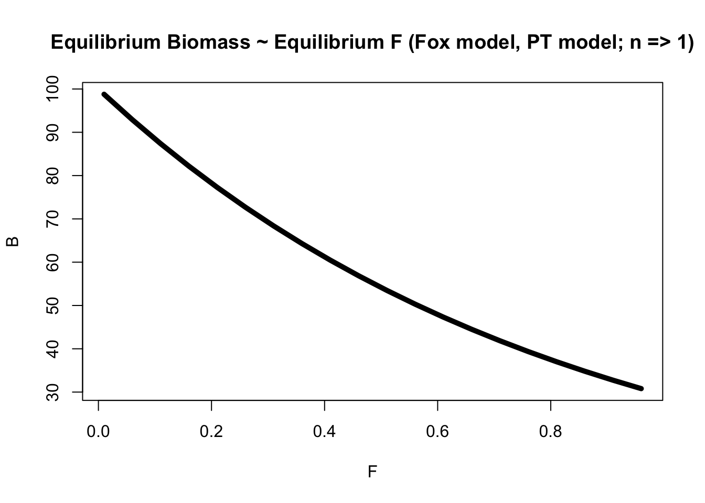

Equilibrium yield is obtained via $Y^* = F^*B^*$ and substituting the above equation into the yield equation:

\begin{equation}
Y^* = F^*B_\infty exp(\frac{-B_m}{m}F^*)
\end{equation}


```r
b_inf = 100 # k
m = 10 # max productivity
b_m = b_inf * 0.368 # msy
eq_F = seq(0.01, 1, 0.05) # equilibrium f
eq_B = b_inf * exp(-(b_m/m )* eq_F) # equilibrium biomass
eq_Y = eq_F * eq_B # equilibrium yield 
par(mfrow = c(1,2))
plot(eq_B, eq_Y, lwd = 5, type = "l", xlab = "B", ylab = "Y", main = "Equilbrium Yield ~ Equilibrium Biomass")
plot(eq_F, eq_Y, lwd = 5, type = "l", xlab = "F", ylab = "Y", main = "Equilbrium F ~ Equilibrium Biomass")
```

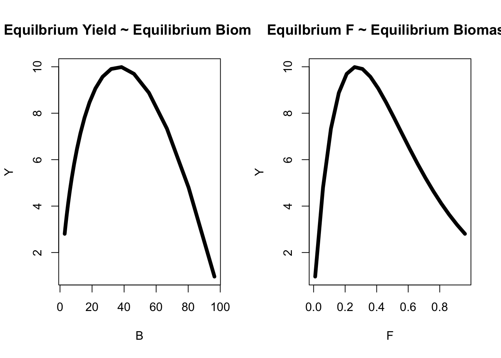

I'm not going to write down the time-dependent equations, but those can be found in page 62 (although working with the difference equations are much easier).

### Fletcher Quadratic Model
The Fletcher Quadratic model expands the GS model by adding rotation terms. This avoids complications because the exponent in the PT model can be indeterminate. The rotation terms that are added allow the parabolic productivity curves to be rotated to new axes, and can resemble the PT model (eq. 2.28). 


### Threshold Models
In many fish stocks, productivity at low levels are even more reduced compared to the equilibrium methods, and many of these stocks cannot recover even when F is reduced. This suggests that there is a threshold of biomass below which the stock cannot recover. This threshold occurs in these surplus production models, when latent productivity is 0 or negative. For our surplus production models, this can easily be incorporated by adding an additional parameter in the latent productivity equations. For the GS model, this would be:

\begin{equation}
\frac{dP}{dt} = \frac{4m}{(B_\infty - T)} (B-T) - \frac{4m}{(B_\infty - T)^2} (B-T)^2
\end{equation}

where $T$ is the additional parameter where the lower biomass level occurs, resulting in 0 latent productivity. This basically shifts the parabola to the right so that productivity is 0 at T.

To incorporate fishing into the equation, simply set $Y = F(B-T)$ when $B >= T$ and 0 when $B < T$. These points for threshold models are illustrated above. In practical applications, I have a hard time imaging the estimability of these models, given that we might not have adequate data to inform the threshold parameter (could be wrong). 


```r
m = 25 # max productivity 
b_inf = 100 # binf
t = seq(0,50, 10) # threshold
b = seq(1, 100, 1) # biomass

col = viridis::viridis(n = length(t))
for(i in 1:length(t)) {
  P = (((4*m) / (b_inf - t[i])) * (b-t[i]) ) - (((4*m) / (b_inf - t[i])^2) * (b-t[i])^2 ) # productivity
  if(i == 1) plot(b, P, type = "l", lwd = 5, col = col[i], xlab = "B", ylab = "P", ylim = c(-25, 25), main = "Latent Productivity (GS Model) at different thresholds")
  else lines(b, P, type = "l", lwd = 5, col = col[i])
}
abline(h = 0, lty = 2, lwd = 3)
```


### Models with environmental variables
One constant criticism of these models is that productivity and carrying capacity are constant, when in reality, these can vary over time due to environmental fluctuations. Here equilibrium conditions are functions of the environment (i.e., new equilibrium at each environmental regime/condition). Similarly, the MSY is also a function of environmental conditions. See equations in section 2.1.6 (page 66), although in general, I think this could be done by adding "process error into a parameter and conditioning on an environmental variable". 

### Parameter estimation
To determine the equilibrium relationships between stock and production, several time periods in which things are at equilibrium need to be observed. For example, it would be helpful for estimation procedures if we observed periods of low stock sizes with without fishing, and periods of high stock sizes without fishing to adequately determine $m$ and $B_\infty$. 

If a time series of yield and effort are available, we can generally use surplus production models to figure out what the population sizes are. So if we have CPUE data, we can use these methods to reconstruct abundance, as we can assume $Y = FB$ and $F = qE$, so $Y = qeB$. An analytical solution (eq. 2.37) can be derived if you make some assumptions for $B_\infty$ if data are available from the onset of the fishery. 

### Annual Surplus Production
To calculate annual surplus production, it doesn't really matter what model you use as long as you can estimate the latent productivity of the stock and have some information on yield. In this case, we can use the equations defined above $\frac{dB}{dt} = \frac{dP}{dt} - \frac{dY}{dt}$ and rearrange it as:

\begin{equation}
\frac{dY}{dt} = \frac{dP}{dt} - \frac{dB}{dt} \\
\int_0^{Y_t} dY = \int_t^{t+1} P(B_t)dt - \int_B^{B+1} dB \\
Y = \int_t^{t+1} P(B_t)dt - B_{t+1} - B_t \\
ASP_t = \int_t^{t+1} P(B_t)dt \\
ASP_t = Y_t + B_{t+1} - B_t
\end{equation}

Thus, annual surplus production is the sum of yield and the change in biomass from the previous year. Note that your annual surplus production can actually be negative. In particular, if you population is above carrying capacity, then your surplus production is going to be negative. 

As noted, ASP can generally be obtained if we have yield and biomass information. Yield information is easy to get, but biomass might not be known. Instead, we can use CPUE data and estimate $q$ to obtain biomass information: $C/E/q = B$.

### Relationship between surplus production and biomass
For the GS model, ASP can be estimated as:

\begin{equation}
ASP_t = \frac{4m}{B_\infty}B_t - \frac{4m}{B^2_\infty}B^2_t + \epsilon_t
\end{equation}

which basically just results in a linear regression relationship that has a parabolic relationship with biomass. You can estimate this as:

\begin{equation}
y = \alpha x_1 + \beta x_2 + \epsilon
\end{equation}

and then rearrange the $\alpha$ and $\beta$ terms to derive management quantities. However, measurement errors are an issue when using these biomass quantities (likely can be alleviated in a state-space approach by partitioning out measurement error and process error). Other rearrangements and formulations can be found in page 69. For ASP for other surplus production formulations, a similar procedure is done where the equilibrium yield equations can be used to derive surplus production, because the population is in equilibrium when yield and productivity are equal. 

For the PT model, estimating the $n$ parameter is quite difficult because the likelihood surface is quite flat and likely not adequate data in estimating the parameter in many cases. In this section, the book goes on to provide equations for reformulating the surplus production equations as a linear model, although given computational tools now, it likely is not necessary for us to use these formulations (i.e., estimate using non-linear optimization methods). 


### Recruiment Adjustment in Surplus Production models (Ricker Model Example)
In these SP models, recruitment is not explicitly accounted for. As in other models, recruitment should be linked to the previous year's biomass. This can be modelled using functional forms like the Ricker:

\begin{equation}
R_t = S_{t-1}exp(\alpha -\beta S_{t-1}) \\
R_t / S_{t-1} = exp(\alpha -\beta S_{t-1}) \\
log(R_t / S_{t-1}) = \alpha -\beta S_{t-1}
\end{equation}

where both $\alpha$ and $\beta$ are larger than 0. To estimate annual surplus production as recruitment, we need to adjust the surplus production relationship as:

\begin{equation}
log(ASP_t / B{t-1}) = \alpha -\beta B_{t-1} + \epsilon_t
\end{equation}

where we simply need to replace $R_t$ with the estimated relationship of $ASP_t$ from equations above. However, for the Ricker model, there is no estimate for $B_\infty$ because recruitment converges to 0 and spawning biomass gets large. 

### Relation ship between Annual Surplus Production and Fishing Effort
Unlike the relationship with biomass, a simple derivation does not exist for fishing effort. However, some ad-hoc methods for developing these relationships exist (see page 72), where: 

\begin{equation}
ASP_t = U_\infty E_t - \frac{U^2_\infty}{4m}E^2_t + \epsilon_t
\end{equation}

and $U_\infty = qB_\infty = C/E$. This relationship can be estimated using a multiple linear regression relationship. In general, we are just re-using the relationships derived above, and replacing them with $C/E = qB_\infty$. 


### Schunte's Non-equilibrium Method
Schunte's method allows the estimation of production parameters ($m$ and $B_\infty$) and catchability, as well as process error $\epsilon_t$ to allow for non-equilibrium calculations:

\begin{equation}
dU = qdB = \frac{4m}{B_\infty}U - \frac{4m}{qB^2_\infty}U^2 - qE \\
dU \frac{1}{U} = \frac{4m}{B_\infty} - \frac{4m}{qB^2_\infty}U - qE \\
\int_{U_t}^{U_{t+1}} \frac{dU}{U} = \frac{4m}{B_\infty} - \frac{4m}{qB^2_\infty}U - qE dt \\ 
log(\frac{U_{t+1}}{U_t}) = \frac{4m}{B_\infty} - \frac{4m}{qB^2_\infty} \int_{t}^{t+1} U - qE dt \\ 
log(\frac{U_{t+1}}{U_t}) = \frac{4m}{B_\infty} - \frac{4m}{qB^2_\infty} U_{t+1} - U_{t} - q(E_{t+1} - E_t) \\ 
log(\frac{U_{t+1}}{U_t}) = \frac{4m}{B_\infty} - \frac{4m}{qB^2_\infty} \frac{U_t + U_{t+1}}{2} - q\frac{E_t + E_{t+1}}{2} + \epsilon_{t+1}\\ 
\end{equation}

where we'll turn the differences into averages for $U,E$, which results in a multiple linear regression relationship. Although like many other methods, this requires good contrast in data to adequately estimate the productivity parameters. Nonetheless, these equations allow us to deviate from the equilibrium assumptions imposed by all the SPMs described above, where we have some process error in our equation. Thus, changes in catch are not due to only density dependent effects of the population in response to fishing, but can also account for resiliency of the species to recover from fishing (i.e., not just density dependent effects impacting recovery, but also how long it takes the fish to mature and grow to large sizes). All to say, non-equilibrium methods should be used, because they better account for process error in the deterministic equation, where changes in biomass can be due to growth and maturity processes, as well as changes in M, etc.

### Difference Equations for Surplus Production
Difference equations here are way more intuitive and much easier to use. We can calculate changes in biomass using a GS model as: 

\begin{equation}
\frac{dB}{dt} = B_{t+1} - B_{t} = \frac{4m}{B_\infty}B_t - \frac{4m}{qB^2_\infty}B_t^2 - Y_t
\end{equation}

which we can then use to project the population forward and make predictions in biomass quantities. Using CPUE data and assuming that $Y_t = qE_tB_t$ and $C_t/E_t = qB_t$, we can use CPUE data to track changes in biomass as an index:

Nonetheless, there are several extensions of these models which change the relationship of yield, q, effort, and biomass. In general, Hilborn found that you need good contrast in your effort and CPUE data to obtain reliable estimates. Constant effort tended to allow for equilibrium yield conditions, while allowing for more variation in yield allows you to learn more about the system and better estimate parameters (seeing a wider range of scenarios for the model to learn from data). More extensions of non-equilibrium methods and difference equation formulations of surplus production models are out there (e.g., Kalman filter/state-space methods) and are briefly discussed in page 75 - 78.

### Synthesis
#### Relationship between Surplus Production, Recruitment, Growth and Natural Mortality
The GS model can be written as:

\begin{equation}
\frac{dB}{dt} =\frac{dP}{dt} - \frac{dY}{dt} = aB - bB^2 - FB
\end{equation}

where the latter part of the equation is just a linear model. Nonetheless, this shows us that $aB$ increases productivity, $B^2$ is regulation in density dependence, and $FB$ is a linear decrease as a function of fishing. Thus, latent productivity changes as a function of a density dependence effect given the quadratic nature, and changes as a function of a density independent effect when decremented by fishing mortality.

Changes in population sizes are due to recruitment $R$, growth $g$, natural mortality $M$ and yield $Y$, and a general model to describe these changes are implicit in all surplus production models, but can be generally described as:

\begin{equation}
\frac{dB}{dt} = \frac{dR}{dt} + \frac{dG}{dt} - \frac{dM}{dt} - \frac{dY}{dt}
\end{equation}

where recruitment, growth, and mortality are combined together and are generally expressed as functions of biomass to allow for density dependence in surplus production models, while density independent effects are due to fishing purely (or environmental if you include those). The general criticism with these models is that you can't parse out time-lags for an individual component of latent productivity (e.g., recruitment, mortality, or growth). The book doesn't discuss this, but it also ignores key components like selectivity and age-structure. 


Across all of the surplus production models, several key principles and patterns emerge:

1. $\frac{dB}{dt} = \frac{dP}{dt} - \frac{dY}{dt}$, where changes in biomass are equal to changes in latent productivity and changes in yield, resulting in a change in "net productivity", 

1. You can take annual surplus production as yield ($\frac{dP}{dt}$), to keep the population at an equilibrium, 

1. To find equilibrium conditions, we simply need to set the differential equations to 0 (e.g., $\frac{dB}{dt} = 0$),

1. To find equilibrium yield, biomass, or fishing mortality, we can use the equation $Y^* = F^*B^*$, solve for those quantities, and rearrange this equation around. I think we generally need to solve for $B^*$ by setting $\frac{dB}{dt} = 0$ first to easily derive the other quantities,

1. To solve for the biomass at which productivity is maximized, we generally need to set $\frac{dP^.}{dB} = 0$ with respect to $B$ to solve for $B_m$,

1. Maximum yield and productivity both occur at $m$ - solved for by replacing $B$ as $B_m$ in $\frac{dP}{dt}$ equations. 

1. Annual surplus production is the sum of yield and the change in biomass $ASP_t = Y_t + B_{t-1} - B_t$.

1. In general, equilibrium surplus production models assume no process or observation error and are problematic, because stocks are never at equilibrium, where catch = surplus production for that level of fishing effort, such that changes in catch are due to changes in density dependence to regulate the population back to an equilibrium. But this is almost never the case because changes in yield can be due to rapid changes in effort, which can lead to yield surpassing the point of maximum sustained yield. 
Using non-equilibrium methods (allowing for process error and observation error) is generally the most appropriate, especially if you have some measure of effort over time.

## Chapter 3 (Stock and Recruitment)
Modelling entries into the population remains a key process in fishery stock assessments, although there is still considerable debate as to whether recruitment is driven by SSB or driven by the environment. However, we know a priori that there should be upper limits in stock size due to food, competition, density depence, etc.

### Spawner Recruit Models
In general, the regeneration of a fish population follows as Eggs -> Larvae -> Juveniles -> Recruits (into the fishery) -> Spawners -> Eggs...

The simplest model to modelling entrants into the population (in the form of eggs) is to just assume some proportional relationship with no density dependence:

\begin{equation}
N_0 = fS
\end{equation}

where $f$ is just some constant value representing the average fecundity per spawner and $N_0$ denotes egg production. Recruitment into the fishery then is proportional to egg production as well:

\begin{equation}
R = lN_0
\end{equation}

where $l$ is the survival of eggs to recruits into the fishery. Given that these are all proportional relationships, recruits are therefore directly proportional to spawners in this model:

\begin{equation}
R = lN_0 = lfS = \alpha S
\end{equation}

where $\alpha$ is the combination of average fecundity per spawner and the survival of eggs. This is a density-independent relationship because the number of recruits you get per spawner are independent of the number of spawners you have (i.e., its a constant relationship). Given the above relationship which is density-independent, $\alpha$ therefore is also known as the density independent parameter. 


```r
alpha = 0.5 # net fec x survival
s = seq(1, 500, 1) # spawners
r = alpha * s # recruits

par(mfrow = c(1, 2))
plot(s, r, xlab = "Spawners", ylab = "Recruits", lwd = 5, type = "l", main = "Recruits ~ Spawners")
plot(s, r/s, xlab = "Spawners", ylab = "Recruits/Spawners", 
     lwd = 5, type = "l", main =  "Recruits/Spawners ~ Spawners")
```

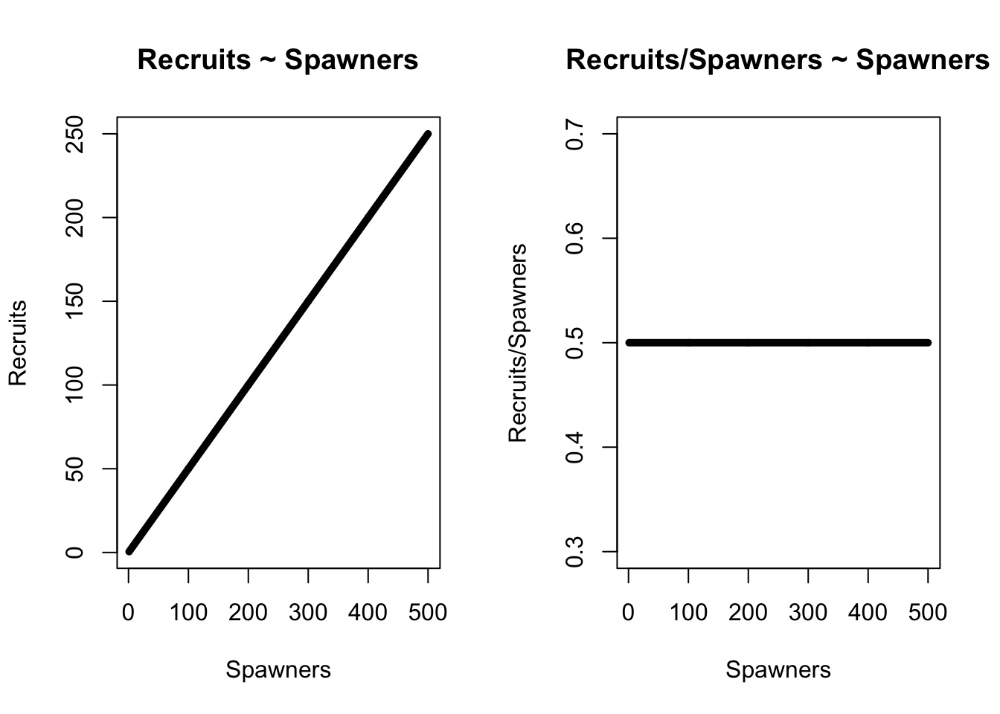


If the number of recruits is constant, say $R = 5$, then the above relationship says that:

\begin{equation}
5 = lN_0 \\
5/N_0 = l
\end{equation}

where $l$ is the net survival of eggs to recruits, and is dependent on the stock size. That is to say, if the number of recruits is constant, then there is a density-dependent effect of the number of eggs produced and the survival of eggs (inverse relationship). Thus, assuming constant recruitment (mean recruits) assumes that early life history is a density-dependent function of egg production (compenssatory process).


```r
R = 1 # constant recruitment (or mean recruitment)
N0 = seq(1, 5, 1)
l = 1 / N0 # survival of eggs
plot(N0,l, type = "l", lwd = 5, xlab = "N0", ylab = "Net survival of eggs to recruits (l)")
```

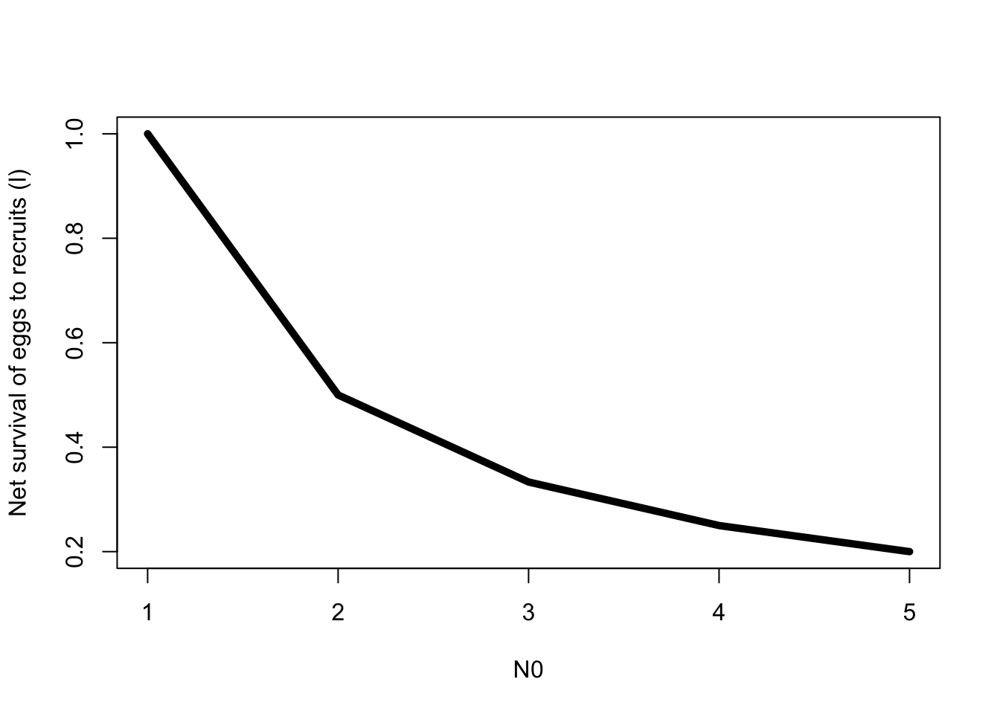

The above equation is one extreme where recruitment is proportional to SSB. However, the other end of the extreme is to model recruitment as a mean process governed by some pdf because its so highly variable and complex (like many stocks in AK), and thus is independent of SSB. But it fails to recognize limitations in recruitment at both low and high stock sizes, whereas density-independent recruitment recognizes limitations of recruitment at low stock sizes. Interestingly, some sort extensions can be done, where you can model a Markov process and allow recruitment to transition between high and low levels. 

### Beverton-Holt
Obviously, if density-dependent effects are present at some point, then assuming density-independent relationships is unacceptable (maybe disagree, we do the best with what we have given data availability). If we assume that recruitment is driven by both density-independent and dependent factors, we can formulate mortality for a given life-stage as:

\begin{equation}
Z_t = a_1 + b_1N
\end{equation}

where $a_1$ is a density-independent effect on mortality, and $b_1$ is a density-dependent effect of numbers at time $t$ on mortality. Reformulating this as a differential equation on changes in numbers at age, we get:

\begin{equation}
\frac{dN}{dt} = -Z_tN \\
\frac{dN}{dt} = -(a_1 + b_1N)N \\
\frac{dN}{dt} = -(a_1N + b_1N^2)
\end{equation}

which basically just gives the logistic growth equations but with negative parameters and $a_1N$ is the density independent effect where as $b_1N^2$ is the density dependent effect that has non-linear relationship with spawners. This results in:

\begin{equation}
R = \frac{N_0}{e^{a_1t} - \frac{b_1}{a_1}N_0 + \frac{b_1}{a_1}N_0e^{a_1t}} \\
R = \frac{S}{\alpha + \beta S} \\
R = \frac{\alpha S}{1 + \beta S}
\end{equation}

assuming that the number of eggs produced is proportional to the number of spawners $N_0 = fS = lfS$. Here, $\alpha$ is the density-independent parameter represent the number of recruits per spawner at lower spawning biomass which is proportional to fecundity given that $\alpha = lf$, while $\beta$ are density-dependent effects (includes fecundity as well). The BH is a monotonically increasing relationship with spawners and asymptotes at $\alpha / \beta$ (max recruitment). Additionally, your productivity (R/S) decreases exponentially with increasing spawners (i.e., the number of recruits you get as spawners increases declines). 


```r
a = 0.5 # alpha 
beta = 5 # beta
s = seq(1, 50, 1) # spawners
r = s / (a + beta*s) # recruits
max_rec = 1 / beta # maximum recruitment possible (conditioned on your density dependent factor)

par(mfrow = c(1,2))
plot(s, r, xlab = "Spawners", ylab = "Recruits", lwd = 5, type = "l")
abline(h = max_rec, lty = 2)
plot(s, r/s, xlab = "Spawners", ylab = "Recruits/Spawners", lwd = 5, type = "l")
```


### Ricker Model
In the BH model, R ~ SSB asymptotes. However, in the Ricker model, a dome-shaped relationship can be generated and similarly follows the differential equations above"

\begin{equation}
Z_t = a_1 + b_1S \\
\frac{dN}{dt} = -Z_tN \\
\frac{dN}{dt} = -(a_1 + b_1S)N \\
\frac{dN}{dN} = -(a_1 + b_1S) dt \\
\int_{N_0}^{N_t} \frac{dN}{N} = -(a_1 + b_1S) dt \\
N_t = N_0exp(-(a_1 + b_1S)t)
\end{equation}

assuming the following $N_0 = fS$, we can rewrite this as:

\begin{equation}
R = (fe^{-{a_1}t})(Se^{-{b_1}tS}) \\
R = \alpha Se^{-\beta S} = Se^{\alpha - \beta S}
\end{equation}

where a dome-shaped relationship occurs, and recruits decline to 0 as spawning biomass increases, because of a negative influence of spawners on the early life history (e.g., superimposition). 


```r
a = 0.5 # alpha 
beta = 0.3 # beta
s = seq(1, 15, 0.1) # spawners
r = a * s * exp(-beta * s)
max_rec = 1 / beta # maximum recruitment possible (conditioned on your density dependent factor)

par(mfrow = c(1,2))
plot(s, r, xlab = "Spawners", ylab = "Recruits", lwd = 5, type = "l")
abline(h = max_rec, lty = 2)
plot(s, r/s, xlab = "Spawners", ylab = "Recruits/Spawners", lwd = 5, type = "l")
```


### Ludwig-Walters Model
This model is most similar to the Ricker model and similarly shows domed-shaped characeteristics, which is parameterized as:

\begin{equation}
R = \alpha Sexp(-\beta S\gamma)
\end{equation}

### Environmental Variation
The Ricker model can be extended to incorporate environmental variation, where:

\begin{equation}
R = \alpha Se^{-\beta S + \gamma_1X_1 + ... \gamma_pX_p} 
\end{equation}

and the terms inside the exponential are simply a linear model. In this case, environmental variation is assumed to impact both density independent and dependent components of the model because it can be rewritten as:

\begin{equation}
R = \alpha Se^{-\beta S}e^{\gamma_1X_1 + ... \gamma_pX_p} \\
R = \alpha Se^{-\beta S}e^\epsilon
\end{equation}

where we are essentially modelling correlating process error terms with environmental impacts and encapsulating all of that into a process error term, if no environmental covariates are present. Alternatively, some other models can be formulated by incorporated process error into the spawners an allowing for an adjustment to yield "effective spawning biomass". This can also be done to adjust the effective recruits from the deterministic RS relationship and correct for the impacts of environment (e.g., $R^{adj} = Re^{\sum \gamma_iX_i}$). Other extensions include modelling these as a GAM and incoporating environmental effects as covariates. 


### Cushing Model
Note that for any SR relationship, any mathematical model can be used as lonhjg as it goes through the origin, increases monotonically at low spawning levels (i.e., linear increase), and has some level of density dependence. Cushing proposed the following model:

\begin{equation}
R = \alpha S^\gamma
\end{equation}

where $\gamma$ is an index of density-dependence and is different from 1. However, this model has a lot of limitations, and can increase to infinite recruitment when there is infinite biomass, with no peak recruitment occuring. However, there can be some density dependence as long as $\gamma < 1$.

### Deriso-Schunte Model
This is a three parameter model that combines BH and Ricker model formulations, and is derived using some theory from predator-prey models:

\begin{equation}
R = \alpha S (1 - \beta \gamma S)^{1/\gamma}
\end{equation}

where $\alpha$ is density-independence, $\beta$ is the optimality parameter, and $\gamma$ is the recruitment limitation or skewness. These models can represent BH or Ricker curves, depending on the value of $\gamma$, and can also repersent situations where recruitment is proprotional to SSB. The maximuim recruitment for this model occurs at different points depending on the value of $\gamma$ and can be found in page 95.


```r
alpha = 0.3 # prod par
beta = 0.5 # opt par
gamma = c(-1, 0.0001, -5e3) # skewness
s = seq(1, 10, 1)
par(mfrow = c(1,3))
plot(s, alpha * s * (1-beta*gamma[1]*s)^(1/gamma[1]), lwd = 5, type = "l", main = "Gamma = -1, BH", xlab = "S", ylab = "R")
plot(s, alpha * s * (1-beta*gamma[2]*s)^(1/gamma[2]), lwd = 5, type = "l", main = "Gamma ~= 0, Ricker", xlab = "S", ylab = "R")
plot(s, alpha * s * (1-beta*gamma[3]*s)^(1/gamma[3]), lwd = 5, type = "l", main = "Gamma ~= -Inf, Proportional", xlab = "S", ylab = "R")
```


### Shepherd Model
This model similarly has three parameters and combines the ideas of BH, Ricker, and Cushing models:

\begin{equation}
R = \frac{\alpha S }{1 + \beta S^\gamma}
\end{equation}

and is a special case of the Deriso-Schunte model ($\gamma = 1$; BH, $\gamma > 1$; Ricker, $\gamma < 1$; Proportional)

### Gamma Model
The gamma model generalizes the Ricker and the Cushing and is just based on an unnormalized (i.e., no normalizing constants) gamma function:

\begin{equation}
R = \alpha S^\gamma e^{- \beta S}
\end{equation}

but this model is unable to caputre BH dynamics, and is always going to have some sort of dome-shaped pattern. 

All to say, there are tons of parameterizations of SR relationships, but generally in stock assessments, we tend to use BH, Ricker, or mean recruitment to model these processes

### Biological Meaning of Parameters
If spawning stock is measured in terms of egg production, then $R/S$ represents early life-history survival and mortality. All of the recruitment models include components 

1. Compensatory Mortality: survival decreases with increasing spawning abundance, which can be represented as:

\begin{equation}
\frac{d(R/S)}{dS} < 0
\end{equation}

where your change in $R/S$ essentially decreases as function of spawning biomass. Another way to think of this is your survival increases with low spawning abundance (e.g., monotonically increasing at low S). Additionally, some models include a second component:

2. Overcompensation: the number of recruits decrease with increasing spawning biomass (e.g., Ricker), where:

\begin{equation}
\frac{dR}{dS} < 0
\end{equation}

So for the Beverton-Holt model, this model is purely compensation, where the number of recruits per spawners decreases, but the number of recruits you get for a given spawning biomass does not decrease. The Ricker model includes both compensation and overcompensation. The other component that some of these models contain is:

3. Depensatory Mortality: where the early survival rates of juveniles increases as a function of spawning biomass, where: 

\begin{equation}
\frac{d(R/S)}{dS} > 0
\end{equation}

where the productivity of your stock actually increases with increasing egg production/SSB. Another way to think of this is that your survival decreases with decreasing spawning abundance (recruitment overfishing). Expanding on this a bit, depenstation can occur if there is a predation rate that is constant, or decreases nonlinearly with decreasing recruitment (i.e., large number of fish are produced, but only a constant number of fish are predated on, resulting in more total fish surviving - e.g., predator-swamping). Another example would be fish schooling, because when prey group together, they're harder to find (not randomly or uniformly distributed). A similar concept is also what we term as:

4. Critical Depensation: where the SSB is so low, that recruitment fails to replenish the stock analagous to the ideas of recruitment overfishing. 

Of the models discussed, only the gamma model includes depensation, where R/S increases with increasing spawning biomass. 

The BH model can be extended to actually incorporate depensatory mortality by including the $\gamma$ term in it: 
\begin{equation}
R = \frac{\alpha S^\gamma}{1 + \beta S^\gamma} 
\end{equation}

However, depensation is often hard to detect in the natural world (although Furey et al. has a bunch of papers on how depensatory mortality can be caused by predator swamping).

### Parameter Estimation
Tradtionally, a lot of SR models are linearized and represented as linear regression models. For example, the BH spawner recruit model can be formulated as:

\begin{equation}
\frac{S}{R} = \alpha + \beta S \\
y = \alpha + \beta S + \epsilon
\end{equation}

which assumes that errors are independent, although you can also model errors following AR1 processes. You also assume $S$ is measured without error, although this is seldom true - but state-space models can overcome this:

\begin{equation}
\frac{S}{R} = \alpha + \beta S^{True} + \epsilon \\
S^{True} = S^{Obs} + \theta \\
\theta \sim N(0, \sigma)
\end{equation}

Failing to account for measurement errors will lead to biased CIs generated as well as estimates. Another consideration is that strong recruitments in some years, will lead to strong recruitments (because of increased SSB) in following years, and impact subsequent estimates of recruitment. This is particullarly peritent and can cause large biases if errors are autocorrelated (not independent). For a linear form of the Ricker model, it can be formulated as:

\begin{equation}
R = \alpha Se^{-\beta S} \\
\frac{R}{S} = \alpha e^{-\beta S}\\
log(\frac{R}{S}) = log(\alpha) -\beta S
\end{equation}

which becomes a linear regression equation. Here, we can use traditional hypotheses tests to figure out whether the descending limb of the Ricker is significant (i.e., $\beta > 0$). However, we need to be cautious about some of these approaches when testing for evidence of overcompensation and the correlations and significance values they generate because the independent variable is also in the dependent variable (some studies have shown that R/S can have about a -0.7 correlation with S, even when they are generated completly independently). Generally spekaing, including environmental covariates into these relationships just simply involves adding them in as new independent variables. Similar formulations of linear models can be recast for the other SR models discussed above. Generally speaking, once we get the alpha and beta parameter estimates from linear regression, we can then back-predict what the expected recruitment should be given a level of spawning biomass. 

For non-linear approaches and how to go about parameterizing, see pages 103 - 104. But in general, this is just the deterministic functions multipled or added by some process error. The only choice here really is to consider what the error structure of process error should look like.

### Measurement error models
Measurement errors are not a panacea because if you have large errors in your measurements, then its hard for the model to figure out what the underlying non-linear relationships should be. The book goes on to state that some approaches have been developed to account for both process and observation error, but the best approach still remains unknown. Given recent developments in state-space models and non-linear optimization methods, I would say the approach is to include both in your models. Back in the dark ages, we needed to know the ratio of process and measurement error to adequately use these approaches, and needed to be linearized and errors were normal (Kalman filter limitation)/ In general, measurement error and process error can be taken into account via (for a Ricker model):

\begin{equation}
R_t = \alpha S_te^{-\beta S_t} + e_t \\
S_t = S_t^{obs} + v_t \\
v_t \sim N(0, \sigma_v^2) \\
e_t \sim N(0, \sigma_e^2)
\end{equation}

Some other approaches of this can be generalized, by allowing both recruitment and spawning biomass to have measurement error.

### Autocorrelated errors
In general, our stock-recruit models do not have correlated errors. However, if the environment effects on these relationships are large, then subsequent observations of recruitment are correlated. This will result in observations of runs of good years and bad years, if environmental effects are strong. In general, allowing for autocorrelated errors can be done via:

\begin{equation}
R_t = F(S_{t-1})e^{\epsilon_t} \\
log(R_t) = log(F(S_{t-1}) + \epsilon_t \\
\epsilon_t = a_t + \phi_1 \epsilon_{t-1} ... \phi_p \epsilon_{t-p}
\end{equation}

which is basically just modelling the errors as an AR(p) process. Failing to account for these autocorrelations can result in large biases in estimates of recruitment (might be important for sablefish) potentially, given recent large cohorts. 

### Semelparous Populations
Some semelparous populations have a constant age of maturity (assumed for simplification), whereas iteroparous populations can have multiple ages contributing to reproduction. Nonetheless, recruits and spawners returning are easier to measure and can be summed across returning age classes to from a given brood year to get recruits, which allows us to easily find the point at which $S_msy$ should be defined, given equations of when peak recruitment occurs (from book). 

In terms of the time-trajectories of a behavior of a stock, pure compensation and pure depensation models allow spawners to converge monotonically towards carrying capcity, while critical depensation models has an unstable point where spawners = 0, in which the population goes to 0. For overcompensation models (Ricker), the population can display very random behavior, tending towards 0, reaching carrying capacity, or cycling around both points (see page 120 for a graphical example). Page 121 dives into details about when productivity is high, overcompensation models can give rise to very chaotic behavior/a limit cycle. 

When harvesting is present, the maximum harvest at equilibrium can be found by taking the derivative of $F(S)$ and solving it to equal to 1, which represents the largest vertical difference between the SR curve and the replacement line $R = S$. Thus, these are similar to our surplus production models for semelparous populations. Thus, for any stock recruit model for semelparous populations, the maximum sustained catch in equilibrium is $m = R_m - S_m$. Basically this says that if we harvest $m$, we still have enough recruits to replace spawners, and is the production of the stock if it wasn't harvested. Some equations are given in pages 122 - 123 to find analytical solutions of MSC. 


```r
a = 2 # alpha 
beta = 0.0000462 # beta
s = seq(1e3, 3e4, 50) # spawners
r = a * s * exp(-beta * s)
max_rec = 1 / beta # maximum recruitment possible (conditioned on your density dependent factor)

# Define ricker function
f <- function(s, a, beta) return(a * s * exp(-beta * s))

# Find the derivative of f(s) with respect to s
derivative <- Deriv::Deriv(expression(a * s * exp(-beta * s)), "s")

# Solve
solution <- uniroot(function(s) eval(derivative, envir = list(s = s, a = a, beta = beta)) - 1, interval = c(1e3, 3e4))

# The solution is in solution$root
s_value <- solution$root

par(mfrow = c(1,2))
plot(s, r, xlab = "Spawners", ylab = "Recruits", lwd = 3, type = "l", main = "Ricker Model w/ replacement line and point at MSC")
abline(0, 1, lty = 2) # replacement line
abline(v = s_value, lty = 2)
abline(r[which.min(abs(s - s_value))] - s[which.min(abs(s - s_value))], 1, lty = 2) # m = r - s
points(s[which.min(abs(s - s_value))], r[which.min(abs(s - s_value))], cex = 3, pch = 18, col = "red")
plot(s, r - s, type = "l", xlab = "Spawners", ylab = "m  = (R-S)", lwd = 3, main = "Point at which MSC occurs")
abline(v = s_value, lty = 2)
points(s[which.max(r-s)], max(r - s), cex = 3, pch = 18, col = "red")
abline(h = 0, lty = 2)
```


## Chapter 4 (Growth and Fecundity)
Growth of an organism is the combination of 2 processes:
1. Anabolism, which is the synthesis of proteins.,
1. Catabolism, which is the degradation of proteins.

Catabolism occurs in every living organism, where it breaks down cells and is therefore proportional to the mass and weight of an individual, while anabolism is the building up of body substances, and is proportional to the surface area of an individual (because its proportional to respiration).

### Weight Length Models
Growth is a three-dimensional process, with length, width, and depth of an individual changing over time. Generally, individuals do not shrink in length (although there are some examples I believe), and growth is generally limited by a species maximum size. 

Isometric growth is when the length, width, and depth of an individual change in proportion to each other. Here, the surface area of an organism is proportional to the square of a 1D measurement, and the volume is proportional to the cube of a 1D measurement. Thus, weight can be proportional to the cube of length. In general, we can write these models as:

\begin{equation}
W = \alpha L^3 \\
W = \alpha L^\beta
\end{equation}

where the latter equation (allometric growth) is used if fish growth does not fit an isometric relationship (i.e., the dimensions of weight, length, and depth do not grow proportionally to each other). The $\alpha$ parameter is also known as the condition factor because two fish with the same lengths, but with different weights can have a different $\alpha$, where the fish that weighs more (better condition) has a higher alpha, while $\beta$ measures curvature (larger $\beta$ = more curved).

When estimating these relationships, its necessary to choose the correct error structure. Assuming additive error suggests that variability in the relationship is a constant of length, while multiplicative error suggests variability increases as a function of length. Some strategies for estimating these relationships involve first fitting the allometric equation, testing whether $\beta$ is significantly different from 3, and if not, using the isometric equation and re-estimating this relationship.

### Length Age Model
The fundamental part of this model is that growth rates begin to decline as fishes get older. A simple differential equation can be formulated:

\begin{equation}
\frac{dL}{dt} = \omega - \kappa L, \omega > 0, \kappa > 0
\end{equation}

where an initial condition of $L(t_0) = L_0$ is imposed, $\omega$ is the growth rate at $t_0$, and the growth rate declines linearly as a function of length to 0 at $\omega / \kappa = L_\infty$. Given these conditions, we can substitute them back into our differential equation to yield:

\begin{equation}
\frac{dL}{dt} = \kappa L_\infty - \kappa L, \kappa > 0, L_\infty > 0 \\
\frac{dL}{dt} = \kappa (L_\infty - L) \\
dL / (L_\infty - L) = \kappa  dt \\
L = L_\infty [1 - e^{-\kappa (t - t_0)}]
\end{equation}

where $t_0$ is a theoretical age at which the individual is at length 0 and governs where the x-intercept is. Here $L_\infty$ is the asymptotic length and $\kappa$ is the curvature parameter (growth rate), which becomes more curved at larger numbers (steeper). $L_\infty$ and $\kappa$ are negatively correlated because increasing the asymptote decreases the curvature. This equation can also be recast into a difference equation:

\begin{equation}
L_{t + \tau} - L_t = (L_\infty - L_t)(1 - e^{-\kappa \tau})
\end{equation}


```r
L_inf = 100 # linfity
k = 0.1 # brody growth
t0 = -5 # theoretical age at length 0
a = seq(-5, 50, 1) # ages
L = L_inf * (1 - exp(-k * (a - t0))) # vonB
diffL = diff(L)
par(mfrow = c(1,2))
plot(a, L, xlab = "Age", ylab = "Length", lwd = 5, type = "l")
plot(L[-1], diffL, xlab = "L", ylab = "difference L", main = "Walford Plot (growth increments)", type = "l", lwd = 5)
```


#### Brody Model
The Brody model describes changes in size as sigmoidal, with two phases and is a 6 parameter model (see page 134 for equations). There are two sets of equations that are modeled, and the given equation modeled is determined by some critical age - i.e., transition to 2nd equation if we are at a particular age. Because this is 2 sets of equations, the derivatives at the two equations must be equal for this equation to be continuous (e.g., similar to a spline by joining the knots together). In general, we won't use this model, but its noted that if you have data from early and adult stages collected on different time scales or studies, it can be useful. 

#### Estimation
In general, we should be using nonlinear least squares to estimate these equations. The assumption of additive and multiplicative errors can simply be checked for by residual plots (e.g., fan shape additive errors = need to switch to multiplicative errors) Note that it could be problematic if you don't have good data observed for older ages and younger ages, given that the asymptotic parameter and the growth rate parameter are negatively correlated. You probably need well defined data at those points to effectively parse out those values. There are some other reparameterizations of the vonB out there, using the concept of expected-value parameterizations where some of the parameters are expected values of the dependent variable at some points of the independent variable - i.e., we can use independent variables to derive the expected values of parameters (page 139 for equations; Francis and the Schnute equations are commonly used in fisheries nowadays). This can help in some cases with estimation problems. 

### Weight Age Models
Growth in weight and age relationships typically grow the fastest at intermediate ages and often takes on a sigmoidal shape. If growth is past the inflection point for a given set of ages, we can reasonably model weight with a form of the LVB model (because LVB has no inflection point). In general, there are some formualtions of weight-age models that we can write as difference equations to represent growth increments:

\begin{equation}
W_{t+1} = W_t + \rho (W_t - W_{t-1})
\end{equation}

where we are just adding some increment to the previous weight, and $\rho$ is a constant such that growth increments decrease by a factor of $\rho$. However, these difference equation forms for modelling weight-age relationships are not really used, as they were used back in the day simply for mathematical convenience. 

#### Combining Weight-Length and Length-Age Models
A weight-age model can be simply constructed by combining the weight-length and length-age models, such that:

\begin{equation}
W_t = W[L_t] \\
W_t = [\alpha L_\infty (1 - e^{-\kappa(t-t_0)})]^\beta \\
W_\infty = (\alpha L_\infty)^\beta \\ 
W_t = W_\infty (1 - e^{-\kappa(t-t_0)})^\beta
\end{equation}

It can be proved using differential equations and derivatives that this model has an increasing function rising to an asymptote, a single maximum point, and an inflection point (unlike the difference equations), which leads to a sigmoidal curve. This is a 4 parameter model and can genearlly be used to adequately describe growth of many fishes. However, this leads to some model instability and is highly correlated in its parameters ($L_\infty, \kappa$, $t_0, \beta$). Commonly, what we do is fit the weight-length relationship outside this model, and fix the beta at the estimated value. We can also just simply fit weight-length and length-age relationships separately, and then combine the two models to get weight-age relationships. Interestingly, the book gives another approach of reparmeterizing this equation, basically where we end up modelling the response as $X_i = W^{1/\beta}$, but requires a fixed estimate of $\beta$. 


### Size-Age Model
Here, size-age models are generalized models where size can be either length, weight, width. This is helpful for modelling shellfish and organisms that don't have a pre-defined way of measuring length or weight. The initial section of the book here gives our traditional allometric growth model, and also presents a linear model for representing relationships between size-age relationships (i.e., polynomial models; allowing for power terms in the linear model).

#### Gompertz Growth Model
The Gompertz Growth Model is another sigmoidal growth model (can also be used to model population changes):

\begin{equation}
\frac{dY}{dt} = \lambda e^{-\kappa t}Y \\
\frac{dY}{Y} = \lambda e^{-\kappa t}dt \\
\int_{Y_0}^Y \frac{dY}{Y} = \int_0^t \lambda e^{-\kappa t}dt \\
Y = Y_\infty exp[-\frac{1}{\kappa}e^{-\kappa (t - t_0)}]
\end{equation}

where the first part of the equation says that changes in sizes declines exponentially as a function of age, and as t goes to infinity, Y reaches some asymptote. The inflection point here is only governed by $Y_\infty$ and thus is less flexible, relative to the LVB, which is determined by 2 parameters (the inflection).


```r
Y_inf = 1000 # asymptote
t_0 = -3 # t0
k = seq(0.1, 0.3, 0.1) # growth
t = seq(1, 100, 1) # time
col = viridis::viridis(n = length(k))
par(mfrow = c(1,2))
for(i in 1:length(k)) {
  Y = Y_inf * exp(-(1/k[i]) * exp(-k[i] * (t - t_0))) # gompertz model
  if(i == 1) plot(t, Y, type = "l", lwd = 5, 
                  xlab = "Time", ylab = "Size", main = "Gompertz", col = col[i])
  else lines(t, Y, type = "l", lwd = 5,col = col[i])
}

# plotting differential equation form
lambda = exp(k[1] * t_0) # repameterization of differential equation 
t = seq(1, 30, 1) # time
Y = Y_inf * exp(-(1/k[1]) * exp(-k[1] * (t - t_0))) # gompertz model
diffeq = lambda * exp(-lambda * t) * Y
plot(Y, diffeq, xlab = "Size", ylab = "Change in Size", main = "Diff Eq of Gompertz", type = "l", lwd = 5)
```


#### Other Size-Age Growth Models
Both the Richards and Schunte Models are able to capture multiple shapes, and can resemble the LVB model, the Gompertz Model, logistic models, isometric models, or allometric models. These models encapsulate more parameters and are more flexible, allowing for a wide range of shapes to take from, with more flexible inflection points in the growth model (see pages 148 - 150 for equations). Schunte's growth model has four solutions, all of which are paramterized differently. The book goes on to show a general algorithim for testing which growth model works/fits the data the best by significance tests (see Fig. 4.8 for representations of the Schunte Growth Model). The Schunte model is generally more stable because two of the parameters are expected value parameterizations and thus, is more stable than the 4 parameter LVB or the Richards model. 

#### Schunte-Richards Growth Model
This is a five-parameter model that can model growth, maturity, and survival. This model takes the form of:

\begin{equation}
Y_t = Y_\infty (1 + \delta e^{-\kappa t^\nu})^{1/\gamma}
\end{equation}

The book doesn't really give any details on the properties of the model, but goes on to note that its a special case of the LVB, Gompertz, and Schunte's original model. 


### Mark-Recapture Data
Two general approaches can be taken for analyzing growth data using mark-recapture data, which includes: 1) growth is related to elapsed time, or 2) age data are availiable.

#### Elapsed Time Models (no aging data)
If the vonB adequately describes growth processes and with an additive error structure, then we can describe growth with mark and recapture models with the following equation:

\begin{equation}
\delta Y_i = (Y_\infty - Y_{1i}) (1 - e^{-\kappa \delta t_i}) + \epsilon_i \\
Y_{2i} = Y_{1i}e^{-\kappa \delta t_i} + (Y_\infty - Y_{1i}) (1 - e^{-\kappa \delta t_i}) + \epsilon_i
\end{equation}

where $Y_{1i}$ is the length at first capture, and $\delta t_i$ is the time in between recaptures (time elapsed), while $\delta Y_i$ is the change in growth. So here, change in growth is modeled by a change in time in between recaptures. However, only two parameters can be estimated here and $t_0$ needs to be obtained elsewhere, although you can solve for it if you know the length-at-age for some ages. Some other derivations are given in page 156 for Schunte's Growth model. In general, some parameters are not estimable simply because there is no information on absolute ages. Some general assumptions here are that: 1) marking does not impact growth, and 2) growth parameters from age-size data are differently interpreted than for mark-recapture data given individual variation. Thus, caution is needed when comparing estimates from the two. For time-elapsed models in one year, it predicts growth one year later for an individual of a given size. For age-size models, it predicts growth one year later for an individual of a given age. In general, combining the two approaches together circumvents the interpretability problem (see sections below). Additionally, note that for some of the parameterizations of the Schunte Growth model, certain parameters need to be fixed given a lack of explicit information into the model about absolute ages (e.g., youngest age in the data, average length at youngest age, and the oldest age in the data). 

### Models with Aging Data
One approach would be to fit a size-age model, but the population during the two time periods could be completely different and the model would not be helpful in either case. Another approach would just be to model the marks and recaptured growth separately but you are not fully exploiting the available data - you get more information by using all data simultaneously. When you have age data, a potential approach would be to solve for a linear system of equations:

\begin{equation}
lnY_{1i} = ln\alpha_i + \beta_ilnt_{1i} \\
lnY_{2i} = ln\alpha_i + \beta_ilnt_{2i} \\
lnY_{2i} - lnY_{1i} = ln\alpha_i + \beta_ilnt_{2i} - ln\alpha_i + \beta_ilnt_{1i} \\
lnY_{2i} - lnY_{1i} = \beta_i(lnt_{2i} + \beta_ilnt_{1i}) \\
\beta_i = \frac{lnY_{2i} - lnY_{1i}}{lnt_{2i} + \beta_ilnt_{1i}} \\
ln\alpha_i = lnY_{1i} - \beta_ilnt_{1i}
\end{equation}

and an overall estiamte of each parameter can be obtained from some function of the individual $\alpha_i, \beta_i$, which can be done by say taking the median. In some cases, you might have two independent sets of information - one from mark-recapture, and the other from size-age data. A paper from Kirkwood combines both data sources and assumes a common constant parameter for all individuals in the population. Kirkwoods approach predicts age from size data, with a mark recapture component and a size-age component. This then combines two likelihood components (one from mark-recapture and one from the size-age data) to jointly estimate model parameters.

Some newer approaches for combining growth data and mark-recapture data is a modified version of the Laslett, Eveson, and Polacheck approach. Here, they use a flexible Richards Growth model for describing and fitting to size-age data, but can be extended to accomodate other functional forms as well:

\begin{equation}
L_a = L_\infty(1 + \frac{1}{p}e^{-\kappa(a - t_0)})^{-p}
\end{equation}

where $p$ is the shape parameter that controls the inflexion point of the curve. To fit tagging data, they extend the Richards growth model and fit to tag at release and recapture:

\begin{equation}
L_{1i} = L_\infty(1 + \frac{1}{p}e^{-\kappa(A_i - t_0)})^{-p} \\
L_{2i} = L_\infty(1 + \frac{1}{p}e^{-\kappa(A_i +\Delta t - t_0)})^{-p} \\
log(A_i) \sim N(log(\mu_{log(A_i)}, \sigma))
\end{equation}

where $L_{2i}$ and $L_{1i}$ are the lengths at recapture and release, respectively, $A_i$ is the age at release, which is unobserved, and $\Delta t$ is the time at liberty $t_2 - t_1$. Although tag data does not have information about $t_0$, this is informed by jointly estimating size-age data. Further, since the age at release is also not observed, we can model this is a latent random effect. Here, separately fitting the release and recapture lengths assumes that these components are independent. However, some other extensions to model this dependency are availiable and does so by allowing correlations between the two points. Given that correlations between two points will be large when the time at liberty is small, we can model correlations as a decreasing function of time at liberty (i.e., less correlation the further apart tag and recaptures are). 

### Comparison of Growth Models
Generally, two things need to compared for growth models: 1) the choice of the growth model, and 2) the error structure imposed upon the growth model. The other issue you need to take into account is differences in growth among sexes, areas, or other groupings. These considerations might necessitate analyzing the groupings separately. 

#### Choosing the best growth model
A priori, Schunte's growth model might be the most logical because it assumes linear relative growth acceleration (i.e., growth is linear relative to its given size). Other growth models are likely appropriate and residual diagnostics will probably be sufficient to tell you whether it adequately describes the growth data. Inspecting residuals will generally tell you whether or not the error structure imposed is appropriate. Lastly, parsimonious model structures should be chosen and we can use information criterion statistics to choose among a candidate set of models. Other approaches would be to use cross-validation methods to select models that best predict the data. 

Broadly, one-parameter and multi-parameter (using variance covariance matrices) can be conducted to test whether one should pool data across sexes or combine data. If statistical tests indicate that parameter estimates are significantly different among sexes or areas, then one should disaggregate data and analyze separately. This is helpful for determining if there is sex-structure in your model or if spatially-explicit approaches should be considered.

### Scale and Otolith Measurements
This section primarily uses annulus growth in any hard part (scale, otoliths, vertebrae) to determine fish growth. In general, these methods seek to use annulus growth and current size to back-calculate growth. One needs to determine the relationship between mean scale size and mean fish size. Francis developed two hypotheses for modelling fish growth with annulus information, which are scale proportional and body proportional. In scale proportional, if a fish has a scale that is larger than the average of a fish of that given size, then the scale would be bigger in general, but the ratio of length and scale size are constant between the two. The other hypothesis is body proportional where if a fish captured is larger than the average fish for a given scale size, then the ratio is constant as well, and its basically just the reverse of the scale proportional relationship (see page 181 and 182 for some equations on this).

### Variation in Growth
Growth in fish populations can vary greatly due to seasonal effects, environmental conditions, food availability, and subsequent metabolic demands. Other factors include genetic and/or cohort effects - similar to sablefish, and posited by Quinn and Deriso, growth might be slower for stronger-year classes given density dependent effects. 

#### Seasonal Growth
Broadly, seasonal growth can be incorporated into our traditional growth models with some sort of sinusoidal variation within the model. Age needs to be recorded in a fine scale and requires a lot of data. These models can take the form of:

\begin{equation}
Y_t = Y_\infty [1 - exp(-\kappa (t - t_0 - (\phi_t - phi_{t0})))] \\
phi_t = \frac{\delta \omega}{2 \pi} sin[(2\pi / \omega)(t - t_1)]
\end{equation}

where the $\phi$ function is the modelled sinuisoidal variation - $\frac{\delta \omega}{2 \pi}$ describes the amplitude of the sine curve. Basically, this allows for sinuisoidal variation in a given parametric form for growth. 


#### Individual Variation in Growth
If you have repeated measurements from individuals, then each individual is going to have its own individual-specific parameters describing growth. However, this is difficult to implement because these data are rarely collected, so we might need to fill in the gaps and make sure they are goverend by some statistical distribution (e.g., using random-effects):

\begin{equation}
Y_\infty \sim (\mu_\infty, \sigma_\infty) \\
\kappa \sim (\mu_\kappa, \sigma_\kappa) \\
Y_{t - t_0} = Y_\infty (1 = e^{-\kappa (t - t_0)})
\end{equation}

Anyways, these models are super complicated... and there are lot of derivations that I prefer to not write. Variations of individual variation in growth models can be extended to incorporate mark-recapture data as well. 


#### Stochastic Growth
The book goes on to describe how stochastic growth processes can be modelled as random effects, and explains how the size of a fish depends on all of its previous random effects. The difference equation it gives is as follows:

\begin{equation}
Y_t = \alpha + \rho Y_{t-1} + U_t \\
Y_t = Y_\infty (1 - exp(-\kappa)) + exp(-\kappa) Y_{t-1} + U_t \\
\end{equation}

which is basically just an AR1 process with expected values written as conditional distributions given the previous point. Some derivations on differential equations are given in page 194 - 197, but are a bit unwieldy to use and type here. 

### Fecundity and Maturity
Maturity can be modelled as either size or age-based, although they tend to need to be converted to age when using maturity in our typical age-structured stock assessments. This can be done by directly modelling ages or by using a size-age transition matrix and applying it to maturity at length. Nonetheless, maturity is generally thought to be better related to size because changes in growth tends to influence maturity.


#### Maturity
The book gives us a simple model for maturity - denoted as the ramp model, where maturity increases as a ramp - it's 0 at some age or length range, ramps up linearly at some age range, and remains at 1 at some age range. Typically, we use the logistic function to model maturity instead, with the parameters describing the size or age at 50% maturity, and the steepness of that curve. Additionally, given that we are modelling two categories, we typically represent this using a binomial error distribution. 


#### Fecundity
Fecundity is defined as the number of fertilized eggs produced by a female, and is typically a tradeoff between the size of eggs and the number of eggs. Fecunidty can be defined as the number of eggs produced multiplied by the fertilization success rate, which can depend on males and may be sperm limited. Some other considerations in terms of representing fecundity are determinate vs. indeterminate fecundity (batch spanwers vs. annual spawners).

Some initial models for fecunidty are:
\begin{equation}
f = \alpha_0V^{\beta_0}_0e^{\epsilon_0}
\end{equation}

where fecundity is allometrically related to volume of eggs in the ovaries and has some process error associated with it (measurement error or environmental conditions). If $\beta_0 = 1$, this relationship is proportional, however, the allometric constant might be needed because females with the same number of eggs, but eggs are bigger results in more fecundity, and that might not scale linearly. Here, egg viability is when the size of eggs might determine the survival of eggs in later life stages. If we assume body volume is also allometrically related to volume of eggs in the ovaries, then we can rewrite this as:

\begin{equation}
V_0 = \alpha_1V^{\beta_1}_0e^{\epsilon_1} \\
f = \alpha_0 \alpha_1 V^{\beta_0\beta_1} e^{\epsilon_0 + \epsilon_1} \\
f = \alpha_2 V^{\beta_2} e^{\epsilon_2}
\end{equation}

so if fecundity is allometrically related to volume of eggs in the ovaries, and the volume of eggs in the ovaries are allometrically related to body volume, then fecundity is also allometrically related to body volume. Using the above relationships, we can assume that volume is allometrically related to weight and weight is also allometrically related to length. Therfore, fecundity is also allometrically related to weight and length:

\begin{equation}
f = \alpha_3 W^{\beta_3} e^{\epsilon_3} \\
f = \alpha_4 L^{\beta_3} e^{\epsilon_4}
\end{equation}

Thus, given that we can assume fecunidty is allometrically related to weight and length, we can use models from previous sections to determine the fecundity at age. 

#### Population Statistics and the Egg Production Method
From a population dynamics sense, we need to make some simplifications and redefine fecundity not as the total number of fertilized eggs produced by a mature female but rather as the average number of eggs produced by a female. So given that, the following equation can take place:

\begin{equation}
f_a = m_af^*_a
\end{equation}

where fecundity per mature female is multiplied by the proportion of females mature, which then gives us the total number of fertilized eggs produced per female. As noted in our recruitment module, the survival of eggs and the number of recruits are inversely related:

\begin{equation}
S_0 = N_r / E \\
S_0 = N_r / N_0 \\
N_r = S_0 E 
\end{equation}

where $S_0$ is the survival of eggs, $N_r = N_{r,f} + N_{r,m}$ are the total number of recruits, and $N_0 = E$ is the total number of eggs produced. So the total number of recruits you see is then the survival of eggs multiplied by the total number of eggs produced. Using the above equation, if we assume that egg production is basically the fecundity (average fertilized eggs produced per female) multiplied by the number of females in the population, then we get the following and can calculate egg survival:

\begin{equation}
E = \sum f_a N_a = \sum m_a f^*_a N_a = \sum E_a \\
S_0 = N_r / E
\end{equation}

where egg production is only a function of females and is the combined multiplication of: 1) the proportion of mature females and a given age, 2) the net number of fertilized egg produced per female of a given age, and 3) the number of females in the population at a given age. Additionally, a sex-ratio can be imposed (which is commonly done in AK) on fecundity to better reflect the production of females on a per-female basis:

\begin{equation}
f^._a = m_a f^*_a X \\
f^._a = X f_a 
\end{equation}

where $X$ is just the proportion of fertilized eggs that will result in females (i.e., our sex-ratio at recruitment (kind of)). 

#### Egg Production Method
The egg production method can be used to help estimate and determine the spawning biomass in the population using egg surveys, and requires the standard theory of sampling (i.e., unbiased). This is a pretty simple method for estimating SSB, where:

\begin{equation}
E = \alpha \sum m_a W_a N_a = \alpha SSB \\
SSB = E / \alpha
\end{equation}

where $\alpha$ is just some arbitrary scalar and fecundity is assumed to be proportional to weight $f^*_a = \alpha W_a$ (that is to say, the number of fertilized eggs produced is proportional to the weight of females). This equation is more akin to what we use, where maturity x weight x numbers gives us our SSB and determines the number of eggs produced. Thus, it assumes that maturity x weight is the same as fecundity x numbers and scales linearly. In math speak this is:

\begin{equation}
f_a = m_a w_a = m_a f^*a
\end{equation}

where maturity x weight = maturity x number of fertilized eggs produced per female. I am actually not quite sure how valid this assumption is to be honest. Perhaps some other methods for accounting for egg production might be better? Another interesting idea is whether this relationship changes over time, and if it would be even feasible to model this as process error deviations?

## Chapter 5 (Delay Difference Models)
Delay-difference models are an intermediate between production and age-structured models. They directly account for age-structure although some of the dynamics of the population are simplified. 

### Allen Clark Abundance Models
The Allen-Clark abundance models are loosely based on a Leslie matrix model, where the population is projected forward for a year using a projection matrix that describes age-specific annual survival or age-specific net fecundity. You can collapse the matrix model into a discrete model for adults only by assuming: 1) fecundity below the age at recruitment is 0, 2) fecundity is age-independent (all ages produce the same number of recruits/eggs), 3) survival is age-independent (i.e., no age-specific M or selectivity), and 4) knife-edged recruitment patterns. Thus, the adults that will survive in the following year are:

\begin{equation}
N_{t+1} = \sum N_{a,t+1} = \\
sum_{a = r + 1} l_t N_{a-1,t} + N_{r,t+1} = \\
l_tN_t + N_{r,t+1}
\end{equation}

where $l_t$ is the survival fraction and $r$ is the recruitment age (i.e., the total adult abundance is the number of surviving adults in the previous year + recruits this year). We can then make the number of recruits in a given year dependent on the adults in previous years, resulting in:

\begin{equation}
N_{t+1} = l_tN_t + F(N_{t+1-r})
\end{equation}

where $F(N_{t+1-r})$ is a spawner recruit function. When the population is at equilibrium, the number of adults in the population is:

\begin{equation}
N_* = \frac{F(N_*)}{1 - l_*}
\end{equation}

which is basically just the number of recruits divided by the deaths and recruitment is scaled by that factor to make sure its higher to offset losses due to natural mortality. This models is more reminiscent of the semelparous populations where the SR curve has a replacement line and you can find Nmsy, etc. This model can be linearized to figure out points at which stability occurs as well. Fishing mortality can easily be incoprorated here by asusming that fishing takes place some part of the year and spawning takes place after fishing:

\begin{equation}
N_{t+1} = l(N_t - C_t) + F(N_{t+1-r} - C_{t+1-r})
\end{equation}

where we are basically just subtracting the number of individuals removed from the population and projecting this forward. To find MSY, the following equations apply:

\begin{equation}
MSY = max C \\
MSY = max N - S \\
MSY = max lS + F(S) - S
\end{equation}

where we are basically just maximizing the equilibrium catch here. By setting this to 0 and differentaitng, the optimal escapement is $1 - l$. We can incorporate stochasticity into this via:

\begin{equation}
N_{t+1} = lS_t + F(S_t)e^{\epsilon_{\epsilon_{t+1-r}}} \\
\epsilon_{t+1-r} \sim N(0,\sigma)
\end{equation}

where we are basically adding multiplicative process error into the spawner recruit relationship and similar equations for MSY applies from above, but incorporating the process error part into it. The Allen Clark delay difference models are simplest of its kind (I believe) and only really incorporates two age classes: 1) adults, and 2) recruits. Further, it doesn't really take into account that fish get bigger as they grow older and is instead lumped into one term. However, its more complex than our biomass dynamics models because it explicitly incorporates a recruitment function.

### Deriso-Schunte Biomass Models
The Deriso model here directly incorporates weight dynamics into our calculations, where changes in weight follow the dynamics below:

\begin{equation}
W_a = (1 + \rho)W_{a-1} - \rho W_{a-2}
\end{equation}

where $\rho = exp(-\kappa)$ is the ford growth coefficient. The use of this model requires that weight is estimated for any age larger than or equal to recruitment as well as annual survival. So using these relationships, we can track biomass instead of numbers as:

\begin{equation}
B_{t+1} \sum W_aN_{a,t+1} = \\
W_rN_{r,t+1} + \sum l_t[(1+\rho)W_{a-1} - \rho W_{a-2}]N_{a-1,t} = \\
(1 + \rho)l_tB_t - \rho l_t l_{t-1}B_{t-1} + W_rN_{r,t+1} = \\
(1 + \rho)l_tB_t - \rho l_t l_{t-1}B_{t-1} + F(B_{t+1-r}) 
\end{equation}

where we are essentially now tracking the biomass from the previous two years and adding in the weight of the new recruits, which can just be written in as a function of biomass in previous years. The equilibrium biomass is similar to previous formulations and is given as:

\begin{equation}
B_* = \frac{F(B_*)}{(1-\rho l_*)(1 - l_*)}
\end{equation}

As in previous formulations, fishing can be incorporated via $S_t = B_t - Y_t$ where $Y_t$ is the removals in biomass, and so survival remains a function of only natural causes. Formulas for MSY are then found by simply maximizing Yield $max Y_t = max(B_t-S_t)$ and substituting the equations back in there. Schunte further extended the Deriso model by allowing for more parameters in describing growth processes here:

\begin{equation}
W_a = W_{r-1} + (W_r - W_{r-1}) \frac{1 - \rho^{1+a-r}}{1-\rho}
\end{equation}

and we can just substitute this equation back into our equations for tracking biomass. There are many extensions to the delay-difference models and we can generally think of them as time-series forecasting models. See page 221 for a list of useful equations describing these models. In general, you don't really need to know the age-structure of the population as long as you have weight at age data as well as some index of abundance and catch or yield data.


### Stock Reduction Analysis
Stock reduction analysis primarily relies on yield and is assumed to be measured without error. It gives us some idea of how much the stock has been depleted relative to its pristine state and stock condition, only using yield data. If mortality processes occur continuously throughout the year, then $l_t = e^{-Z_t}, Z_t = M_t + F_t$. We can then use Baranov's equation here to predict yield given quantities from the delay-difference models:

\begin{equation}
Y_t =[B_tF_t(1-l_t)]/ Z_t
\end{equation}

where we assume at time $t = 1$, biomass is at virgin biomass $B_0$ such that $B_0 = B_1$, and a random value is chosen for $F_t$ to numerically solve these equations, while proposing trial values for $B_0$. $B_t$ is derived from deterministic equations from delay-difference models in page 222. After solving for multiple $B_0$ values, you can compare the ratio of $B_{t+1}/B_0$ and compare it to something like the ratio of CPUEs to see which $B_0$ fits best. Other more objective ways such as using an objective function can be done as well. However, many parameters here (recruitment, growth and natural mortality) are assumed known as the only information is really on yield. 

### Parameter Estimation
Delay-difference models require time series of catches and some relative or absolute abundance measure to estimate it. Additionally, information on growth, natural mortality, and some spawner recruit relationship is needed. Generally, the following parameters are needed: 1) stock recruitment e.g., $\alpha, \beta$, 2) ford growth parameters e.g., $\rho$, 3) survival e.g., $l$, and 4) initial abundances or biomasses e.g., $N_{1,1}, N_{2,1}...,N_{A,1}$. Estimation is then straightforward if you have an index of absolute abundance since you can just minimize the sum of squares between predicted and observed. However, if you have a relative index of abundance, you would instead reparameterize your equations to have some catchability coefficient and some term to adjust for potential hyperstability or hyperdepletion (or alternatively assume its proportional) $CPUE_t = qB_t^\nu$. However, its pretty difficult to estimate all these parameters with just a single time-series and your ford growth coefficient could just be fixed and estimated outside this model. Additionally, survival or mortality can also be derived elsewhere using empirical relationships, etc. Spawner recruit analysis outside of this delay-difference model could also help if you have independent information about the number of spawners. Lastly, you can also do this in a Bayesian manner and impose priors on parameter estimates to help with stability. 

There are three flavors for error structure in delay-difference models: 1) measurement error only, wherein the index of abundance has some sort of error and you also minimize the differences between observed and predicted biomass, 2) process error only, wherein the index of abundance has no error and only the predicted biomass has process error, and 3) measurement and process error models, wherein
both the index and the observed and predicted biomass are simultaneously minimized. The specification of the type of error is really important according to the book because your results can greatly differ based on the specification. The measurement and process error model essentially invovles integrating over multi-dimensional space where you have a conditional distribution of your index, conditional on estimated parameters and you minimize your measurements, as well as a conditional distribution of your biomass conditional on all previous states, which is basically your process error model there. 


## Chapter 6 (Per Recruit and Year Class Models)
Age-structured models are also called dynamic pool models and generally represent the population with multiple year classes or cohorts. They take into account mortality, growth, and recruitment. By contrast, per-recruit or year-class models only take into account mortality and growth, because this is for a given year class (i.e., only 1 year of recruitment). In year class models, we track the cohort across its fishable life-span. The goal of our per-recruit models is to investigate the effects of fishing mortality and changing length or age-at-capture on an arbitrary year class and subsequent yield. The cohort abundance will be projected forward via:

\begin{equation}
N_t = N_re^{-M(t-t_r)}
\end{equation}

where $N_r$ is the initial abundance and $t_r$ is the age at recruitment. Basically this is our typical exponetnial decline equation. If we have some sort of weight-at-age information, we can multiply our numbers at age by our weight at age to get biomass at age across the fishable life-span of the cohort. This is usually some sort of dome-shaped relationship, where the peak is called the critical age $t^*$. There are some analytical solutions for finding the critical age, which is just found by setting the derivative of biomass of the cohort to 0. The critical age is basically a trade off between growth and natural mortality. When we are at this point, the yield of the cohort is maximized.


```r
n_r = 1 # init abundance
M = 0.1 # natural mortality
t_r = 1 # age at recruitment
t = seq(1, 20, 1) # ages
L_inf = 82 # linf for vonB
k = 0.15 # brody for vonb
t0 = -3 # theoretical age at size = 0
W_inf = 6.2 # winf for vonB
waa = W_inf * (1 - exp(-k * (t - t0)))^3 # weight at age
n_t = n_r * exp(-M * (t - t_r)) # second part of this term sequentially modifies the ratio (annual survival fraction)
b_t = n_t * waa # biomass at time t
crit_age = t0 + (1/k) * log(1 + (3/(M/k))) # critical age
plot(t, b_t, type = "l", main = "Cohort Biomass (red) abundance (blue)", ylab = "b_t or n_t", col = "red", lwd = 5, ylim = c(0,1.6))
lines(t, n_t, type = "l", col = "blue", lwd = 5)
abline(v = crit_age, lty = 2, lwd = 3)
```


### Beverton-Holt Models
For the classic Beverton-Holt models, we assume all members of a cohort reach a fishable size at the same age, which is basically just assuming knife-edged selectivity, although this can easily be extended to other selectivity forms. Here, we assume that fishing mortality is constant across a range of ages, which is seldom practical because of changes in gear efficiency, uncertain stock abundance, variable fishing effort, and selectivity. For the simple yield-per-recruit models here, the change in biomass over time, given that there is a constant age-at-recruitment into capture ($t_c$) is:

\begin{equation}
\frac{dN}{dt} = -M, t_r < t < t_c \\
\frac{dN}{dt} = -Z, t >= t_c \\
N_t = N_re^{-M(t-t_r)}, t <= t_c \\
N_t = N_re^{-Z(t-t_c)}, t >= t_c 
\end{equation}

where $Z = F + M$, which are all constant rates for now. The year-class will initially decline exponentially, and then you will see Z increase such that there will be a sharp drop in cohort abundance. The yield of the cohort is then calculated via:

\begin{equation}
C_t = N_re^{-M(t_c - t_r)} \frac{F}{Z} (1 - e^{-Z(t - t_c)})
\end{equation}

where $N_re^{-M(t_c - t_r)}$ is our initial start abundance at which fishing can commence. Catch-per-recruit increases linearly as a function of $F/Z$ where increasing the exploitation rate leads to a linear increase in catch, and catch in numbers is maximized when you harvest at $t_r = t_c$ because thats where maximum abundance occurs. However, maximizing catch in yield here is a different story. Increasing the length-at-first-capture (minimum size limits) linearly reduces the catch-per-recruit you get because these individuals will have succumbed to natural mortality. However, in terms of getting the yield-per-recruit, setting a minimum-size-limit will allow young fish to grow to a size wherein growth is maximized, and allow for increased yield. Thus, given that the biomass of the cohort is maximized at $t^*$ (the critical age), applying infinite fishing mortality at this point will allow for maximizing the yield-per-recruit. 
Some common patterns that we find in yield-per-recruit curves and isopleths is that many combinations of exploitation and minimum size limits result in the same amount of yield per recruit, the global maximum of yield-per-recruit occurs when exploitation is the highest at the critical age, yield-per-recruit is a dome-shaped function of exploitation - i.e., increasing F will quickly remove a bunch of individuals, resulting in diminishing yields, and lastly, yield-per-recruit is also a dome-shaped function of length-at-first-capture. While these methods allow us to explore the effects of fishing on a cohort and resultant yield, a key drawback is that it fails to take into account the impacts of harvest on the spawning population. 

Some extensions of the yield-per-recruit model can incorporate stochasticity of growth processes for a given cohort. Historically, some methods have assumed some distribution on growth parameters and stratified these parameters from its distribution, and then constructed yield-per-recruit for each of these stratified parameters (i.e., each cohort has its own yield-per-recruit curve). Further extensions of these yield-per-recruit models are typically what we use now. Instead of assuming knife-edged recruitment into the fishery, we modify these equations with age-specific selectivity $F_a = s_aF$ and we can also modify mortality to include an additional subscript $M_a$, and finally incorporate these mortality processes into our typical per-recruit calculations $N_a = N_re^{-F_a + M_a}$. Pulse fishing can also easily be incorporated into these models by assuming that natural mortality occurs during the first part of the year, and then both fishing and natural mortality occurs during the latter half of the year (or something like that). 

### Spawning Stock and Egg Production Per Recruit
As discussed, the YPR models don't really account for the impacts of fishing on spawning biomass, and purely focus on maximizing yield. However, extensions of the YPR model can accommodate metrics of spawning biomass. The book details some of the more deterministic equations, although I will describe the generic approach below. Specifically, we only really need metrics about spawning biomass per recruit:

\begin{equation}
S^B_a = N_ae^{-M_a + F_a} W_a M_a
\end{equation}

where fecundity is basically $W_aM_a$ such that the egg production per female scales linearly with proportion mature and weight. Note that these are different from our yield-per-recruit curves because spawning abundance is conditional of maturity - i.e., at the initial stage, there are few mature individuals, and as they continue to progress through the cohort, more and more individuals will recruit into the mature population. This begins to decline when the rate of maturity is surpassed by natural mortality. Note that we often assume that weight is proportional to fecundity of females at age because we don't have fecundity data (number of eggs produced per female). When using these per-recruit methods, it is generally good to extend out the $t$ to encompass the entire reproductive life span of the cohort. Say if our WAA is only for 30 ages, given asymptotic growth conditions, we can just extend the WAA for age 30 into the later $t$. 


```r
n_r = 1 # init abundance
M = 0.1 # natural mortality
t_r = 1 # age at recruitment
t = seq(1, 20, 1) # ages
L_inf = 82 # linf for vonB
k = 0.15 # brody for vonb
t0 = -3 # theoretical age at size = 0
W_inf = 6.2 # winf for vonB
waa = W_inf * (1 - exp(-k * (t - t0)))^3 # weight at age
maa = 1 / (1 + exp(-0.3 * (t - 5))) # maturity at age


# population quantities
sb_n_t = n_r * exp(-M * (t - t_r)) * maa # spawning abundance per recruit
sb_b_t = sb_n_t * waa # spawning biomass at time t

par(mfrow = c(2,2))
plot(t, sb_b_t, type = "l", main = "Cohort Spawning Biomass (red) abundance (blue)", ylab = "sb_b_t or sb_n_t", col = "red", lwd = 5, ylim = c(0,1.3))
lines(t, sb_n_t, type = "l", col = "blue", lwd = 5)
plot(t, waa, type = "l", main = "WAA", ylab = "WAA", col = "red", lwd = 5)
plot(t, maa, type = "l", main = "MAA", ylab = "MAA", col = "blue", lwd = 5)
plot(t, maa * waa, type = "l", main = "Fecundity (egg production)", ylab = "Fecundity", col = "blue", lwd = 5)
```


### Effects of harvesting
The book uses an example of sablefish to illustrate the effects of harvesting and the trade-off between yield, spawning biomass, and exploitation. In general, if fishing occurs before the age-at-maturity, your spawning biomass per recruit will have a much lower scale than when fishing occurs after the age-at-maturity. Furthermore, your yield increases when you harvest before maturation (i.e., trade-off with natural mortality). Thus, a population with later maturation and earlier capture is genearlly considered more vulnerable. 

### Discard Mortality
Metrics of discard mortality are important to include in our YPR analyses because you get lower YPR when discards are present, vice versa. A simple way to incorporate discards into our YPR analyses is to modify our survival function with some sort of discard mortality fraction. Here, $H$ can represent the probability of dying after being caught:

\begin{equation}
S = 1 - H(1 - e^{-F}) \\
\end{equation}

and we can simply just include these fractions back into our YPR calculations. Basically, this equation gives us the survival fraction after experiencing some F, and is able to adjust the survival fraction based on $H$. If we have 100% (full retention) then survival is just $S = e^-F$. However, if we have discards and some are able to survive after being caught, we basically modify the death fraction $1 - e^{-F}$ to allow for some survivors. So in the case where we have some discard mortality, the overall survival rate will increase relative to full retention. I guess, here your F would describe your total catch (so retained + discarded).


```r
f = seq(0.2)
h = seq(0, 1, 0.01)
survival = 1 - (h * (1 - exp(-f)))
par(mfrow = c(1,2))
plot(h, survival, type = "l", xlab = "Discard Mortality Probability", ylab = "Survival Rate", lwd = 3)
plot(h, h * (1 - exp(-f)), type = "l", xlab = "Discard Mortality Probability", ylab = "Annual Death Frac", lwd = 3)
```


### Per-recruit models by sex
Per recruit models can easily be extended to incorporate sexes. They can be constructed separately, with per recruit = 1, or (I think) constructed to be combine sexes, with per recruit = sex ratio at initial ages, and then summed. For hermaphroditic fishes, this is more complicated/more interesting. In general, for sex-changing fish, you need to incorporate parameters to describe the proportion of fish changing sex-at-age. If we have some estimate of proportion of fish changing sex by age $\theta_a$, then we can incorporate it into our per recruit calculations. For the following equations, we'll describe this process as females changing to males:

\begin{equation}
N_{a+1,f} = N_{a,f} (1 - \theta_a) e^{-Z+{a,f}} \\
N_{a+1,m} = [N_{a,m} + (N_{a,f} \theta_a )]e^{-Z+{a,m}} 
\end{equation}

where $\theta_a$ describes the proportion of females changing to males, so the term $(N_{a,f} \theta_a )$ describes the number of females changing to be males, and $N_{a,f} (1 - \theta_a)$ describes the proportion of females remaining as females. You can then construct our typical objective functions - maximizing combined sex-YPR or some fraction of SSBPR, as well as sex-specific YPR.

### Per-recruit models for multispecies or multiple fisheries
For per-recruit models that are for multipspecies or multiple species, the theory is similar. However, here the per recruit basis will differ by fishery - i.e., each species will start with a different per recruit proportion (relative abundance for species). You can then loop through your typical per recruit calculations with those starting abundances per recruit basis. Obviously, different objective functions can be constructed - maximizing the per recruit yield for the entire system or maybe keeping the spawning biomass per recruit above some reference level. These all have their respective tradeoffs, with the latter resulting in reduced yield, and the former potentially resulting in some weaker stocks experiencing overfishing. 

For cases where we have multiple fisheries, we simply have to do a weighted-sum of the selectivities by the F estimated for the fishery such that selectivity will look more similar to the fishery with a higher effort expended (i.e., $F_a = \sum_j s_{a,j}F_j$). This is pretty typical in many assessments with multiple fleets and we tend to attempt to maximize yield in these cases. 

## Chapter 7 (Renewal Theory)
The previous extensions of age-structured models do not explictly incorporate renewals into the population, and instead, simply consider populations on a per recruit/cohort basis. In this chapter, we further extend these ideas to incorporate renewals/recruitment into an age-structured assessment. One of the simplest forms is a Leslie matrix model, where the first row of the projection matrix describes survival and fecundity and allows us to estimate recruits in the first age conditional on the previous ages present in the population. We'll describe these below.

### Leslie Matrix Discrete Model
Typically, the Leslie Matrix model only projects the female component of the population forward and assumes that males are not a constraint on the fertility of females. Obviously, we can extend and relax these assumptions by incorporating sex structure into the model. In general the population dynamics are projected forward as such:

\begin{equation}
\boldsymbol{N_{t+1}} = \boldsymbol{M}\boldsymbol{N_t}
\end{equation}

where this is just matrix multiplication (rows of matrix x columns and sum). Here $\boldsymbol{M}$ is our projection matrix and is a square matrix dimensioned by ages x ages. I don't really want to spend time writing out the structure of the matrix, but the first row of the projection matrix describes $S_0f_a$ which is mutliplied by the column vector $\boldsymbol{N_t}$ and summed to get our renewals in our population. Here, $S_0f_a$ is the survival of eggs multiplied by the age-specific egg production by females. The diagonals of the matrix (after the first row), then describe the survival of individuals in the previous age/year, and the offdiagonals are all 0s. Furthermore, if the population is in equilibria, we can simply project the population forward in time by doing raising the matrix to a power $\boldsymbol{M}^t\boldsymbol{N_0}$, which is analagous to geometric growth $RN$. As you can see below, the population grows exponentially (similar to geometric growth), although the initial stages are a bit more variable and unstable. The population grows exponentially because the subsequent age classes are also growing in size, which allows for more renewals, assuming that renewals and numbers-at-age scale proportionally. 


```r
a = 1:3
f_a = c(0,1,2)
s0 = 0.576
S_a = c(0.8, 0.8)
M = matrix(data = 0, ncol = length(a), nrow = length(a))
M[1,] = f_a * s0 # egg survival to recruit
# Age-specific survival
M[2,1] = S_a[1]
M[3,2] = S_a[2]
N_0 = c(100, 30, 50) # start age structure
t = seq(1, 30, 1) # tiime
N_proj = matrix(0, nrow = length(a), ncol = length(t))
for(i in 1:length(t)) N_proj[,i] =  matrixcalc::matrix.power(M, t[i]) %*% N_0 # project popn forward

# Exponential growth
plot(t, N_proj[1, ], type = "l", ylim = c(0, 600), xlab = "Time", ylab = "N")
lines(t, N_proj[2, ], type = "l")
lines(t, N_proj[3, ], type = "l")
```

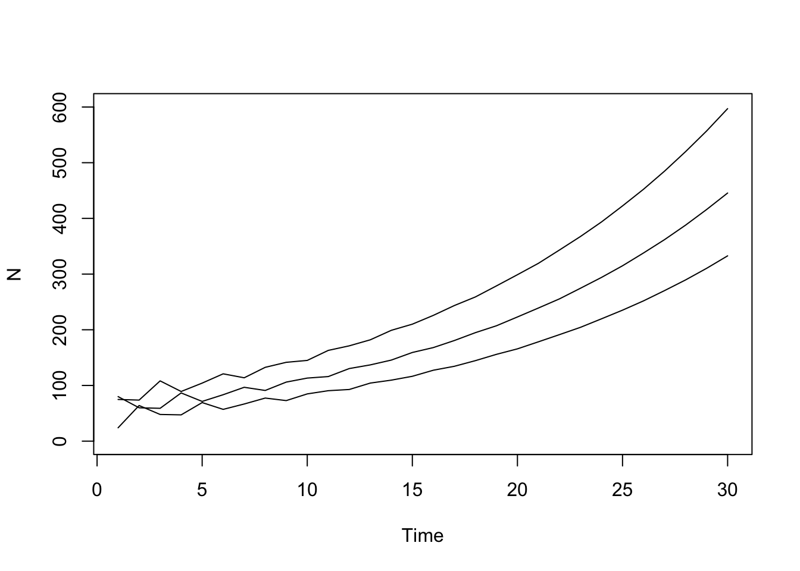

```r
eigen(M)$values # dominant eignvalue = 1.07 - indicates popn increasing 
```

```
## [1]  1.0717764+0.0000000i -0.5358882+0.6330312i -0.5358882-0.6330312i
```

The population dynamics can then be analyzed by finding the eignvalues $\lambda_a$ using the projection matrix and the corresponding eignvectors (column and row) (size a $k_a$, and size a $h_a$):

\begin{equation}
\boldsymbol{M}\boldsymbol{k} = \lambda \boldsymbol{k} \\
det(\boldsymbol{M} - \lambda \boldsymbol{I}) = 0
\end{equation}

where multiplying the projection matrix by the eigenvectors gives you the eigenvalues x eigenvectors. All we need to do is solve this determinant such that its 0 - the above is the characteristic equations. Finding the eigenvalues of the projection matrix allows us to predict toal abundance simply based on the eignvalues of M. M only has one positive eigenvalue and that the first value is dominant (the largest eignvalue), and all other eigenvalues are negative or complex numbers. Long term abundance is purely determined based off the dominant eigenvalue (i.e., the largest value), which also represents the intrinsic growth fraction of the population. So if the dominant eigenvalue is larger than 1, the population growths, if it is less than 1, it declines, and if it is at 1, it is at an equilibria. However, some matrix models can have all eigenvalues that are negative presumably due to skip spawning or a single fecund age, as described by the book.

In the context of a leslie matrix model, a stable population is when the fraction of the age structure remains constant - so in the figures above, when the ratio of the age-structure is more or less constant, the population is at a stable point. Other useful derived quantities can be found using the dominant eigenvalue here (annual egg production and mean generation length in a stable population, see pages 274 to 275). The model described above assumes that the parameters for survival and net fecundity remain constant over time. However, it is easy to extend this to have time-varying properties and the dynamics of the equations are the same, except that the projection matrix will vary over time. 

Similarly, all of the models described above assume deterministic dynamics - i.e., there is no stochasticity. This can be extended to allow some stochastic term although it requires the construction of a variance-covariance matrix to govern deviations from the deterministic equation and allow for correlations among and between ages. 

## Chapter 8 (Catch age and Age structured Assessment Methods)
### Length Frequency Analysis
Length is the most common information collected in fisheries just because its easy. Distinct modes in length composition can potentially represent age classes. Length frequencies are typically represented with multinomial likelihood, where the log-liklihood is used to express this, just so we can avoid writing out the constants (constant of integration of sum doesn't matter in MLE):

\begin{equation}
f(\boldsymbol{L^O}) = C \Pi p_l^{L_l^O} \\
log f(\boldsymbol{L^{O}}) = C + \sum L_l^O log(p_l)
\end{equation}

where $C$ is your choose function (your constant) and can simply be dropped, while $L^O$ is a vector of observed length compositions, while $log(p_l)$ is a vector or proportions at each length interval. The probability density of length $P_a(L)$ is usually a normal where the variance is age specific - to get your age-length transition matrix. So to fit your length composition in an assessment, we first need to derive our age-length transition matrix by first fitting a growth model, we then need age-specific estiamtes of the variance of length at age, and then we can integrate (typically sum for computational reasons) across all lengths for a given age to get the marginal distribution of length for a given age:

\begin{equation}
\psi_{l,a} = \int_l P_a(L)dL \\
L_l = \sum_a \psi_{l,a} \theta_a \\
P(l) = \sum_a P(l,a)
\end{equation}

where we are able to convert ages to lengths in order to fit length compositions using a multinomial. Essentially, multiplying the vector of ages by the age-length matrix gives us the joint distribution of the two. To get the probability of length, we simply integrate of sum across all combinations of ages to get the marginal probability of length. However, some complications can arise because growth rates can vary and the age-length transition matrix might not be constant. Fournier and Breen further extended this simple model from above by allowing for more stochasticity in this process, and to admit some variability in the ageing process (I think... although the notation is pretty wonky). Here, let $\theta_a$ be the estimated age proportions (parameter vector) and $\theta_a^*$ be the equilibrium predicted age proportions such that we have some constraint there. Thus, we would first fit a growth model:

\begin{equation}
\mu_{laa} = f(a) \\
\end{equation}

where $\mu_{laa}$ is the true mean length-at-age and $f(a)$ is some growth function. We would then minimize the observations  using sum of squares of some other likelihood function (they apply weights as well):

\begin{equation}
G = \sum (\mu_{laa}^O - \mu_{laa})^2
\end{equation}

where $\mu_{laa}^O$ are the observed lengths. Then we need to have some model of proportions at age such that it is treated as a random varialbe, and is fit against an exponential mortality equations:

\begin{equation}
\theta_a^* = c e^{-Za} \\
log \theta_a^* = logc -Za \\
M = \sum log(\theta_a - \theta_a^*)^2
\end{equation}

where we minimize our estimated ages against some equilibrium age structure. This allows our ages to be a random variable - such that it is constrained to be similar to an equilibrium age-structure and has some normal stochasticity there. Note that if our age compositions are highly variable, this method might not work well as it assumes a equilibrium age-structure. Fournier and Breen add an additional constraint to ensure that the proportions sum to one as a penalty - but this can probably be circumvented by estimating these parameters in a multivariate logit space or something like that. You can then construct your age-length transition matrix from above and convert ages to lengths, and minimize length compositions using a multinomial, conditional on the estimated age compositions $\theta_a$. You can then add up all your likelihoods and penalties into an objective function to minimize that. After getting your final solution, you simply just need to put your parameter estimates back into a normal likelihood to describe the pdf of length at a given age (i.e., each age group has some pdf of a length distribution) and overlay these pdfs onto the length frequency plot. Some additional constraints are imposed as well to reduce parameters here - i.e., for the standard deviations for length-at-age, it is commonly either assumed to be constant or is a function of age (function of age allows us to interpolate and from min sd to max sd to get age-specific sds). 

So the end goal here is to track age cohorts using only length-frequency data. If you have some growth model with LAA data, this will work well as you can adequately describe the AL matrix. Additionally, given the equations above, no age composition data are obtained - age comps are estimated using MLE, multiplied by the AL matrix, and is then maximized by maximizing fit to length comps. This can easily be extended to incorporate age composition data by allowing for an additional likelihood fuctnion. Nonetheless, this sets up the theory behind fitting length composition within an age-structured model. This sets up the theory behind fitting length composition within age-structured model. I'll reiterate the general steps from above for clarity and my own understanding:

1. Get some estimate of mean length-at-age and its associated standard deviations at age,
1. Integrate out a normal likelihood conditional on the mean LAA and sd at age to get an AL transition matrix,
1. Multiply the age-length transition matrix by some estimated parameter vector of age-composition (our quantiy of interest). This gives us a joint distribution of lengths and ages. To convert this to lengths, we need to integrate or sum out our ages. 
1. Once we have our conversion to lengths, we can maximize a multinomial likelihood to fit to the observed data. The predicted length compositions are conditional on the parameter vector of age compositions and maximizing the length composition data allows us to derive some quantity of age-composition.

#### Sampling Considerations
##### Simple Random Sampling
If aging is possible for all fishes captured, then under simple random sampling, if $A$ fish are taken out of $N$, then define the true proportion of fish as:

\begin{equation}
\theta_a = N_a / N
\end{equation}

where $N_a$ is the true number of individuals at age $a$. If sampling is independent and each fish is aged and there is sampling variability in the population (i.e., not sampling the entire population), then the frequency of observed fish is:

\begin{equation}
\theta_a^{est} = A_a / A \\
V(\theta_a^{est}) = \theta_a^{est} (1 - \theta_a^{est}) / A
\end{equation}

where $A$ is the total number of fish caught and sampled in a given tow. Thus, the expected values and variance will follow a multinomial distribution and the marginals are based on a binomial as shown above. Some methods for obtaining population age-structure and associated uncertainty is given in page 302 (pretty standard expected value variance stuff).

From the above equations, we have some estimate of proportions at age $\theta_a^{est}$. If we want catch at age, we first need to know the catch in terms of the number of individuals. As we commonly have yield data, we can use the weight and catch in numbers relationship to relate that back to yield and derive catch in numbers:

\begin{equation}
Y = CW \\
C^{est} = Y/W
\end{equation}

where $W$ is mean weight and is a random variable, $Y$ is the yield and $C$ is catch in numbers. This relationship gives us the average number of individuals that were caught. If we want to know the catch-at-age, we could just multiply this by the catch proportions derived from above:

\begin{equation}
C_a^{est} = C^{est}\theta_a^{est}
\end{equation}

which gives us our estimated proportions at age. Note that this estimator can be biased especially if mean weight is poorly sampled. Furthermore, this assumes simple random sampling. Nonetheless, this gives us a genearl theory for estimating catch-at-age using age-composition data and yield. Variance estimates can be found using the standard delta method for derived quantities. 

##### Two-Stage Random Sampling
Under two-stage resampling, two assumptions are made:
1. A simple random sample of size $L$ is taken from catch of individuals $C$. This sample can be of length frequencies, or other size measurements. Let us classify this into $l$ strate, 
1. Within this simple random sample of size $L$, another sub-sample of size $A$ is taken to age fish in the second stage. Here $A_l$ is randomly taken from $L_l$. For the second-stage resampling, there are some common allocation strategies for selecting $A_l$, which is fixed (constant across length bins), or proportional (proportional to the length bins defined) allocation. Proportional is usually best as it allows for self-weighitng of composition among strata. 

From the above, we can construct an age-length key using paired age-length samples $A_{la}$. If $C_{la}$ is the true number of fish of length $l$ that are of age $a$ in the catch, then you can sum across the ages to get the total lengths and its associated proportions:

\begin{equation}
\alpha_l = \sum_a C_{la} / C \\
\alpha_l = C_{l} / C
\end{equation}

To get the proportion at each length and age then, this would be:
\begin{equation}
\theta_{la} = C_{la} / C_l
\end{equation}

where we are basically just normalizing the rows of the catch of length and age to get an age-length key. Given that we have an age-length key (P(L|A)), then we can go from lengths to ages and ages to lengths. The following goes from lengths to ages:
\begin{equation}
\theta_{a} = \sum_l \alpha_l \theta_{la} = \sum_l C_{la} / C
\end{equation}

where we can convert our proportions at length to proportions at age. So in the context of an estimator, we can construct the variances for all of these quantities for a two-stage resampling process. For the proportions at age $\theta_a$, the variance is composed of a within length and a between length component in terms of the variability (see page 305) - within length variability = variability of ages in a given length, and between length variability = the overall variability of lengths. Extending the equations above, if we have weight samples for every length (can ignore ages), then we can convert this weight-length relationship to a weight-at-age relationship using our age-length key:

\begin{equation}
W_a = \sum_l W_l \theta_{la} 
\end{equation}

where the variances of weight-at-age are derived using the delta method, based on the variances of proportions at age and the variance of the age-length key. Essentially, in all of these equations, we are just taking the weighted average of proportions at age or length using the age-length key to convert between length and age.

##### Considerations of using age-length keys to other samples
In pages 311 to 316, the book gives an example where an age-length key is constructed using pair age and length samples. It shows that the age-length key is a function of the obtained age composition, so if you were to say apply it to another sample, you would obtain results that were most similar to the age-composition from the age-length key (i.e., applying length samples to the AL key to convert to ages would produce ages more similar to the AL key, even if they are different). However, if you can assume that the age-length key is the same between different populations and is constant over time, and you take a random sample of lengths, then you can convert your lengths back to age compositions to solve for your expected age compositions. I think the general sentiment here is that as long as the ALK can be assumed to be the same between populations or years, then you can use it to estimate ages. However, if it is not, then the age-compositions you produce from length frequencies will look more like the age-compositions collected for constructing that ALK. The book then goes on to give least squares solutions for solving for age-composition data using general linear model theory $A = (X^TX)^{-1}X^TL$.

### Estimation of Abundance and Population Parameters
The value of having age-structured data is that you can trace cohorts through their lives and what they experienced as long as you can separate out the confounding factors of fishing, death, migration, and catchability. In the following examples, we will build this to track a single year class. To track the cohort through ages, we just use a simple exponential mortality model:

\begin{equation}
N_a = N_{a-1}e^{-Z_{a-1}} \\
N_a = N_{a-1}S_{a-1} \\
N_a = N_r exp(- \sum_r^{a-1} -Z_a)
\end{equation}

where recall that survival is multiplicative and total mortality is cumulative. To derive the catch-at-age for this cohort, simply use Baranov's catch equation:

\begin{equation}
C_a = \frac{F_a}{Z_a} N_a(1-e^{-Z_a}) \\
C_a = \mu_a N_a
\end{equation}

where $\mu_a$ is the exploitation fraction. However, there is some parameter confounding we need to deal with. The book gives an example of attempting to estimate catch ratios between successive years:

\begin{equation}
\frac{C_{a+1}}{C_a} = \frac{(F_{a+1}/Z_{a+1}(1-exp(-Z_{a+1})))}{(F_{a}/Z_{a}(1-exp(-Z_{a})))} e^{-Z_a} = \\
\mu_{a+1} / \mu_a S_a
\end{equation}

so here, if you have one observation of the catch ratio, there is still 4 parameters that needs to be estimated (fishing mortality and natural mortality for the two years). Even if natural mortality is known, you still only have one observation to estimate two parameters. So some simplifications are necessary here for analyzing a single cohort, where we need to assume $F_{a+1} = F_a$ and $M_{a+1} = M_a$, resulting in the exploitation fraction being the same throughout the year class $\mu_{a+1} = \mu_a = S_a$ and the only parameter left you need to estimate is by combining fishing mortality and natural mortality into a single term (e.g., $S_a = e^{-Z_a}$), where we only need to estimate $Z$. So if natural mortality and fishing mortality are both constant, the ratio of successive catches estimates the total survival of the year class, as well as total mortality. If we have some estimate of $M$, we can treat it as known or fixed, estimate what $Z$ is and back calculate what the fishing mortality at age should have been $F_a = Z_a - M$. In general however, these methods are not reliable because mortality processes vary across age-classes and are not constant, which can give unrealistic results of mortality processes as well as survival. Thus, these approximations e.g., assuming the successive Fs and Ms are constant should not be used to back-calculate what fishing mortality was. 

#### Catch Curve Analysis
If we can assume that survival is constant beyond a given age $f$, then we can calculate the theoretical mortality and survival processes by projecting survival forward in time:

\begin{equation}
N_{f + x} = N_f S^x
\end{equation}

note that because survival is multiplicative, we can just raise it to the power of $x$. If we assume that the exploitation fraction is lognormally distributed such that the expected value of catch and the median can be calculated as such:

\begin{equation}
med(C_{f+x}) = \mu N_{f+x} = \mu N_fS^x \\
E(ln(C_{f+x})) = ln(\mu N_{f+x}) = ln(\mu N_{f}) + x ln(S) 
\end{equation}

If we substitute in the following, we can get a regresison relationship that is more apparent ($Z = -lnS$, $x = a-f$):

\begin{equation}
E(ln(C_{a})) = ln(\mu N_{f+x}) = ln(\mu N_{f}) - (a-f)Z \\
E(ln(C_{a})) = ln(\mu N_{f} +fZ) - aZ \\
\end{equation}

where the slope is $Z$ and the intercept is $ln(\mu N_{f} +fZ)$, so that way, we can get some sort of estimate of total mortality. Here, we are simply predicted the catch of a cohort across its life-span (e.g., ln(C) ~ Age), which forms what we know as our catch curves. In general, we will see some sort of increasing dome shaped trend for younger ages because of selectivity effects (e.g., survival is not constant until a given age). From the slope, if we have some true known value of natural mortality, we could then calculate the average fishing mortality for that cohort. Note that often, we apply catch curves to a single year of data instead of a single cohort. Thus, we have to make the assumption that recruitment and mortality/survival is constant - such that the Z is constant for every cohort. If recruitment isn't constant, then the $Z$ might decline more steeply at those initial ages, or it might ramp up, which could cause bias if applied to other cohorts.

To further reiterate the points above of using a catch curve and assuming constant survival, non-constant survival is actually pretty common, which can show up as variation in the slope as well as some curvlinearity. This can be due to age-specific M or selectivity effects, as well as spatial effects. If recruitment is either exponentially increasing or decreasing over time, the mortality process will actually become $Z+\nu$, where $N_{r,t} = N_re^{Z+\nu}$. Given that, if you assume constant recruitment you will probably over or underestimate the total mortality, if only one year of a synthetic cohort of data is used (i.e., each age-class has a different recruitment if you only look at one year, and that can bias your results). 

The example the book gives uses exponentially declining recruitment to show that the mortality between successive age classes is unbiased but by using a single year of data of a synthetic cohort, the estimate of mortality is going to be negatively biased, but the slope will look constant and indicate nothing is wrong. Hence, why catch-curves should not be based off of one year of data. The example is coded below. Essentially, when recruitment is decreasing and you only use one year of data, even if you survival in a cohort is the same, the lowered recruitment from previous years is going to propagate through to the current synthetic year such that it seems like you have a higher survival rate.

This happens because say if your recruitment was declining over time and you only track one year of fish, then previous year cohorts will have more abundance - as they end up in the current synthetic year, and the subsequent cohorts are declining exponentially in terms of total recruitment, it will appear as if you have more individuals surviving in that synthetic cohort - just because each successive cohort from previous years actually has more individuals in the population (so more individuals surviving from previous cohorts because the initial years have higher recruitment = synthetic population appears to have higher survival). 


```r
S_4 = 0.5 # survival of age 4
S5_8 = 0.67 # survival of age 5-8
nu = -0.1 # declining recruitment
N_r = 2000 # start recruitment
y = 0:5 # years
rec_num = 2000 * exp(nu * y) # recruitment numbers that are declining over time

# storage 
n_at = matrix(0, nrow = 6, ncol = 6)
log_n_at = matrix(0, nrow = 6, ncol = 6) 
n_at[1,] = rec_num
log_n_at[1,] = log(rec_num)

# run through catch curve popn here
for(a in 2:nrow(n_at)) {
  for(y in 2:ncol(n_at)) {
    if(a == 2) n_at[a,y] = n_at[a-1,y-1] * S_4
    else n_at[a,y] = n_at[a-1,y-1] * S5_8
    log_n_at[a,y] = log(n_at[a,y] )
  } # y
} # a

# Visualize tracking a cohort over time
par(mfrow = c(1,2))
plot(diag(log_n_at), type = 'l', col = "red", lwd = 3, lty = 2,xlab = "time", ylab = 'logN (decln rec)', main = "Red = actual, black = snythetic")
lines(log_n_at[,5], type = 'l')
log_n_at[,5][2] - log_n_at[,5][3] # slope of a synthetic cohort with varying recruitment
```

```
## [1] 0.3004776
```

```r
# storage 
n_at = matrix(0, nrow = 6, ncol = 6)
log_n_at = matrix(0, nrow = 6, ncol = 6) 
n_at[1,] = 2e3
log_n_at[1,] = log(2e3)

# run through catch curve popn here
for(a in 2:nrow(n_at)) {
  for(y in 2:ncol(n_at)) {
    if(a == 2) n_at[a,y] = n_at[a-1,y-1] * S_4
    else n_at[a,y] = n_at[a-1,y-1] * S5_8
    log_n_at[a,y] = log(n_at[a,y] )
  } # y
} # a

plot(diag(log_n_at), type = 'l', col = "red", lwd = 3, lty = 2,xlab = "time", ylab = 'logN (constant rec)', main = "Red = actual, black = snythetic")
lines(diag(log_n_at[,-1]), type = 'l')
```


```r
diag(log_n_at[,-1])[2] - diag(log_n_at[,-1])[3] # slope of a synthetic cohort with constant recruitment
```

```
## [1] 0.4004776
```

Thus, given the above, catch curves should only be used to track cohorts and not synthetic populations and the linearity of the slope does not necessarily mean that all assumptions have been made (constant survival and constant recruitment). 

### Virtual Population Analysis and Cohort Analaysis
A virtual population is a population that does not experience natural mortality. If catch is measured without error, the virtual population can be obtained by subtracting your previous ages virtual population by the catch at that age and you can back-calculate your minimize population size using just catch data, where you need to assume some conditions, which is $V_A = C_A$, where the terminal abundance is the final catch:

\begin{equation}
V_{a+1} = V_a - C_a \\
V_a = V_{a+1} + C_a \\
V_a = \sum_a = C_a
\end{equation}

This gives us the minimum population size without accounting for natural mortality. Further extending this, natural mortality can readily be incorporated using Baranov's catch equation, by assuming known M and $F_a$:

\begin{equation}
C_a = N_A(1 - e^{-Z_A}) \frac{F_a}{Z_a} \\
\frac{C_a}{(1 - e^{-Z_A})} = N_A\frac{F_a}{Z_a} \\
\frac{C_a}{(\frac{F_a}{Z_a} 1 - e^{-Z_A})} = N_A
\end{equation}

where we are just re-arranging Baranov's equation and this is to calculate terminal abundance. To calculate previous ages, we can just project forward:

\begin{equation}
C_a = N_a(1 - e^{-Z_a}) \frac{F_a}{Z_a} \\
N_{a+1} = N_ae^{-Z_a} \\
\frac{C_a}{N_{a+1}} = \frac{F_a}{Z_a}(e^{-Z_a} - 1)
\end{equation}

where the third equation is here just computed by substituting equation 2 into equation 1. Then if we know what $C_a$, $M_a$, and $N_a$ is, then we can easily solve for $F_a$ numerically. This is what we commonly term as sequential population analysis where if we have these known quantities, we can sequentially and recursively solve these equations to get $F_a$, although it was hard back in the dark ages because of lack of computational power and the nonlinearity. 

In terms of cohort analysis, which approximates VPA and was popularized by Pope (1972) to deal with the non-linearities in Gulland's equations, it uses the following approximation:
\begin{equation}
\frac{1 - e^{-x}}{x} \sim=e^{-x/2}
\end{equation}

presuambly to make calculating exponential and nonlinear functions much easier back in the day. The approximation by rewriting:

\begin{equation}
N_{a+1} = N_ae^{-Z_a} = N_ae^{-(M_a+F_a)}\\
N_{a+1}e^{M_a} = N_ae^{-(M_a+F_a)}e^{M_a} = N_ae^{-F_a} \\
N_{a+1}e^{M_a} = N_ae^{-F_a} = N_a - N_a(1 - e^{-F_a}) \\
\end{equation}

Recall the Baranov equation can be rearrange as such:

\begin{equation}
C_a = \frac{F_a}{Z_a} N_a(1 - e^{-Z_a}) \\
\frac{C_a}{(1 - e^{-Z_a})} \frac{Z_a}{F_a} = N_a \\
\end{equation}

and we can substitute this into:

\begin{equation}
N_{a+1}e^{M_a} = N_ae^{-F_a} = N_a - N_a(1 - e^{-F_a}) = \\
N_a - C_a\frac{(1 - e^{-F_a})}{(1 - e^{-Z_a})} \frac{Z_a}{F_a}
\end{equation}

and using the approximation $1-e^{-x}/x \sim= e^{-x/2}$, we can substitute that into our previous equation where:

\begin{equation}
\frac{(1 - e^{-F_a})}{F_a} \sim= e^{-F_a} \\
\frac{(1 - e^{-Z_a})}{Z_a} \sim= e^{-Z_a} \\
N_a - C_a\frac{e^{-F_a/2}}{e^{-Z_a/2}} = \\
N_a - C_ae^{-F_a/2 + (M+F)/2} = N_a - C_ae^{M_a/2}
\end{equation}

which is a good approximation only when $M_a$ is less than 0.3, and $F_a$ is less than 1.2. Given that we are dividing the exponent by 2, it assumes that all fishing takes place in the middle of the year. Rewriting the above equation, we can essentially get a forward equation:

\begin{equation}
N_{a+1}e^{M_a} = N_a - C_ae^{M_a/2} \\
N_{a+1}e^{M_a}e^{-M_a} = (N_a - C_ae^{M_a/2})e^{-M_a} \\
N_{a+1} = (N_ae^{-M_a} - C_ae^{-M_a/2}) = (N_ae^{-M_a/2} - C_a)e^{-M_a/2} \\
\end{equation}

and a backward equation:
\begin{equation}
N_{a+1}e^{M_a} = N_a - C_ae^{M_a/2} \\
N_a = N_{a+1}e^{M_a} + C_ae^{M_a/2} \\ 
\end{equation}

which gives us a way to project either forward or backward. If catch is taken halfway through the year as the equations assume, then we can perfectly fit to catch, but if not, then thats not the case - there are slight differences. Nonetheless, using these equations, we will first solve for the abundance of the oldest age: 

\begin{equation}
C_a = N_a(1 - e^{-Z_a}) \frac{F_a}{Z_a} 
\end{equation}

then project backwards using this initial age estimate:
\begin{equation}
N_a = N_{a+1}e^{M_a} + C_ae^{M_a/2} \\ 
\end{equation}

and then solve for catch again using:
\begin{equation}
C_a = N_a(1 - e^{-Z_a}) \frac{F_a}{Z_a} 
\end{equation}

where, we then solve for $F_a$ here if we know what the true $M_a$ is:

\begin{equation}
N_{a+1} N_ae^{-Z_a} = \\
ln(N_{a+1}/N_a) = -M_a - F_a \\
F_a = -ln(N_{a+1}/N_a) - M_a
\end{equation}

We can use some alternative equations to calculate the terminal abundance and then back-calculate the virtual population. The first formulation uses a plus group where all ages $A+$ are grouped into one age class:

\begin{equation}
C_{A+} = N_{A+}\frac{F_{A+}}{Z_{A+}}(1-e^{-Z_{A+}\tau})
\end{equation}

where $\tau$ is the number of years represented by the plus group. Rearranging this equation, we get to the terminal year abundance:

\begin{equation}
N_{A+} = \frac{C_{A+}Z_{A+}}{F_{A+}(1-e^{-Z_{A+}\tau})}
\end{equation}

and if $\tau => \infty$, then it reverts to $N_{A+} = \frac{C_{A+}Z_{A+}}{F_{A+}}$ where $(1 - e^{-Z})$ goes to 0. But this is of limited use because it requires us to determine the oldest ages at a long period to track it to its final dissolution. Another variation from Ricker is denoted in the book (page 325). 

For VPA, it is not possible to obtain variance estimates because there are more parameters than there are observations. But if you have auxiallry variance estimates of catch, terminal fishing mortality, and natural mortality, as well as their covariances, it is possible to get some variance estimates here. The book further provides some equations in page 325 - 326. In general VPA and cohort analysis was popular because your estimates of $F$ was less sensitive as you continue to peel back and back-calculate years, which gave us a robust procedure to look at historical trends in abundance and fishing mortality. Errors become small (as a rule of thumb) when the cumulative estimated F is larger than 1 (kind of weird tbh, but probably some cutoff for the number of total years fished).
In general, these methods (VPA and cohort analysis) are tracking a single cohort over time, although you can easily extend this to incorporate multiple cohorts. You probably poorly estimate F if you don't observe the cohort for a long enough time series. While this is all well and good, cohort analysis suffers from the fact that there is no error admitted (catch-at-age, natural mortaliy is assumed known), and can be sensitive if there is immigration or emigration. Foward projection equations can be used starting from the youngest ages, but its more sensitive (i.e., F is more sensitive projecting forward than backward, because you have less data to project forwards).

Below is an example of cohort analysis using Pope's approximation, which uses the following equations derived from above. First we calculate the abundance for the oldest age class, with some value of $F_a, M_a$:

\begin{equation}
N_A = \frac{C_a}{(\frac{F_a}{Z_a} 1 - e^{-Z_A})}
\end{equation}

from this starting point, we can then back-calculate what our $F_a$ should have been given some observed value of $C_a$:

\begin{equation}
N_a = N_{a+1}e^{M_a} + C_ae^{M_a/2} \\ 
F_a = -ln(N_{a+1}/N_a) - M_a
\end{equation}

The example below illustrates this implementation for EBS pollock for a single year class from ages 2-9. Obviously here, we have some estimate of natural mortality. however, if we just simply take out the $M_a$ term, we can go back to the dark ages and get some estimate of minimum population size. In the book, they give an example of what happens when you change the value of terminal F, but in general, the effect of different $F$ values lessens as you go further back in time. I presume that with catch-at-age data, you can basically just tune the $F$ such that you arrive at the solution with the closest fit. You can do the same analysis using forward projections, although the book shows that the $F$ for the initial age and model sensitivity is not as robust as backwards-calculations, but you have the benefit of being able to project forwards.


```r
C = c(25241, 13306, 21178, 74749, 228463, 682467, 1097360, 1073816) # catch series by age 9 - age 2
M = c(rep(0.3, 8), 0.4) # nmort (age 9 - 2) 
N = vector() # numbers at age 9 - 2
f = vector() # fishing mortality
f[1] = 0.12 # terminal F
z = vector() # total mortality
z[1] = M[1] + f[1] # initial mortality
for(i in 1:length(C)) {
  if(i == 1) N[i] = C[i] / ((f[i]/(f[i]+M[i])) * (1 - exp(- (f[i]+M[i])))) # abundance of oldest age class
  else {
    N[i] = N[i-1] * exp(M[i]) + C[i] * exp(M[i]/2) # project back to get starting abundance of cohort
    f[i] = -log(N[i-1]/N[i]) - M[i] # calculate F
    z[i] = f[i] + M[i]
  } # end else
} # end catch series (t)

par(mfrow = c(1,2))
plot(rev(N), type = "l", lwd = 3, main = "1975 EBS pollock cohort")
plot(rev(z), ylim = c(0, 0.66), type = "l", col = "red", lwd = 3, ylab = "Z (red), M (blue), or F (green)")
lines(rev(f), ylim = c(0, 0.66), type = "l", col = "green", lwd = 3, ylab = "Z (red), M (blue), or F (green)")
lines(rev(M), ylim = c(0, 0.66), type = "l", col = "blue", lwd = 3, ylab = "Z (red), M (blue), or F (green)")
```


In pages 328 to 330, you can find equations for specifying fishing or pulse mortality for VPA-like calculations occuring at different times of the year. 


### Relative Abundance Analysis
Instead of using absolute catch-at-age data, here we can use proportions of catch-at-age to determine relative abundance over time. This forms some of our integrated catch-at-age models when we only have catch and survey abundance-at-age data. In general, we need to make some simplifying assumptions to free up some degrees of freedom. In an normal context where we have $a$ ages and $t$ time periods to model, we would have $a*t$ parameters to model. We will first discuss the model structure and then dive into where these simplifying assumptions are necessary. As in the previous models, we have an exponential mortality model where total mortality is assumed to be constant across all ages and years:

\begin{equation}
N_{a,t} = N_{r,t-a+r}e^{-Z(a-r)} 
\end{equation}

where $r$ is the age at recruitment. In each year, a survey is conducted and some sample of the population is aged, which gives us some idea of the catch-at-age for that survey:

\begin{equation}
\mu_{a,t} = C_{a,t} / N_{a,t}
\end{equation}

where $\mu_at$ is the exploitation fraction at each age and time for the survey, which is simply a proportion of the catch obtained in the survey and the total abundance (i.e., fraction caught by the survey). However, note that we know have $a * t$ parameters to estimate for the exploitation fraction of the survey $\mu_{a,t}$, which does not give us enough degrees of freedom. To free up this constraint, we can impose the separability assumption wherein the exploitation fraction is:

\begin{equation}
\mu_{a,t} = s_a \mu_t
\end{equation}

reducing the number of parameters to $a$ parameters and $t$ parameters. We can further simplify the number of selectivity parameters estimated by imposing some parametric form. Using the following equations described above, we can then calculate the catch-at-age using the separability assumption:

\begin{equation}
\mu_{a,t} = C_{a,t}/N_{a,t} \\
C_{a,t} = \mu_{a,t} N_{a,t} \\
C_{a,t} = s_a \mu_t N_{r,t-a+r}e^{-Z(a-r)} 
\end{equation}

However, note that because $s_a \mu_t$ are confounded, we don't really have enough information to estimate the abundance. However, if we treat the following as a proportion, we can get rid of the exploitation rate term:

\begin{equation}
C_{a,t} = s_a \mu_t N_{r,t-a+r}e^{-Z(a-r)} \\
p_{a,t} = \frac{s_a \mu_t N_{r,t-a+r}e^{-Z(a-r)}}{\sum_a s_a \mu_t N_{r,t-a+r}e^{-Z(a-r)} }
\end{equation}

which gives us some idea of how changes in the population occur in a relative sense. This further reduces the number of parameters to one $Z$ term, $A+T-1$ recruitment terms, and selectivity parameters. Writing the denominator from above as a constant, we can rearrange to get relative abundance:

\begin{equation}
p_{a,t} = \frac{s_a \mu_t N_{r,t-a+r}e^{-Z(a-r)}{C} } \\
p_{a,t}C = s_a \mu_t N_{r,t-a+r}e^{-Z(a-r)}\\
\frac{p_{a,t}Ce^{Z(a-r)}}{s_a} = N_{r,t-a+r}
\end{equation}

Note that changes in abundance are in a relative sense, despite be being denoted as $N$, because we don't know what the exploitation rate is since we normalized it out (akin to our $q$). We can then fit these values using some objective function - typically we use a multinomial:

\begin{equation}
ln L_1 = \sum_t \sum_a C^O_{a,t} ln p_{a,t}
ln L_1 = \sum_t \sum_a n_{a,t} ln p_{a,t}
\end{equation}

where the first equation in the likelihood assumes that all fish are aged. However, this is often not the case, and we need to adjust the likelihood term to instead by the number of fish aged $n_{a,t}$. However, we still want to make sure we keep track of the catches because the change in numbers of fish aged could differ from year to year and do not necessarily entirely reflect changes in relative abundance. So if not all fish that are captured are aged, we need to add another likelihood to fit to the total catch data:

\begin{equation}
ln L2 = \sum_t (C^O_t - C_t)^2
\end{equation}
 
which is in log space - contrary to the book because you can't have negative catches. Some other likelihoods involve just using the raw observed proportions as opposed to numbers because the numbers implicitly weights the multinomial likelihood and the number of ages aged do not necessraily reflect the variance in those data accurately. The book proposes another way to fit the composition data, which I believe to be an additive logistic normal likelihood, which allows for controlling the variance of the composition data, and uses a multivariate logit transformation. I won't dive too deeply into this, since there are now a whole family of self-weighting likelihoods and perhaps a bit beyond the scope of my studies right now. 

A crucial assumption here is that fishing mortality $Z = F + M$ is age and time-invariant because we don't have any data to estimate those parameters. This is unrealisitic and more realism can be built in with age-and time-varying fishing mortality parameters in the next section if we have some sort of catch data. 

#### Catch-Age Analysis with Auxillary Information 
In the previous examples, we have assumed that $Z$ is constant. However, if we have data outside of a survey and want to treat the total mortality process as age-and time-varying, we need some sort of auxiallary data (catch outside of the survey). The genearl relationships follow from above. Let us first redefine total mortality as:

\begin{equation}
Z_{a,t} = F_{a,t} + M_{a,t} 
\end{equation}

then, our catch-at-age relationship (really the exploitation fraction) follows Baranov's catch equation:

\begin{equation}
\mu_{a,t} = \frac{F_{a,t}}{Z_{a,t}} (1 - e^{-Z_{a,t}}) \\
C_{a,t} = \mu_{a,t} N_{a,t} 
\end{equation}

and our abundance relationship is just:

\begin{equation}
N_{a+1,t+1} = N_{a,t}e^{-Z_{a,t}} 
\end{equation}

Similar to the survey section where we have not enough degrees of freedom to estimate fishing mortality at age and year $F_{a,t}$, we need to impose a separability assumption here again:

\begin{equation}
F_{a,t} = s_a F_t 
\end{equation}

to free up some degrees of freedom. While we might attempt to estimate natural mortality, this parameter is often hard to estimate with only catch data, because it can be confounded with selectivity and the fishing mortality. The likelihood surface for this parameter is often very flat. The book gives some extensions and likelihoods of fitting these data. In general, catch data are estimated using a lognormal likelihood, and a multinomial likelihood is used for composition data, although requires some assumptions there. A process error model can also be incorporated to the exploitation fraction to model deviations from this from (i.e., deviations in selectivity from this "parametric form"), and is akin to the approach used by SAM:

\begin{equation}
\mu_{a,t} = \frac{s_aF_t}{(s_aF_t + M_{a,t})} (1 - e^{-(s_aF_t + M_{a,t})})e^{\epsilon_{a,t}} \\
\epsilon_{a,t} \sim N(0,\sigma_\mu)
\end{equation}

although this is probably pretty hard to estimate and parameterize. 

#### Other Auxillary Data
In addition to catch-at-age data from the fishery, other auxillary data sources can also be included. This can include fishing effort data to estimate fishing mortality. Recall that $F = qE$ from Chapter 1, and assume that catchability here is constant. Then, we can estimate fishing mortality using this relationship:

\begin{equation}
F_t = qEe^{\epsilon_t} \\
\epsilon_t \sim N(0,\sigma)
\end{equation}

which adds one parameter to the estimation problem $q$. We still have to estimate the $F_t$ but we now have $T$ additional observations to help information the estimation process. This can be emplotyed using a SSQ framework:

\begin{equation}
RSS(E) = \sum_t [ln F_t - (ln q +ln E_t)]^2
\end{equation}

If hyperstability occurs, we can extend this to incorporate some sort of power relationship from our CPUE equations in Chapter 1. The book talks about data-weighting issues and note that weights are not estimable in a penalized likelihood framework. Under this, they suggest analyzing the variance outside of the assessment model and then fixing it at those values. They also suggest choosing the weighting parameter based on the SSQ of catch or those with a lower SE for some population parameter. 

To incorporate a SR relationship to estimate the abundance in the initial age, we can use a spawner recruit model with process variation:

\begin{equation}
S_t = \sum_a f_a N_a,t
\end{equation}

where $S_t$ is the number of spawners, $f_a$ is the fecundity, where $f_a = m_a g$ such that $m_a$ is maturity-at-age and $g$ is the eggs produced per mature female. We can then use a SR relationship, in this case, a Ricker to estimate numbers during the initial age-at-recruitment:

\begin{equation}
N_{r, t+r} = \alpha S_t e^{-\beta S_t} e^{\epsilon_r} \\
\epsilon_r \sim N(0,\sigma^2)
\end{equation}

this adds $\alpha,\beta$ into the number of parameters needed to be estimated. We can penalize this to be estimable by imposing some sort of SSQ or lognormal likelihood. Note that the following equations are essentially equivalent:

\begin{equation}
RSS(R) = \sum_t [ln N_{r, t+r} - (ln \alpha  + ln S_t - \beta S_t)]^2
RSS(R) = \sum_t [\epsilon_r - 0]^2
\end{equation}

where we are just penalized the deviations to be towards zero. 

An additional source of information could be abundance indices or estimates obtained from a survey or other approaches (mark-recapture, etc.), which can be used to provide additional information. If say the survey indexes $N^*_x$ fish, where this denotes the total number of fish caught by the survey, then we can use this to estimate the trends in abundance:

\begin{equation}
N^*_x = (qs \sum_a N_a,x) e^{\epsilon_x} \\
\epsilon_x \sim N(0,\sigma^2)
\end{equation}

where $qs$ is a calibration coeffficient for the survey. If the survey provides units in absolute abundance, then $qs$ can be set to 1. We can then minimize these observations via SSQ or lognormal:

\begin{equation}
RSS(S) = \sum_x [ln N^*_x - ln(qs \sum_a N_a,x)]^2
\end{equation}

The book notes that $qs$ is a calibration coefficient which is confusing because we are not calibrating the survey index to anything (e.g., another survey), but rather its just a catchability coefficient. If the survey is measured in biomass, we need to multiply the numbers at age indexed and caught by some metric of average weight-at-age. Further if the survey is selective of ages, all we need to do is estimate $s_a$ using composition data from the survey (i.e., from the section on relative abundance analysis). 

Some key things the book notes of is that we should ensure parameter values are insensitive to initial starting values, different weighting values should be used to ensure the results are robust, and to use different values to natural mortality to see what turns up. Selectivity should be estimated not as knife-edged and F-tests should be conducted to compare growth models.

After your assessment is done, we can take out some parameter estimates to derive our management quantities:
\begin{equation}
\mu_{a,t} ~= s_aF_t \\
C_t ~= F_tEN_t \\
Y_t ~= F_tEB_t 
\end{equation}

The book gives some useful derived quantities to output. 

Of interest are exploitation rate or fraction at a given year, which is:
\begin{equation}
\mu_t = \frac{\sum_a s_a {N_a,t}}{\sum_a N_{a,t}}
\end{equation}

and the annual surplus production (recall $dP = dB - dY$):
\begin{equation}
ASP_t = Y_t + B_{t+1} - B_t
\end{equation}

I think the above would be useful quantities to comptue out, which we seldom do. The following section describes some methods for obtaining variance estimates of parameters, which can be obtained via the delta method from inverting the Hessian, as well as bootstrap methods (resampling residuals, adding to predictions, and applying model to these new "datasets"). 

#### Stratified Catch-Age Analysis
For models with multiple fleets, catch data can be pooled over a gear type and total effort should be weighted by the predominant gear type - we want to do a weighted average of age-compositions to make sure that selectivity is a weighted avearge of the different gears (more dominant - selex looks more like the dominant fleet). If changes in the catch ratio occur, this would then potentially manifest into time-varying selectivity, which would invalidate the separability assumption. The other approach is to have a multi-fleet model with multiple selectivities for each gear type. This method is pretty much the same as previous methods although adding in a new gear subscript for the fishing mortality processes, where catch-at-age and time would be:

\begin{equation}
\mu_{a,t,g} = \frac{F_{a,t,g}}{Z_{a,t}} N_{a,t} (1 - e^{-Z_{a,t}}) \\
C_{a,t,g} = \mu_{a,t,g} N_{a,t}
\end{equation}

and fishing mortality still has a separability assumption, although with a new $g$ subscript:
\begin{equation}
F_{a,t,g} = s_{a,g} F_{t,g}
\end{equation}

and our standard model fitting procedures will similarly add a new gear subscript. While this method better captures the complexities of the selection process and results in "more data", you data are broken up into smaller pieces, which can result in more variability than when you pool your data together.    

### Estimation of Natural Mortality
Natural mortality is one of the most difficult to estimate parameters because of confounding with recruitment and fishing mortality. Furthermore, it is hard to collect specific data to tease out the effect of M, because it is hard to directly observe. Some methods have been proposed to estimate $M$, which are generally based on the relationship of $Z = F + M$. Using effort data, some folks have tried to estimate $M$ using the following relationship:
\begin{equation}
Z_i = M + qE_i
\end{equation}
but it does not usually provide good estimates of M because this relationship is so variable and the contrast in effort might be too small. Some other methods include: 1) catch-curves, 2) length-frequency analyses, 3) mark-recapture, 4) life-history analyses.

#### Catch Curves
For catch-curves, if you have data for an early part of the fishery history where F is negligible, then your negative slope of the cohort is going to be approximately your natural mortality rate. With high fishing mortality, and without data at the start of the fishery, its really hard to tease our whether changes in the cohort are due to recruitment and fishery selectivity, or due to natural mortality, which is why we often need data at the start of the fishery to estimate M adequately. 

#### Length Frequency analysis
Using LFA, you can potentially get an estimate of $M$ when you are trying to track age-cohorts as an estimated parameter over time, using the $Z_i = M + qE_i$ relationship, or some other relationship that would relate the two. However, if fishing mortality varies a bunch over time, its going to lead to pretty inaccurate estimates - although the LFA methods assume constant recruitment and prerecruit mortality. Another method is to use the LVB relationship to derive an estimate of $Z$, which forms some of our empiricla methods:

\begin{equation}
Z = \kappa \frac{L_\infty - L^{bar}}{L^{bar} - L_c}
\end{equation}

where length at capture is assumed to be knife edged. 

#### Mark-recapture Experiments
Mark-recapture is one of the better methods for estimating $M$, because released fish can either only die or emigrate. The Jolly-Seber method is more commonly used for single and multiple releases and can be generalized to closed or open populations. If you have the number of fish marked as $N_0$, $F_i = qe_i$, $E = \sum_i e_i$ (cumulative effort) describing the fishery process, and time period $t_i$, then you can derive the marked fish per unit effort:

\begin{equation}
ln \frac{m_i}{e_i} = ln(qN_0) - M \frac{t_{i-1} - t_i}{2} - q \frac{E_{i-1}+E_i}{2} + \epsilon_i
\end{equation}

which is basically just a linear regression model. So here, the intercept is $ln(qN_0)$ your exploitable or capturable individuals from the marked population, which is decremented by $M$ in between those time points, and is also decremented by fishing mortality, which gives you your mark per unit effort. This is basically just a depletion estimator from DeLury!

An extension of this is given by Treble et al. (1993). Let $N_t$ by the number of individuals left at a given time after the population has been tagged with $N_0$ individuals, $\alpha$ be deaths due to tag loss or mortality right after tagging, and $X(t)$ be due to tag loss from tag loss, mortality (natural and fishing), resulting in:

\begin{equation}
N_t = \alpha N_0  exp[-\int_{t_0}^t X(t)dt] \\
N_t = \alpha N_0 exp[-X^{bar}_t (t - t_0)] \\
log(N_t) = log(\alpha N_0) -X^{bar}_t (t - t_0) \\
log(N_t / N_0) = log(\alpha) -X^{bar}_t (t - t_0) \\
log(p_t) = log(\alpha) -X^{bar}_t (t - t_0)
\end{equation}

where $log(p_t)$ is the log proportion of marked individuals found at time $t$ (probability of finding an individual), which is governed by initial tag losses, as well as average tag loss due to fishing and natural mortality as well as bad tagging efforts over time. Similarly, this is just a linear equation and can be estimated using regression methods. Another method described invovles using tag data within a VPA, and applying the following equation, while recursively solving those nasty VPA equations:

\begin{equation}
N_0 = \sum_t C_t exp[M(t-1/2)]
\end{equation}

where $N_0$ is the number of individuals released and $C_t$ are the recaptures. So here you are basically summing all the recaptures while adjusting it to add in natural mortality to make sure you match the initial number of recaptures, which allows you to solve for $M$. Another similar method is:

\begin{equation}
N_0 = \sum_i exp[M(t_i - t_0)]
\end{equation}

which allows you to use exact times, but requires you to run the experiment until all marked fish are dead (basically just summing all the mortalities until you get back to $N_0$). Let's rearrange this equation to get some intuition as to how this works. Suppose we have 3 individuals recaptured at this time point:

\begin{equation}
N_0 = \sum_i^3 exp[M(t_i - t_0)] \\
log(N_0) = M(t_1 - t_0) + M(t_2 - t_0) + M(t_3 - t_0) \\
log(N_0) = M((t_1 - t_0) + (t_2 - t_0) + (t_3 - t_0)) \\
M = \frac{log(N_0)}{(t_1 - t_0) + (t_2 - t_0) + (t_3 - t_0)}
\end{equation}

so if individuals end up getting recaptured a long ways out your $M$ is going to be lower. However if you only recapture 3 individuals, it doesn't matter how long they live, because your summation in the denominator is small. If you recapture a bunch of individuals in subsequent times, then you will add onto that denominator:

\begin{equation}
M = \frac{log(N_0)}{(t_1 - t_0) + (t_2 - t_0) + (t_3 - t_0) ... (t_\infty - t_0)}
\end{equation}

which will make the natural mortality rate much smaller if you recapture a bunch of fish. However, I think the sensitivity of this model will greatly depend on how we sample as well as the size of the population. In all, it's also being weighted by the number of fish you initially mark $N_0$. In the first example where you only have 3 individuals caught but you have a large $N_0$, that suggests that the mortality rate is actually fairly high. 

#### Multi-species VPA
Multi-species VPA can also be used to estimate $M$, wherein you need data of gut contents from different species. If you have an index of consumption $m_{i,j}$ where that denotes consumption of $i$ by $j$, we can estimate this as some linear model:

\begin{equation}
M_i = \beta_0 + \sum \beta_j m_{i,j}
\end{equation}

which basically says the natural mortality of species $i$ is equivalent to some average mortality $\beta_0$ plus all species $j$ consuming species $i$ ($\beta_j m_{i,j}$, where $\beta_j$ scales the index of consumption to a total consumption rate). 

#### Life-History or Meta-Analysis
Using predictive regressions and life-history parameters, we can potentially figure out what natural mortality might be. For example, species that are $r$ selected experience high mortality and generally have large GSI, high fecundity, fast growth rates, and small asymptotic size. Using the LVB model, we can derive what $M$ might be using the critical age $t^*$, which is when an unfished cohort reaches its maximum size:

\begin{equation}
t^* = 1/\kappa ln((M + 3\kappa)/M) \\
M = 3\kappa / ((expt^*\kappa) - 1)
\end{equation}

Some approxmiations are given, for example if $M ~= \kappa$ then $t^* ~= 0.25t_m$, which is the maximum observed age although some studies have verified that it should be $t^* ~= 0.38t_m$. Another relationship was from from Hoenig, where mortality is inversely related to longevity wherein $M = -ln(0.01)/t_m$, where $t_m$ is the maximum age observed. Hoenig's method assumes that the proportion of individuals that reach the maximum age is 1% here, and rearranged the exponential decline equation for an unfished population. Some authors prefer to use 5% instead. Nonetheless, this is shown below, assume we are doing this on a per-recruit basis, then:

\begin{equation}
0.01 = N_0 e^{-M(t_m)} \\
0.01 = e^{-M(t_m)} \\
log(0.01) = -M t_m \\
-M = log(0.01) / t_m \\
M = -log(0.01) / t_m
\end{equation}


```r
t_m = seq(10, 100) # max age
m = -log(0.01)/t_m # empirical mortality relationship 
plot(t_m ,m, xlab = "Maximum Age Observed", ylab = "Mortality")
```


Pauly also found some empirical relationships between $M$ and their temperatures experienced which also brings in growth data (LVB LAA and WAA as well as temperature). See code below for an example for sablefish


```r
temp = 0.5:30 # temp range
ln_M1 = -0.4852 - (0.0824 * log(5.87)) + (0.6757 * log(0.17)) + 0.4627 * log(temp) # based on winfinty
ln_M2 = -0.0152 - (0.279 * log(81.2)) + (0.6543 * log(0.17)) + 0.4634 * log(temp) # based on linfinty

plot(temp, exp(ln_M1), xlab = "Temp", ylab = "M", type = "l", lwd = 3, col = "red", main = "Red - Winf, Blue = Linf")
lines(temp, exp(ln_M2), xlab = "Temp", ylab = "M", type = "l", lwd = 3, col = "blue")
```


Some other methods use a gonadosomatic index to estimate $M$ - if you have a relatively large gonad compared to your body size, your M is likely to be much higher. 

## Chapter 9 (Size structured Models and Assessment Methods)
Often, size-structured models are needed because we only have length data and because the stock of interest is hard to age (think our crusty crustaeceans). In most of these size-structured models, it is not possible to determine what exactly a year class is and growth is often more difficult to model. 

### Beverton-Holt Approach
The book first presents how we can use average size of the catch to infer mortality using the approach developed by fathers Beverton and Holt. Herein, the approach is a per-recruit model which uses assumes that LVB growth can be applied to length, and mortality is constant beyond the age at recruitment. The average length is then defined as:

\begin{equation}
\overline{L} = \frac{\int_{t_c}^{t_\infty}L(t)N(t)dt}{\int_{t_c}^{t_\infty}N(t)dt} 
\end{equation}

Recall that:

\begin{equation}
\frac{dN}{dt} = -ZN \\
\frac{dN}{N} = -Zdt\\
log(N) = -Z^t \\
N = e^{-Zt} \\ 
\int_{t_c}^{t_\infty}N(t)dt = e^{-Z(t-t_c)}
\end{equation}

Thus, the first equation defined here is written as:
\begin{equation}
\overline{L} = \frac{\int_{t_c}^{t_\infty}L(t)e^{-Z(t-t_c)}dt}{e^{-Z(t-t_c)}dt} 
\end{equation}

Note that the abundance term of the cohort appears here, because the average length of the population or catch is depend on the population abundance at that time in point, as well as the length-at-age relationship. If our $L(t)$ is a vonB, then we can rearrange this equation and write it as the following:

\begin{equation}
L(t) = L_\infty - (L_\infty-L_c)e^{-\kappa (t-t_c)} \\ 
\int_{t_c}^{t_\infty}L(t)e^{-Z(t-t_c)} dt \\
\int_{t_c}^{t_\infty} [L_\infty - (L_\infty-L_c)e^{-\kappa (t-t_c)}]e^{-Z(t-t_c)}dt\\
\int_{t_c}^{t_\infty} L_\infty e^{-Z(t-t_c)} - (L_\infty-L_c)e^{-(\kappa + Z)(t-t_c)}dt\\
\int_{t_c}^{t_\infty} L_\infty e^{-Z(t-t_c)}dt - \int_{t_c}^{t_\infty} (L_\infty-L_c)e^{-(\kappa + Z)(t-t_c)}dt
\end{equation}

For $\int_{t_c}^{t_\infty} L_\infty e^{-Z(t-t_c)}dt$ this becomes:
\begin{equation}
int_{t_c}^{t_\infty} L_\infty e^{-Z(t-t_c)}dt = \\
u = Z(t-t_c) \\
\frac{L_\infty}{Z} int_{t_c-t_c}^{t_\infty-t_c}e^{-u}du\\
\frac{L_\infty}{Z} (1 - e^{-Z(t_\infty - t_c)}) 
\end{equation}

and for $\int_{t_c}^{t_\infty} (L_\infty-L_c)e^{-(\kappa + Z)(t-t_c)}dt$, this becomes:

\begin{equation}
\frac{(L_\infty - L_c)}{\kappa+Z} (1 - e^{-(\kappa + Z)(t-t_c)}) \\
\end{equation}

where the resulting closed form solution is:
\begin{equation}
\overline{L} = L_\infty - \frac{Z(L_\infty - L_c)}{\kappa+Z} [\frac{(1 - e^{-(\kappa + Z)(t_\infty-t_c)})}{(1 - e^{-Z(t_\infty-t_c)})}]
\end{equation}

and as $t => \infty$, the resulting equation collapses to:
\begin{equation}
\overline{L} = L_\infty - \frac{Z(L_\infty - L_c)}{\kappa+Z}
\end{equation}

Thus, this gives us a way to estimate the total mortality simply based on the average length of the catch:
\begin{equation}
\overline{L} = L_\infty - \frac{Z(L_\infty - L_c)}{\kappa+Z} \\
\overline{L}(\kappa+Z) = L_\infty(\kappa+Z) - Z(L_\infty - L_c) \\
\overline{L}\kappa+\overline{L}Z = L_\infty \kappa + ZL_c \\
\overline{L}Z - ZL_c = L_\infty \kappa - \overline{L}\kappa \\
Z(\overline{L} - L_c) = \kappa(L_\infty - \overline{L}) \\
Z = \frac{\kappa(L_\infty - \overline{L})}{(\overline{L} - L_c)}
\end{equation}

Some other extensions of this exist, but invovle writing it as a non-linear equation and estimating $Z$ using numerical methods - see page 365. We will leave it as such as it's a bit tedious. Obvious extensions of this include extending $Z$ to be length-specific and including a selectivity term $s(L)$. This is generally done as such:

\begin{equation}
\overline{L} = \frac{\int_{t_c}^{t_\infty}L(t)s(L)e^{-Z(L)(t-t_c)}dt}{s(L)e^{-Z(L)(t-t_c)}dt} \\
Z(L) = s(L) F + M
\end{equation}

where $s(L)e^{-Z(L)(t-t_c)}$ is basically the exploitable abundance and we would just be taking the average exploitable abundance as well as the average total mortality by integrating across $t_\infty,t_c$. Note that the Beverton-Holt method can have substantial bias compared to the non-linear method (Erhardy-Ault), and really should not be used nowadays. Further, for both methods, we need to assume stationary in recruitment. If there is indeed a trend in recruitment, we can similarly get biased estimates of $Z$. From these simple models, we can estimate $Z$ simply by using some vonB growth function and knowning what the average length of catch was. The degree to which this method is reliable is dubious.

### Basic Size-based Models
We can extend our age-based models to size-based - denote $y$ as size. For a simple cohort of abundance, size-specific mortality is then:
\begin{equation}
\frac{dN}{dt} = -Z(y)N
\end{equation}

where $Z(y) = Z[y(t)]$ is the instantaneous mortality at size $y$. If size and age are related by a growth model $dy/dt = g(y)$ (aka change in size over time), then the chain rule defines the following:

\begin{equation}
\frac{dN}{dt} = \frac{dN}{dy} \frac{dy}{dt} \\
-Z(y)N = \frac{dN}{dy} \frac{dy}{dt} \\
-Z(y)N = \frac{dN}{dy} g(y) \\
\frac{dN}{dy} = \frac{dN}{dt} / \frac{dy}{dt} = -\frac{Z(y)}{g(y)} N
\end{equation}

wherein the change in abundance by a small change in size is the negative ratio of mortality and growth, which forms the decrement fraction for abundance. Basically, this tracks the abundance of size-classes - i.e., as the size changes incrementally, how much does the abundance change, for which is determined by the mortality and growth of those size-classes. This results in the following equation if $N_r$ is the abundance at recruitment size $y(t_r) = y_r$:

\begin{equation}
N(y) = N_r exp[-\int_{y_r}^y \frac{Z(y)}{g(y)} dy]
\end{equation}

which gives us a way to track abundance at size over time. For catch and yield, we can do something similar. Recall that catch is:
\begin{equation}
\frac{dC}{dt} = FN 
\end{equation}

so in the size-structured world, this becomes:
\begin{equation}
\frac{dC}{dt} = F(y) N \\
\frac{dC}{dt} = \frac{dC}{dy} \frac{dy}{dt} \\
F(y)N = \frac{dC}{dy} g(y) \\ 
\frac{dC}{dy} = \frac{F(y)}{g(y)} N \\
C = \int_{y_1}^{y_2} \frac{F(y)}{g(y)} N(y) dy
\end{equation}

and yield would just be incorporating the weight-at-size:
so in the size-structured world, this becomes:
\begin{equation}
Y = \int_{y_1}^{y_2} \frac{F(y)}{g(y)} N(y) W(y) dy
\end{equation}

### Stage Structured Matrix Models
Similar to our Leslie Age Matrix Models, we here instead represent ages as stages (our lengths) to describe our population, which can be dependent on development, sex, or region. For a given year, individuals in a given size-class can stay in the same size-class or move onto some larger size class due to growth. If we let $P_{x,y}$ be the proportion of individuals that survive and move from size class $x$ to $y$, and $P_{y,y}$ be the proportion of individuals in size class $y$ that stay in $y$. Then, the number of individuals in the first size class will be the proportion of individuals that stay in that size class plus the recruitment into that size class from fecundity:

\begin{equation}
N_{1,t+1} = S_1 P_{1,1} N_{1,t} + S_0 \sum_{x=1}^Y f_x N_{x,t}
\end{equation}

where $S$ is survival and $f_x,Y$ are fecundity and the total number of size classes. For other size-classes, this becomes:

\begin{equation}
N_{x,t+1} = \sum_{x=1}^Y S_x P_{x,y} N_{x,t}
\end{equation}

and the last term of that summation represents non-growing individuals (i.e, $P_{Y,Y} = 1$), such that they stop growing and are only decremented by survival. See page 370 for a nice representation of the projection matrix. In matrix form however, we can write the above equation as:

\begin{equation}
\boldsymbol{N_{t+1}} = (\boldsymbol{PS+R})\boldsymbol{N_t}
\end{equation}

### Stochastic Models
By making some assumptions about stochastic growth, survival, and size-selectivity fishing mortality, we can write equations to propagate the probability density function of size of individuals in the population through some by recursively updating parameters. Here, we will sue a Bayesian updating approach and assume a normal prior with a normal likelihood to allow for conjugacy. Growth in size of an individual is as follows:

\begin{equation}
x_{a+1} = \alpha + \rho x_a + \epsilon \\
\epsilon \sim N(0,V_\epsilon)
\end{equation}

where growth in size of an individual is a function of the previous age with some intercept and $\rho$ coefficient. Here, $x$ is a Box-Cox transformation of length $x = (L^\gamma - 1)/\gamma$. Apparently, transforming the above as a log transformation turns this equation into a Gompertz growth model. Additionally, growth variability can be done by replacing the constant variance term to model variance by age ($V_\epsilon (a) = V_\epsilon \rho^a$, variation decreases with age), and individual cohort variation can be modeled by allowing the intercept to have an index $i$. The distribution of sizes within a given cohort $a$ follows a normal distribution:

\begin{equation}
x_a \sim N(E_x(a), V_x(a))
\end{equation}

where the expected values and variacnes of the distribution of size-at-age are given as recursive equations in page 376. Because fishing gear is typically size-selective, a length separability assumption here is modelled - separable size-specific selectivity and fully-selected fishing mortality. The probability of a fish being captured for size $x$ and year $t$ is:

\begin{equation}
P(captured|x) = 1 - e^{-F(t,x)}\\
F(t,x) = F_t S(x)
\end{equation}

where $F(t,x)$ is the fishing mortality at time $t$ and size class $x$. The probability of surviving is our standard equation:

\begin{equation}
P(survive|x) = e^{-F(t,x)}\\
\end{equation}

In this model, fishing takes place in one part of the year and growth takes places in other part. Additionally, the size distribution of individuals in the youngest age follows a normal distribution, size-selectivity mortality is separable, growth follows a Cohen-Fishman stochastic growth model, weight is allometric with length, and annual survival is probabilistic. Additionally size-selectivity is modeled as a polynomial in each year (time-varying). The dynamics are as follows:

\begin{equation}
f(x|a,t) = f(x|survive) \propto P(survive|x)\psi(x|a,t)
\end{equation}

where $\psi(x|a,t)$ is the sioze distribution of fish of age $a$ prior to fishing and is determined by the mean and variance of $E_x(a,t),V_x(a,t)$. To make these equations equal, it is integrated across all possible outcomes (e.g., integrating across all sizes in the denominator). Essentially, the above equation gives us the probability of size-classes given that the fish survives. The probability of the size distribution of the catch here is then the complement $f^c(x|a,t) = 1-f(x|a,t)$ (see page 377). Expected abundance is calculated recursively using expected abundance in the previous year and the annual survival probability. This method estiamtes parameters using a maximum likelihood framework, but estaimtes parameters using forms of Bayesian updating? I don't really get how it works... Nonetheless, I belive its an integrated model wherein, 3 general likelihood components are used: 1) the size frequency of catch, 2) the size-frequency of catch given that fish are aged and are transformed to fit size-bins, and 3) the yield express in biomass units. 

### Length-Based Assessment Methods
#### Length Cohort Analysis
The goal of this method is to use length frequency data of catches to back-calculate and estimate abundance and fishing mortality. This assumes that catches are measured without error and that growth can be modeled as a vonB, From the backwards equations:

\begin{equation}
N_a = N_{a+1}e^M + C_a e^{M/2}
\end{equation}

which can be generalized for any arbitrary age:
\begin{equation}
N_a = N_{a+\tau}e^{M\tau} + C_a e^{M\tau/2}
\end{equation}

Thinking of ages in lengths, we can think of $a$ as a lower bound $l_l$ and $a+\tau$ as an upper bound $l_u$. If we can think of time increment $\tau$ as $\tau_l$, we can write our time increments as:
\begin{equation}
\tau_l = \frac{1}{\kappa}ln(\frac{L_\infty - l_l}{L_\infty - l_u})
\end{equation}

which this equation tells us on average, how much time it would be needed to go from $l_l$ to $l_u$. So as you reach older sizes and towards the asymptpotic limit, the time needed to grow from $l_l$ to $l_u$ is going to be a lot more. See example below.


```r
kappa = 0.3 # kappa
linf = 103 # inf
ll = seq(1,100) # lower len
lu = seq(2,101) # upper len
plot(1 / kappa * log((linf - ll)/(linf - lu)), type = "l", xlab = "ll to lu", ylab = "Time from ll to lu", lwd = 5)
```


So replacing this equation into our backwards recursive equations, we are going to get:
\begin{equation}
N_l = (N_{l+1}X_l + C_l)X_l \\
X_l = (\frac{L_\infty - l_l}{L_\infty - l_u})^{M/2\kappa}
\end{equation}

where $N_l$ is the abundance at length class $l$. To do these back-calculations, we have to start at the last length bin $L$, using the equations from defining the abundance of the plus group in our cohort analysis:
\begin{equation}
N_L = C_L / (F_L/Z_L)
\end{equation}

and following that, we can back calculate the abundance at the start of the other length-classes:
\begin{equation}
N_l = (N_LX_l + C_L)X_l \\
N_l = (N_{L}X_l + C_l)X_l
\end{equation}

where $N_{l+1}X_l$ essentially tells us the time it would take for $N_l$ to grow to $N_L$ with some natural mortality baked into it. Fishing mortality and resultant population averages can then be calculated as:
\begin{equation}
F_l/Z_l = C_l/(N_l-N_{l+1}) \\
Z_l\tau_l = log(N_l-N_{l+1}) \\
F_l\tau_l = (F_l/Z_l)(Z_l\tau_l) \\
\overline{N_l} = (N_l - N_{l+1}) /  (Z_l\tau_l)
\end{equation}

Unfortunately, for length-based cohort analysis, several assumptions need to be made in that we are isolating the catch-length data from a year-class over its life-span, but that requires us knowing the ages, which defeats the whole purpose. The alternative requires the assumption of the length composition in a given year being representative of the catch of a year-class over its lifespan, but this can only occur if growth and recruitment are constant - which is never the case. Furthermore, the LVB model is assumed to be constant in this case - deterministic with no stochasticity. Lai and Gallucci did some simulations and found that errors due to incorrect specification of $M$ and other input parameters led to large errors in abundance - and that these length cohort methods are highly reliant on steady-state conditions (constant growth, mortality, recruitment) and are not as reliable as cohort-age analyses. For a length-cohort analysis, the input parameters needed are $L_\infty,M/\kappa,F_L/Z_L, C_L$. An example is given below to put this into practice. This is generally similar to an age-based cohort analysis, except that instead of taking annual increments and raising the numbers-at-length to a mortality exponent multiplier, we are back-calculating abundance-at-length by raising it to a mortality exponent multiplier and taking into account the amount of time it would take to grow and transition into the subsequent lengths using a LVB functional form. 


```r
linf = 80 # linf
m = 0.2 # mortality
k = 0.2 # brody growth
lbins = 1:11 # total number of length bins
l_l = seq(20, 70, 5) # length bin increments
c_l = c(0.1,0.47,3.88,5.54,5.37,4.62,3.03,1.68,1.02,0.46,0.25) # catch at length bin l

par(mfrow = c(1,3))
plot(c_l, xlab = "Length",ylab = "Catch at l", lwd = 5, type = "l") # catch at length
x_l = ((linf-l_l[-length(l_l)]) / (linf - l_l[-1]))^(m/(2*k)) # vector of time needed to transition between length bins
plot(x_l, xlab = "ll - lu", ylab = "Time between ll to lu", lwd = 5, type = "l") # so as you get bigger, it takes more time to transition

FLZL = 0.5 # terminal exploitation
NL = c_l[length(lbins)] / FLZL # estimate of terminal abundance

# storage container
nl_mat = matrix(0, ncol = 1, nrow = length(lbins))
nl_mat[1] = NL # terminal abundance

# project cohort abundance back
for(l in 2:length(lbins))  nl_mat[l] = ((nl_mat[l-1] * rev(x_l)[l-1]) + rev(c_l)[l-2+2]) * rev(x_l)[l-1]
plot(rev(nl_mat), xlab = "Length", ylab = "Numbers at length", type = "l", lwd = 5)
```


#### Catch-Length Analysis and Length-Based Stock Synthesis
Considering that the length-based cohort VPA method requires you to assume stationary recruitment and growth, this is a very strict assumption. Thus, we will use some other length-based methods to get around this issue. 

##### Catch-Length Analysis
For catch-length analysis, the population model is as such:
\begin{equation}
\boldsymbol{N_{t+1}} = \boldsymbol{PS_tN_t} +  \boldsymbol{R_{t+1}} + \boldsymbol{w_t} 
\end{equation}

where this extends it to incorporate a white noise error term $\boldsymbol{w_t}$ where $\boldsymbol{S_t}$ is the survival-at-length and is time-varying. Here, recruitment is $\boldsymbol{R_{t+1}}$ is modelled using a temporal component as well as a length component:

\begin{equation}
R_{l,t} = R_t p_l
\end{equation}

where $p_l$ essentially distributes the lengths of recruitment. $p_l$ can be represented with a gamma distribution, which reduces the number of parameters needed to be estimated. The mortality the submodel is similar to catch-at-age analysis:

\begin{equation}
C_{l,t} = \frac{F_ts_l}{F_ts_l + M_l} N_{l,t} (1-exp(-(F_ts_l + M_l)))
\end{equation}

where selectivity $s_l$ can be modeled using a variety of parameteric and non-parmetric forms. Additionally, $\boldsymbol{S} = S_{l,t}$ where $S$ is the survival at length and time. To obtain the lower triangular togrowth transition matrix $\boldsymbol{P}$, we can use some stochastic growth model, to find the proportion of individuals that survive from length class $l$ to $m$ ($P_{m,l}$). If $l_l$ and $l_u$ are two ends of the length class, then $l^*$ is the midpoint and the expect length change or growth increment over one time period is:

\begin{equation}
\overline{\Delta_l} = (L_\infty - l^*)(1-e^{-\kappa})
\end{equation}

wherein, if we assume a vonB relationship, as your sizes get older, your growth increments are going to get smaller. Thus, the expected length of a fish of mid-length $l^*$ is:

\begin{equation}
E(x) = l^* + \overline{\Delta_l}
\end{equation}

which is basically the mid-point length plus whatever the growth increment is. The latter part of this is where our stochasticity for an individual is midlength gets incorporated (similar to an error term in regression). 


```r
ll = seq(1, 30, 1) # lower
lu = seq(2, 31, 1) # upper
lstar = (ll + lu ) / 2 # midpoitns
linf = 30; kappa = 0.1 # vonB pars
par(mfrow = c(1,2))
growth_inc = (linf - lstar) * (1 - exp(-kappa)) # growth increment
plot(lstar, growth_inc, type = "l", xlab = "Midpoint Length", ylab = "Growth Increment", lwd = 5)
plot(lstar + growth_inc, type = "l", xlab = "Midpoint Length",  ylab = "Expected Size", lwd = 5)
```


Stochasticity in this growth transition matrix is then incorporated into the midpoints of the lengths using a gamma distribution:

\begin{equation}
g(x|\alpha_l,\beta) = \frac{1}{\beta^{\alpha_l}\Gamma(\alpha_l)} x^{\alpha_l - 1}e^{-x\beta}
\end{equation}

where our size is our random variable. Note that here, the random variable is size and not the growth increments. Similar models can be used (i.e., normal likelihood) as well as other growth models. Here, we model $\alpha_l$ as a function of size classes, as it scales our estimate of size to the appropriate units, while we model $\beta$ as length indpendent (governs the descending limb) because of model confounding and parsimony. Thus, $E(x_l) = \alpha_l\beta$ and $V(x_l) = \alpha_l\beta^2$ following the properties of a gamma distribution. If we equate the two expected value equations together, we get:

\begin{equation}
\alpha_l\beta = l^* + \overline{\Delta_l} \\
\alpha_l = \frac{l^* + \overline{\Delta_l}}{\beta} \\
\alpha_l = \frac{l^* + (L_\infty - l^*)(1-e^{-\kappa})}{\beta} 
\end{equation}

where $\alpha_l$ is really just a function of the vonB parameters. To finish this up, if the lengths are $m_l$ and $m_u$, then the growth transition matrix can be written by integrating the gamma distribution:

\begin{equation}
P_{m,l} = \int_{m_l}^{m_u} g(x|\alpha_l,\beta)dx
\end{equation}

which is basically integrating the cdf and tells us that if we are of size class $x$, what is the probability of moving from $m_l$ to $m_u$. The predicted catch-at-length is then:

\begin{equation}
C_{l,t} = \frac{F_{l,t}}{Z_{l,t}} N_{l,t} (1 - e^{-Z_{l,t}})
\end{equation}

which is our basic Baranaov equation - additive error or lognormal error can be easily incorporated by fitting this to some likelihood function. Thus, this catch-length model depends on: 1) estimated recruitments wherein they are distributed using $p_l$ which can be modelled with some parametric form, 2) initial population vector, 3) annual fishing mortality multiplier, 4) selectivity-at-length, 5) natural mortality-at-length, and 6) growth parameters to construct the growth transition matrix ($L_\infty,\kappa, \beta,\alpha_l$). 

In this model, other auxillary data is needed to fit this, such as fishing effort $F_t = qE_te^{\epsilon_t}$ and indices of abundance from a survey. The catch-length model is a state-space model given that the abundance process equation has deviates to it. Minimization is done using a Kalman-Filter as described by the book, but can easily be extended to Laplace Approximation using recent tools. Using simulated data, the book states that the value of $\beta$ describing the shape of the growth transition matrix should probably be fixed, given difficulty in estimation procedures. Additionally, they note that the recruitment proportion at length distribution should be carefully modeled. A brief example (not a full analysis) is provided below in terms of how to estiamte $\alpha_l$ when $\beta$ is known and what the growth transition matrix looks like.


```r
linf = 100 # inf
k = 0.2 # kappa
beta = 2 # beta for growth transition 
ll = c(18.1, 30, 45, 55, 75) # lower l
lu = c(30, 45, 55, 75, 125) # uppper l
lstar = (ll + lu) / 2 # midpint
grw_inc = (linf - lstar) * (1 - exp(-k)) # growth increment
e_x = lstar + grw_inc # get expected size
plot(e_x, xlab = "Index", ylab = "E(size)", lwd = 5, type = "l")
```


The plots below this show a subset of $\alpha_l$ arising from some gamma distribution. Note that the expectation of the gamma in terms of sizes are equal to $E(x) =  l^* + \overline{\Delta_l}$

```r
linf = 100 # inf
k = 0.2 # kappa
beta = 2 # beta for growth transition 
ll = c(18.1, 30, 45, 55, 75) # lower l
lu = c(30, 45, 55, 75, 125) # uppper l
lstar = (ll + lu) / 2 # midpint
grw_inc = (linf - lstar) * (1 - exp(-k)) # growth increment
e_x = lstar + grw_inc # get expected size
alpha_l =( lstar + (linf - lstar) * (1 - exp(-k)))/ beta
sd_x = sqrt(alpha_l * beta^2) # starandard deviation based on variance of gamma
for(i in 1:length(alpha_l)) {
  if(i == 1) plot(density(rgamma(1e4, alpha_l[i], 1/beta)), xlim = c(0, 140), xlab = "Size", main = "Growth Transitions")
  else lines(density(rgamma(1e4, alpha_l[i], 1/beta))) # rgamma uses a weird parameterization of the scale
}
```

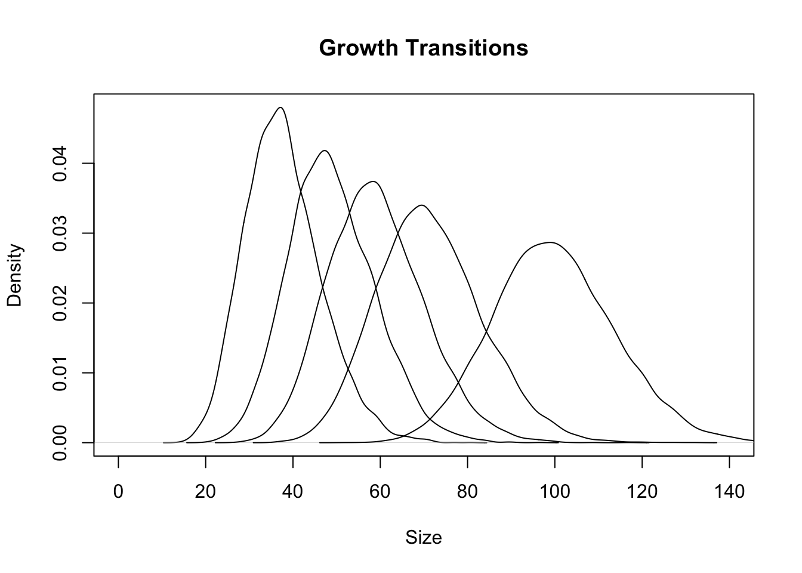


##### Length-based stock synthesis
The population dynamics here remain fundamentally age-based instead of length-based as in the previous section. Instead, a length-age transition matrix is used to determine and convert between lengths and ages. The age-length transition matrix (proportion of fish of age $a$ in length class $l$) is constructed assuming a normal distribution about the mean, and using the normal cdf method will work to calculate this. In these methods, gear-selectivity is length-based instead of age-based and is calculated fairly easily:

\begin{equation}
s_a = \sum_l s_l \psi_{l,a}
\end{equation}

Starting from the base, average abundance-at-length is:

\begin{equation}
\overline{N_{l,t}} = \sum_a \psi_{l,a} \overline{N_{a,t}}
\end{equation}

which is essentially just a weighted sum. The catch distribution of lengths in proportions is then:

\begin{equation}
\alpha_{l,t} = s_l\overline{N_{l,t}} / \sum_l \overline{N_{l,t}}
\end{equation}

and the age distribution of these catches are approximately:

\begin{equation}
\theta_{la,t} = s_a\overline{N_{a,t}} / \sum_a \overline{N_{a,t}}
\end{equation}

note that these are average age distributions because size-selectivity does not directly map to age-based selectivity. Lastly then, the catch-at-length can be calculated as such:
\begin{equation}
C_{l,t} = \alpha_{l,t}C_t
\end{equation}

which is just distributing the catches across the catch distribution of lengths. If this is entirely length-based, the following is equivalent in terms of age-based yield vs. length-based yield:

\begin{equation}
Y_t = \sum_a W_a N_{a,t} = \sum_l W_l N_{l,t}
\end{equation}

where we would be using a weight-length relationship to fit to yield instead of a weight-age relationship. Continuing some of the readings, the book discusses the idea of vulnerability in stock assessment models, which is modelled as such ($v_a$):

\begin{equation}
N_{a+1,t+1} = N_{a,t}[(1-v_a)e^{-M_{a,t}} + v_a e^{-Z_{a,t}}] \\
C_{a,t} = v_a \frac{F_{a,t}}{Z_{a,t}} (1 - e^{-Z_{a,t}}) N_{a,t}
\end{equation}

where if vulnerability is 1, then it decomposes to the Baranov equation. However, we seldom have information on availability (i.e., information on where that portion of the stock is at that time in point where we are fishing) and estimate both selectivity and vulnerability is confounded and difficult. Thus, we tend to subsume them into one selectivity term (contact and vulnerability/availability). 

They also discuss that back in the day, SS started out the model using pristine equilibrium age-structure to reduce parameter estimation. However, I don't think any study has really tried to look at the effects of these initial conditions - i.e., equilibrium when there is stochastic, when there is fishing prior to this, etc. I generally think it would be interesting (I don't its been done) using a age-based length-structured model, entirely length-based model and how the model performance might vary depending on the types of data provided to the assessment. In general, the length-based models are a bit more complex, given the need to distribute recruitment across a proportion of bins and the need to model the growth-transition matrix as a gamma distribution. 

## Chapter 10 (Migration Movement and Other Spatiotemporal Considerations)
### Population Models
Migration can be based either on annual or instantaneous rates, which depends on if we are modeling movement as a continuous or discrete process. The book describes movement as an instantaneous process, where the notation is moving from region $i$ to region $j$ ($\psi_{i \rightarrow j}$). Thus, the instantaneous exit rate is:

\begin{equation}
\psi_i^* = \sum_{i\neq j} \psi_{i \rightarrow j}
\end{equation}

where the above is the sum of all movements away from $i$. Similarly, the annual rate of movement (not instantaneous) is also denoted as the equation above:

\begin{equation}
\theta_i^* = \sum_{i\neq j} \theta_{i \rightarrow j}
\end{equation}

where $\theta_i^*$ is the annual movement rate away from region $i$. The proportion of individuals in a given year staying in region $i$ would then be:
\begin{equation}
\theta_{i \rightarrow i} = 1 - \theta_i^* = 1 - \sum_{i\neq j} \theta_{i \rightarrow j}
\end{equation}

#### Deterministic Model, Non-Age-Structured Population
In this model, time is continuous and so instantaneous rates are used $\psi$. Here, subscript $i$ will denote the region and we have region specific parameters ($r_i$ - growth rates, $K_i$ - carrying capacity, and $N_i$ - numbers). The model below is basically a logistic growth model, but incorporating movement dynamics:

\begin{equation}
\frac{dN_i}{dt} = r_iN_i(1 - \frac{N_i}{K_i}) - \sum_{i\neq j}^R \psi_{i \rightarrow j} N_i + \sum_{i\neq j}^R \psi_{j \rightarrow i} N_j
\end{equation}

where the first term is the rate of increase for region $i$, the second term denotes the number of individuals leaving from region $i$, and the third term denotes the number of individuals entering region $i$ from region $j$. Like other models, this can be written in a difference equation form and these types of models are called compartmental models, where the modelling of a process is account for as separate components. 

This can also be written as a function of exit rates $\psi_i^*$:

\begin{equation}
\frac{dN_i}{dt} = r_iN_i(1 - \frac{N_i}{K_i}) - \sum_{i\neq j}^R \psi_{i \rightarrow j} N_i + \sum_{i\neq j}^R \psi_{j \rightarrow i} N_j \\
\frac{dN_i}{dt} = r_iN_i- \frac{r_iN_i^2}{K_i}) - \psi_i^* N_i + \sum_{i\neq j}^R \psi_{j \rightarrow i} N_j \\
\frac{dN_i}{dt} = (r_i - \psi_i^*)N_i - \frac{r_iN_i^2}{K_i} + \sum_{i\neq j}^R \psi_{j \rightarrow i} N_j 
\end{equation}

An important assumption here is that movement rates follow a Markovian process. That is to say, movement is only a function of the region the individual is in and does not account for previous states, which could be unrealistic if site fidelity or natal homing is a potential mechanism (e.g., Pacific Cod). 

A generalization of this model by allowing for exponential dynamics is by allowing no carrying capacity $K_i \rightarrow \infty$, resulting in:
\begin{equation}
\frac{dN_i}{dt} = (r_i - \psi_i^*)N_i + \sum_{i\neq j}^R \psi_{j \rightarrow i} N_j \\
\frac{dN_i}{dt} = \kappa_iN_i + \sum_{i\neq j}^R \psi_{j \rightarrow i} N_j \\
\end{equation}

this model can be written in a nice matrix form as: $\boldsymbol{dN/dt} = \boldsymbol{\Psi N}$ where the first row of the first vector here would be the change in abundance of region $i$ ($dN_i/dt$), the rows of matrix $\boldsymbol{\Psi}$ for the first row would tell you the number of fish that grew as well as are leaving region $i$ and the remaining elements in that first row would allow you to do a dot product to sum up all the individuals in other regions $j$ moving into region $i$ (see page 401 for a nice compact description). This differential equation results in the following solution:

\begin{equation}
\boldsymbol{dN/dt} = \boldsymbol{\Psi N} \\
\boldsymbol{dN/N} = \boldsymbol{\Psi dt} \\
\boldsymbol{log(N) - log(N_0)} = \boldsymbol{\Psi t} \\
\boldsymbol{N} = \boldsymbol{e^{\Psi t}N_0} \\
\boldsymbol{N} = \boldsymbol{RN_{t-1}} 
\end{equation}

which is just our common solution for exponential growth and the exponential term is a Taylor series. 

#### Difference models
Difference models for these dynamics are much more tractable and easier to understand. If we assume that the order of dynamics is: 1) harvest, 2) natural mortality, 3) movement, then this model is written as:

\begin{equation}
N_{i,t+1} \sum_{j=1}^R N_{j,t} (1 - \mu_{j,t})l_j \theta_{j \rightarrow i} + R_{i,t}
\end{equation}

where this is in units of annual movement. Here, we have $N_{j,t} (1 - \mu_{j,t})$, which represents the number of individuals surviving exploitation, multiplied by $l_j$ the natural survival after exploitation, and then multiplied by the number of individuals that move from $j \rightarrow i$ ($\theta_{j \rightarrow i}$; incorporates both emigration and immigration dynamics), lastly adding in recruitment into the region $i$. Because movement dynamics are annual, the rows of the matrix should sum to 1. In the above equation, we don't need to add other indexing and what not - this took me a while to figure out how the indexing worked but in essence, we are indexing the movement matrix by $i$, which gives us the movement of all reigions into $i$, we multiply these to get the total contribution of all regions into $i$ and sum up the rows $j$.

#### Diffusion models
Instead of a difference model, we can model movement using partial differential equations along three dimensions in continuous space. These three dimensions are $x$, $y$, and time, where $x,y$ are different positions for which the individual is in (does not need to be coordinates). In the form of a partial differential equation, this is:

\begin{equation}
\frac{\partial N(x, y, t)}{\partial t} = -M N + D \left( \frac{\partial^2 N(x, y, t)}{\partial x^2} + \frac{\partial^2 N(x, y, t)}{\partial y^2} \right)
\end{equation}

where the first term $\frac{\partial N(x, y, t)}{\partial t}$ is a partial derivative with respect to time (i.e., how does abundance change at a given point), the second term is just our decay from natural mortality $-M N$, and the third term is our diffusion of individuals in two dimensional space. For $\frac{\partial^2 N(x, y, t)}{\partial x^2}$, it measures the curvature of abundance along the $x$ axis, while $\frac{\partial^2 N(x, y, t)}{\partial y^2}$ measures that along the $y$ axis. This is then added and multiplied by our diffusion coefficient $D$ (how fast $N$ moves through $x,y$ space) to get an estimate of the total change in spatial contribution by $N$ over time (i.e., how does the concentration of $N$ vary across space). So if the partial second derivatives are large in that third term, it indicates that individuals are more concentrated along a given axis and will. However, this model does not distinguish between specific directions and exhibits isotropic movements. Hilborn wrote this into a difference equation, but this is not numerically stable (see eq 10.14) because the terms on the RHS of the PDE are approximated by being dependent on previous states of the system. 


#### Basin models
MacCall developed a model that uses the theory that some areas are more suitable in terms of habitat than others, so fish movement are related to habitat suitability. A population at low levels will move towards suitable habitat and as the population increases, these habitats become less suitable, and the population will expand into less suitable habitats. The dynamics here are a logistic model:
\begin{equation}
\frac{\partial N}{\partial t}\frac{1}{N} = r - bN - F 
\end{equation}

where per-capita growth is $r - bN$ and is determined by habitat suitability (intrinsic growth) and carrying capacity. The movement process is then a diffusion process where migration is proportional to the gradient of the realized habitat suitability:


\begin{equation}
\frac{\partial N}{\partial t} = \kappa \frac{\partial^2 N}{\partial x^2} - V^{-1} \frac{\partial (r-bN)}{\partial x}\frac{\partial N}{\partial x} \\
\frac{\partial N}{\partial t} = (r-b)N - FN + \kappa \frac{\partial^2 N}{\partial x^2} - V^{-1} \frac{\partial (r-bN)}{\partial x}\frac{\partial N}{\partial x}
\end{equation}

where $\kappa$ is the diffusion coefficient, and $V$ is constant population flow (viscosity) where your population into area $x$. This forms what we know as our diffusion-advection models (first and second terms of derivatives). The advection piece follows a gradient of habitat suitability and abundance (first derivative), where if the gradients are large, it would drive directional movement due to sharp gradients in habitat suitability etc (outside or into a specific region), whereas if the gradients are small (e.g., smaller change in habitat suitability or abundance over changes in $x$) your diffusive process would dominate more. The diffusion term is as above, where it measures the curvature/concentration of individuals in area $x$. If you have very concentrated individuals/high curvature, then individuals are going to be spread away from high density to low density. Conversely, when individuals are less concentrated, they will spread from low to high density.

#### Stochastic Model, Non-Age Structured Populations
We will discuss the form of Deriso's stochastic model instead of Grant here, as more in-depth detail is given. Here, we incorporated elements of natural mortality, fishing mortality, effort, and recruitment as a continuous diffusion process. Here, movement occurs at the start of the time interval and natural and fishing mortality occur simultaneously. This is in contrast to Hilborn's method where it follows as harvest, natural mortality, and movement. Movement follows as:
\begin{equation}
P^*_{j,t} = \sum_{i = 1}^R P_{i,t} \theta_{i \rightarrow j}
\end{equation}

which gives us the probability of being in region $i$ ($P_{i,t}$) multiplied by the probability of moving from $i$ to $j$ ($\theta_{i \rightarrow j}$) and $P^*_{j,t}$ is the probability of staying in region $j$. This is basically the sum of all probabilities moving from region $i \rightarrow j$. The probability of capture in region $j$ after movement is $f_{j,t} = \mu_{j,t} P^*_{j,t}$ and the probability of staying in region $j$ is then $P_{j,t+1} = S_{j,t}P^*_{j,t}$, which is the probability of being in $j$ after movement and the probability of surviving in $j$. In this model, movement probabilities are approximated with a continuous diffusion model, where the population is divided into equal-sized quadrants and fish are uniformly distributed. There is then a movement box for which are dimension ed at $x,y$ and individuals move about this quadrant based on angles, velocity, diffusion. 

#### Age-structured Populations
A simple extension without having to index areas is the Leslie matrix, wherein a single population is considered and the renewal process incorporates both recruitment and immigration, while subtractions incorporate deaths and emigration. The other more common approach is to stratify your age-structured population into different regions. In a hypothetical population with two regions, the number of age-1s is as follows:
\begin{equation}
N_{1,t+1,i} = S_{0,i} \sum_a f_{a,i}N_{a,t,i}
\end{equation}
which basically says that our contribution to region $i$ is a function of survival of eggs $S_0$ and the fecundity-at-age times numbers-at-age in region $i$. The numbers-at-age for other age-classes then becomes a function of: 1) survival and 2) movement into and out of region $i$:

\begin{equation}
N_{a+1,t+1,i} = S_{a,i} (N_{a,t,i} - N_{a,t,i}\theta_{a,i \rightarrow j} + N_{a,t,j}\theta_{a,j \rightarrow i}) = \\
S_{a,i} (N_{a,t,i}(1 - \theta_{a,i \rightarrow j}) + N_{a,t,j}\theta_{a,j \rightarrow i}) = \\
S_{a,i} (N_{a,t,i}\theta_{a,i \rightarrow i} + N_{a,t,j}\theta_{a,j \rightarrow i})
\end{equation}

which is just the number of individuals staying and the number of individuals from $j$ moving into $i$. Combining across the areas to get total abundance, you just sum up area-specific abundances. If survival and fecundity are constant over regions, then this just reduces into a single-region Leslie matrix model. This can also be written into a Leslie matrix model format, where your numbers is a column vector indexed initially by region $i$ and region $j$ is stacked on the bottom. The projection matrix in a two-area model would be dimensioned as 2x2, although there is a nested matrix of movement and survival for a given region $i,j$ describing the dynamics of survival and fecundity within that (see page 409). The difference equations for multiple regions in this case is just:

\begin{equation}
N_{a+1,t+1,i} = S_{a,i} (N_{a,t,i}\theta_{a,i \rightarrow i} + \sum_{i \neq j} N_{a,t,j}\theta_{a,j \rightarrow i})
\end{equation}

Note that the movement matrices sum to 1, which can reduce additional parameters that need to be estimated (sum to 1 constraint). 

### Estimation of Migration
Mark-recapture data can be used to estimate movement rates. However, some major problems are tag loss, no information on reporting rates, and failing to meet assumptions of mark-recapture. 

#### Darroch's Method
This is an extension of a Petersen mark-recapture method. This method requires temporal and/or spatial marking but is not constrained by a constant probability of capture. Additionally, it also assumed that the population is closed such that the movement probabilities sum to 1, that all individuals in region $j$ have the same probability of capture $p_j$m fish movement is independent of others in regards to movement and capture, movement and capture are independent, the movement matrix is nonsingular, and that tagging does not affect fish movement, in order to generalize to the whole population. See page 412 - 413 for equations. In general, however, the probability of movement from region $i$ to $j$ is $\theta_{i \rightarrow j} = m_{i \rightarrow j} 1/p_j a_i$, which is the number of recaptured fish from $i \rightarrow j$ times the inverse of the probability of capture in $j$ times the number of fish released in $i$. This basically says that the number of fish recaptured is a function of the probability moving to that region x the probability of capture in that region x the total released from region $i$. However, this method is limited to one recapture event and one time interval - although extensions of this exist. 

#### Hilborns Method and Extensions
Hilborns model is a population dynamics model with an observation model with recaptured marks and can use maximum likelihood to estimate parameters. Here, we usually define a tag group as $N_{i,j,t}$ where $i$ is the tag group and $j$ is the region for which individuals were tagged in the population. Essentially, the observation submodel here models the tagged population as its own, and is therefore a function of tagged individuals, movement and other population parameters, and fishing effort. For one tag group, this becomes:

\begin{equation}
N_t = f(N_{t-1}, N_{t-2}...|\gamma, T , E)
\end{equation}

where $N_t$ is the abundance of the tag group, $\gamma$ are parameters for population dynamics and movement, $T$ are tag releases into a given area for a new tag group, and $E$ is the fishing mortality or effort. This is basically our process model. For our observation model, this becomes:
\begin{equation}
C_t = g(N_t|\nu, E)
\end{equation}

where $\nu$ are parameters related to tag shedding, misreporting, reading error, catchability and $C_t$ is our recaptures. In the case where all individuals are recaptured and reproted and harvest rate is the same for all tag groups, this becomes:
\begin{equation}
C_{i,j,t} = \frac{F_{j,t}}{Z_{j,t}} N_{i,j,t} (1 - exp(-Z_{j,t}))
\end{equation}

where all tag groups experience the same harvest rate. Because the number of tags released $T$ and recaptures are integers, we can use probability mass functions such as the Poisson, multinomial, negative binomial to model the recapture process. For a Poisson, minimizing the likelihood for recaptures to estiamte movement parameters would just be:
\begin{equation}
L(C_{i,j,t}|C_^o{i,j,t}) = \frac{e^{-C_{i,j,t}C_{i,j,t}^{C_^o{i,j,t}}}{C_^o{i,j,t}!}
\end{equation}
for which we would just jointly maximize this function to estimate our parameters for $\nu$ and for $\gamma$ (movement related parameters and tag related parameters). In essence, this method basically has a population dynamics model and a submodel for the tagged population following the same dynamics - the observation model would then be conditioned on the released tags and their population dynamics, and you would maxmimize or minimize your likelihoods for your observed and predicted recaptured individuals.  

Below is an example using Hilborn's method for a 2-region model for 3 tag groups (initial area 1, 2, and at time point 3 for area 1). The following equations used were:

\begin{equation}
N_{i,t} = \sum_{j=1}^R N_{j,t-1} (1 - \mu_{j,t-1})l_j \theta_{j \rightarrow i} + T_{i,t} \\
C_{i,t} = \mu_{i,t} N_{i,t} 
\end{equation}

where the first part of the equation tracks the tagged group and its resultant dynamics, while the second part of the equation tracks the recaptured portion of the tagged population. From this, we could simulate our observation process, where our observation model can arise from a poisson distribution or something alike.


```r
move = matrix(c(0.8, 0.3, 0.2, 0.7), 2, 2) # movement matrix
N_it = matrix(c(1000, 2000, 0, 0, 0, 0, 0, 0), 2 ,4) # initial releases
C_it = matrix(c(0, 0, 0, 0, 0, 0, 0, 0), 2 ,4) # recaptures
obs_C_it = matrix(c(0, 0, 0, 0, 0, 0, 0, 0), 2 ,4) # observed
T_it = matrix(c(0, 0, 0, 0, 1000, 0, 0, 0), 2 ,4) # releases after initial
mu = matrix(c(0.2, 0.1), nrow = 2) # exploitation
surv = 0.9 # survival
time = 1:4 # time idx
region = 1:2 # region idx
C_it[,1] = mu * N_it[,1] # recaptures in first time period
for(i in 1:length(region)) obs_C_it[i,1] = rpois(1, lambda = mu[i] * N_it[i,1]) # simualte observations

for(t in 2:length(time)) {
  for(i in 1:length(region)) {
   N_it[i,t] = sum((N_it[,t-1] * (1 - mu)) * surv * move[,i]) + T_it[i,t] # process equation
   C_it[i,t] = mu[i] * N_it[i,t] # observation equation
   obs_C_it[i,t] = rpois(1, lambda = mu[i] * N_it[i,t]) # simulate recaptur observations
  } # end i 
} # end t
```


#### Differential equation approaches
Here, we will describe equations and the model for which assumes an instantaneous rate of transfer - whereas in Hilborn, we assumed annual rates of transfer. This model is what we tend to think of our standard box-transfer equations using instantaneous transfer coefficients, and begins to build on some of the models we tend to see nowadays:

\begin{equation}
M^* = M+L\\
\frac{dN_1}{dt} = -(M^* + L + F_1 + T_1)N_1 \\
\frac{dN_2}{dt} = -(M^* + F_2)N_2 + T_1N_1
\end{equation}

where no transfers are assumed to occur from region $2$ to region $1$. The solutions for this is straightforward:
\begin{equation}
N_1 = N_{1,0}e^{-(M^* + F_1 + T_1)t}
N_2 = N_{1,0} \frac{T_1}{F_1 - F_2 + T_1}[e^{-(M^*+F_2)t} - e^{-(M^*+F_1+T_1)t}]
\end{equation}

and the catches follow our standard Barnaov equations, except the denominator incorporates our transfer coefficients. However, as this model is written right now (also see page 420), there is no round trip movement and underestimates migration rates. Nonetheless, this can be useful for describing movements from near-shore to off-shore fisheries (e.g., different fleets). 

### Migratory Cohort and Catch-Age Analyses
These flavors of models are our modern day box-transfer models integrated with catch-age data, as well as tag data (our tag-integrated data). Estimation is similar to previous sections, where we will model the dynamics of our tagged population and have it follow processes governing the overall population, except that we need to incorporate nuisance parameters in the tag population such as reporting rate, tag loss, tag mortality, etc. These models are difficult to estimate because there is substantial confounding between natural mortality and movement rates. 

#### Migratory Cohort Analysis
This is our typical backwards recursion model using $F$ where migration is assumed to occur at the end of the year, catch occurs in the middle using Pope's approximation, and we have estimates of age-specific migration rates. These models are pretty much the same as the regular cohort analysis equations, except that they are multiplied by a matrix of movement parameters (see page 422).

#### Migratory Catch-Age Analysis
This section was a bit lackluster imo. Not much to add from previous equations in section 8, except that we are now having to index by region. 

### Geographic apportionment
Because spatial models are so data-hungry, it is often better to have a single-area model where the CV of your population estimates are much smaller. However, in this case, we need to think about how we might want to apportion our harvest across regions. The other trade-off however, is that our assumptions regarding constant catchability, selectivity are likely more appropriate on a smaller spatial scale, than on a large spatial scale, as well as the fact that management deicsions for separate regions are less likely to over harvest in a given region. 

The simplest way to do geographic apportionment is if we have some estimate of abundance in a given year derived from some cohort, catch-age, or other model, and if we also have some estimate of relative abundance (in proportions likely) or density in a given region (CPUE, mark-recapture), then we can get area-specific abudance estimates via $N_{r,t} = p_r N_t$ where $r$ is an index of region and $p_r$ is the relative abundance or density of the stock in a given region. This is valid if these estimates are unbiased and are independent. Our abundance can be for any population unit (mature females, total population, exploitable population, etc), which allows us to extend the apportionment to those units. 

As long as we have some sort of relative abundance information (i.e., from a survey) this can be potentially a viable option. However, each source of information will have its own peculiarities. For example, if you catchabilities differ by region or by time, this might lead to inaccurate and biased apportionment. Other sources such as hydroacoustic surveys can be used, although this has problems with mixed-species aggregations. In general, our approach is to apportion total catch levels after estimating something like ABC to regions in proportion to their distribution of relative biomass (e.g., more fish in CGOA = higher ABC in that region). 
Some other apportionment methods include: 1) equal apportionment among regions - which can be of use when apportionment/relative abundance is highly uncertain or if areas are of equal sizes, 2) a weighted-average of relative biomass over time - which can be of use if there are species distribution shifts over time and localized depletion in certain areas, which can allow for more adaptation, although is more variable in terms of catch apportionment due to year-to-year measurement error, 3) apportionment using the equilibrium distribution of biomass. Other weighting schemes are also available (e.g., weighting most recent survey higher, exponential weighting). In general, equal apportionment can lead to less variation in yield, but with higher risk of overfishing (exerting differential fishing mortality rates on populations if sizes differ). Apportionment based on most recent survey biomasses can be variable due to measurement error, while apportionment methods that are area-weighted (based on biomass distributions) or some weighted-average of survey biomass in the last $x$ years tend to perform well and similarly. 

### Migratory Per-Recruit Analyses
Per-recruit analyses for migratory regions are more complicated because of differences in size and fishing mortality by region, resulting in the need to explore a larger parameter space. The other issue in a "per-recruit" context is that we need to know the relative "recruits" per region, given that recruits might enter a given region in different proportions. However, knowing the relative recruitment can be easy/does not need to be estimated if we have information on the recruitment proportions from the survey using relative apportionment methods described above. If that is the case, we will just set up our YPR analysis with recruitment differing by the survey proportions, proceed to maximize the YPR by region to find the optimal exploitation rate by region, uses the exploitation rates in our population dynamics model, and project forward by a year. However, this method assumes that regional recruitment is constant, and there is no movement or exchange of individuals to change the relative proprotions of recruits in a given area. Few papers at this time have really looked at migratory yield-per-recruit at the point this book was written. The notable one was from Deriso, whom used a stochastic model to look at migration on management, which just had a capture probability by region, for which was conditioned on: 1) exploitation rate in that region, 2) the movement to that region, and 3) the probability of capture in that region. This was then multiplied by the average weight-at-age in that region and summed acoss ages and region to get the total YPR (see 436). This is pretty simple and you are essentially maximizing the entire system yield - harvesting at this rate could potentially lead to localized depletion. Some other studies looked at the methods of recruitment apportionment by region in a YPR analysis and generally have found these YPR results to be fairly variable and inconsistent. However, the general result of needing to reduce harvest rates by the suggested maximum was necessary in order to avoid overharvest in some regions. 

## Chapter 11 (Optimal Harvesting)


